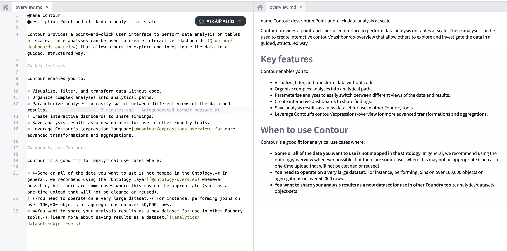
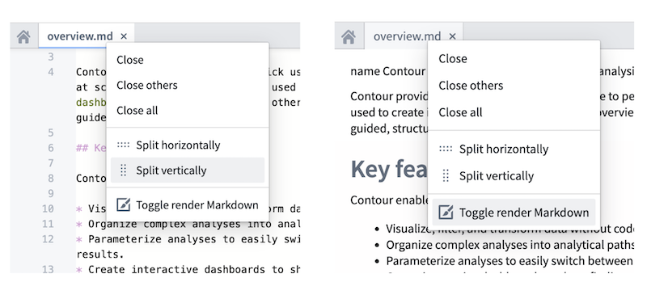

<!-- source: https://palantir.com/docs/foundry/custom-docs/preview-markdown/ · mirrored 2026-08-14 from Palantir Foundry docs -->

# Preview custom documentation in Code Repositories

To help you write and edit custom documentation, you can preview Markdown files in your documentation repository using Code Repositories. Markdown previews are rendered side-by-side with the source Markdown code in the code editor, as shown in the screenshot below.

## How to turn on Markdown preview

To view a rendered preview of your Markdown files in Code Repositories, you can turn on Markdown preview by following these steps.

* Right-click on your open Markdown file tab.
* Select **Split vertically** or **Split horizontally** to view the contents in two panes.
* Turn on **Toggle render Markdown** in the pane you would like to render as Markdown.

## Differences between rendered Markdown preview and published custom documentation

Note that not all features of Palantir custom documentation will be fully rendered in a Markdown preview using Code Repositories, as the Markdown preview uses "vanilla" Markdown without Palantir-specific additions. The Markdown preview is intended to facilitate the custom documentation process but does not display a 1:1 copy of the final published documentation; Palantir-specific formatting will be applied later in the publishing process.

In particular the following will not render in their display format until published:

* Palantir-custom syntax - denoted by the `@` tag, such as `@title` or `@description` - will appear as plain text in Markdown preview but will be applied later in the publishing process.
* [Navigational elements](/docs/foundry/custom-docs/custom-docs-bundle-structure/), as designated in the table of contents `ordering.md` file, may not be available in Markdown preview.
* HTML elements such as [callouts](/docs/foundry/custom-docs/add-callouts/) will not appear the same as in their final published form.
