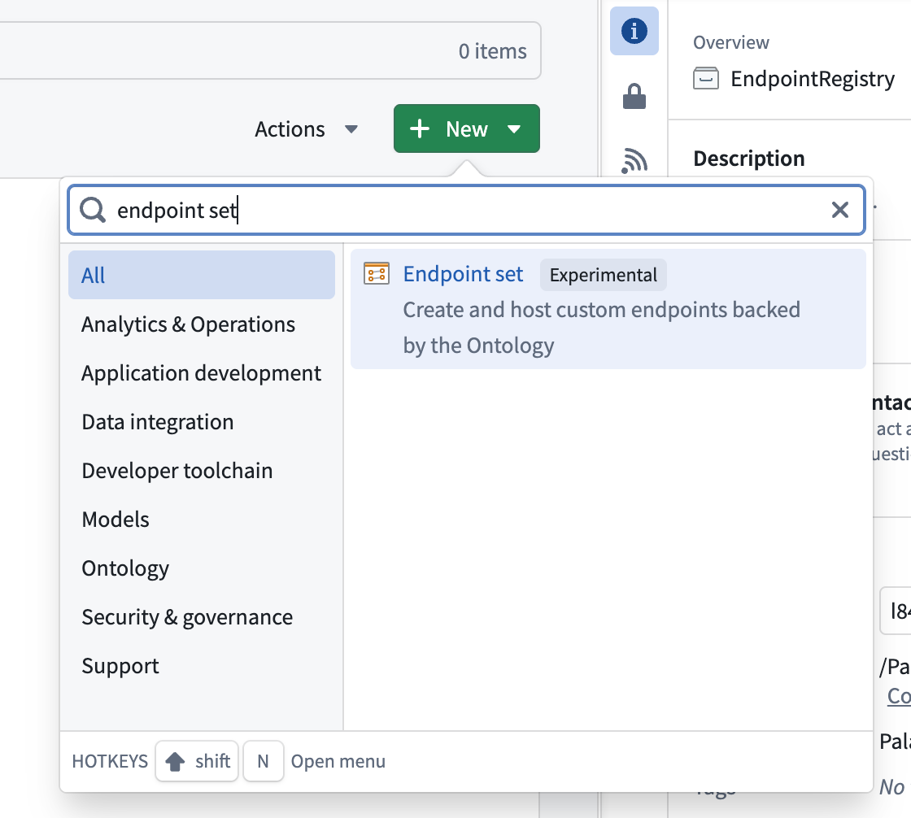
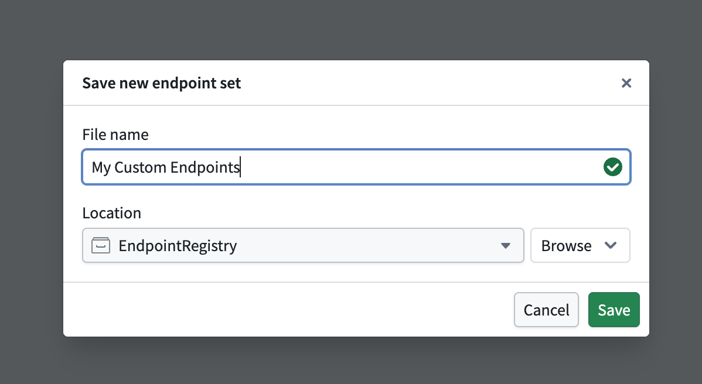
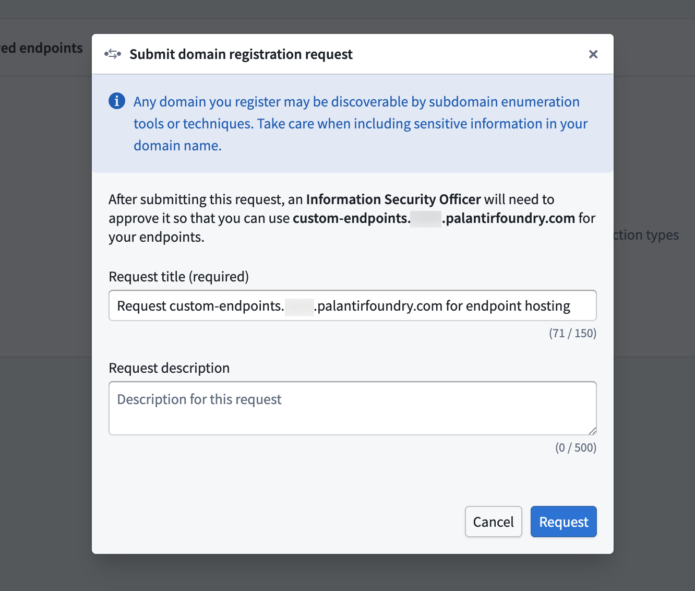
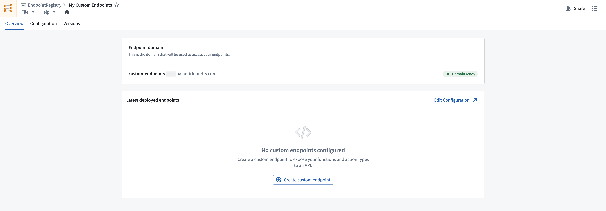

<!-- source: https://palantir.com/docs/foundry/custom-endpoints/create-endpoint-set/ · mirrored 2026-08-14 from Palantir Foundry docs -->

# Create an endpoint set

Follow the instructions below to create a new endpoint set:

1. Select **Files** from the workspace navigation bar and find your desired project or folder.
2. Select **New > Endpoint set** in the top right to create a new endpoint set in the current project or folder. The new endpoint set will inherit permissions from its parent project or folder.       
3. In the **Save new endpoint set** dialog, input a name for your endpoint set and save it. This creates a new empty endpoint set resource.   
   

## Register a subdomain to host your endpoints

In production workflows, all custom endpoints are served from a user-specified subdomain. This subdomain acts as the host for your endpoint set release, enabling access to deployed endpoints that execute foundry logic.

To request a new endpoint hosting subdomain, follow the instructions below:

1. Navigate to **Overview > Endpoint domain** in your selected endpoint set, and specify a subdomain name.
2. Select **Request endpoint hosting domain** in the top right and acknowledge the instructions to create a subdomain registration request.   
      
3. Await approval for your subdomain registration request from your enrollment administrator.

After registering and receiving approval for your subdomain, you should see a **Domain ready** tag next to your deployed subdomain. While waiting for approval, you can continue to configure and test your endpoint definitions. Review the [custom endpoint definition](/docs/foundry/custom-endpoints/define-endpoints/) documentation for more details.

