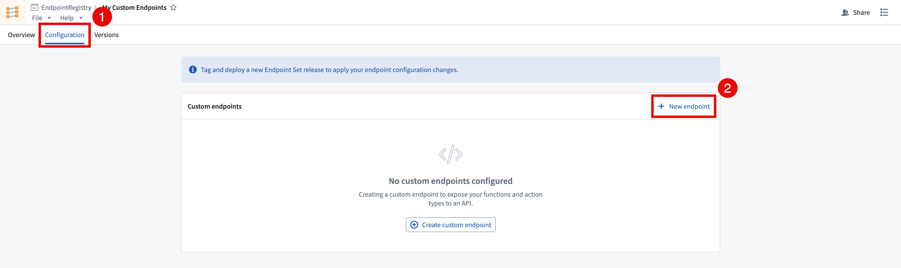
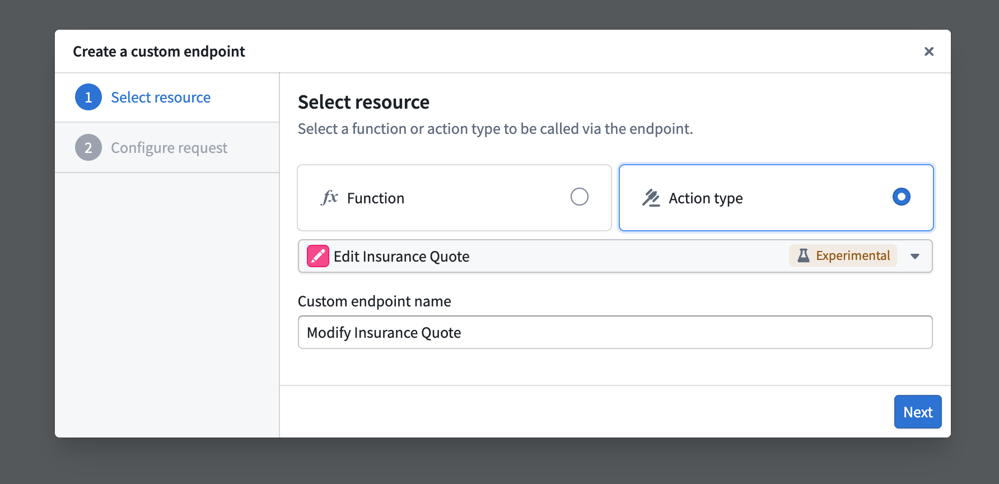
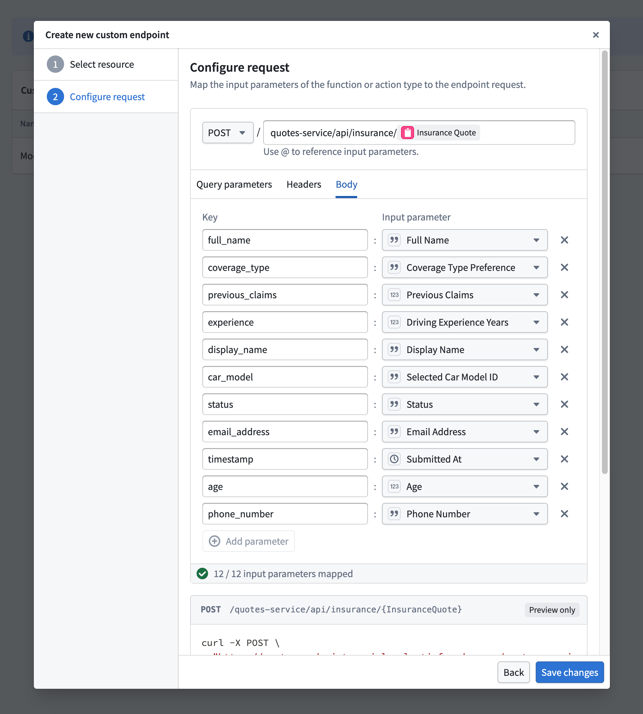
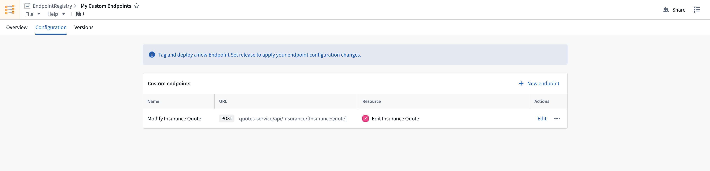

<!-- source: https://palantir.com/docs/foundry/custom-endpoints/define-endpoints/ · mirrored 2026-08-14 from Palantir Foundry docs -->

# Define custom endpoints

After creating an endpoint set, you can configure new endpoint definitions that expose Foundry functions and actions.

Follow the instructions below to create a new endpoint definition:

1. In the Custom Endpoints application, open the endpoint set that you want to add custom endpoints to and navigate to the **Configuration** tab.
2. Select **+ New endpoint** in the top right of the **Custom endpoints** table. This will open the **Create a custom endpoint** wizard. Note that newly created endpoint definitions will not be accessible until a release is created and deployed.   
      
3. In the **Create a custom endpoint** wizard, input your endpoint's name and select a backing action or function to be executed by your endpoint.   
      
4. After selecting a backing function or action, you will be asked to map each parameter to a newly defined endpoint parameter. The following configuration options are currently supported:

   * **User-defined request types:** `GET`, `POST`, `PUT`, `DELETE`, and `PATCH`.
   * **User-defined endpoint routes:** Host a new endpoint on your application's subdomain, allowing you to define a custom path with path parameters conforming to your organization' standards, such as `/form/{formId}/section/{sectionId}`.
   * **User-defined query parameters:** Define query parameters that will pass in additional information to the underlying function when specified.
   * **User-defined header parameters:** Provide additional headers in your request that can be handled and mapped to function inputs.
   * **User-defined request body:** Custom  request body shape definitions for `POST`, `PUT`, `PATCH`, and `DELETE` requests.

   :::callout{theme="neutral"}
   All parameters must be mapped in the custom endpoint definition, including optional parameters. Some JSON parameters can only be mapped to the endpoint's `requestBody`.
   :::

      
5. After selecting a resource and configuring the request remapping, select **Create Endpoint** to save the new endpoint’s definition.   
   
