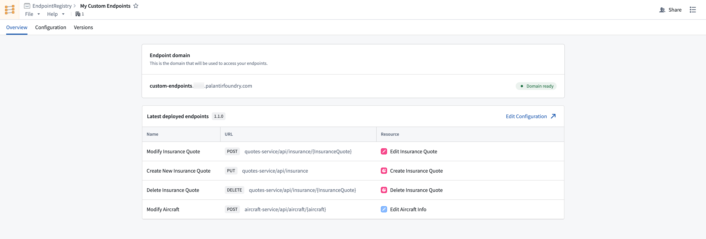

<!-- source: https://palantir.com/docs/foundry/custom-endpoints/overview/ · mirrored 2026-08-14 from Palantir Foundry docs -->

# Custom Endpoints

:::callout{theme="neutral" title="Beta"}
The Custom Endpoints application is in the [beta](/docs/foundry/platform-overview/development-life-cycle/) phase of development and may not be available on your enrollment. Functionality may change during active development. Contact Palantir Support to request access to Custom Endpoints.
:::

The **Custom Endpoints** application enables developers to configure and deploy user-defined API endpoints with their own URL patterns. Users can also configure request and response shapes and endpoint specifications, while leveraging Foundry's back-end capabilities. Custom endpoints are backed by the ontology through actions and functions.



The Custom Endpoints application provides managed infrastructure for treating Foundry as a back-end service. Developers can define endpoint metadata describing how HTTP requests map to ontology operations, eliminating the need for external middleware services. This enables organizations to expose Foundry data through APIs that conform to their existing enterprise standards and specifications.

Below is an example of a standard Foundry API call:

```http
POST https://{your enrollment}.palantirfoundry.com/api/v2/ontologies/{ontology}/queries/{queryApiName}/execute
Body: {"parameters": {"form_id": 62536, "section_id": 5}}
Response: {"code": 200, "data": {"value": ["Val1", "Val2", "Val3"]}}
```

Below is the same API call, customized to accommodate existing organizational standards and remapped to a `GET` request:

```http
GET https://subdomain.domain.com/myApi/form/{form_id}/section/{section_id}
Response: {"code": 200, "data": {"section1": "Val1", "section2": "Val2", "section3": "Val3"}}
```

Some examples of custom endpoint use cases include creating a unified API that combines Foundry data with third-party services, or a legacy-compatible endpoint that matches existing enterprise URL patterns and response formats.
