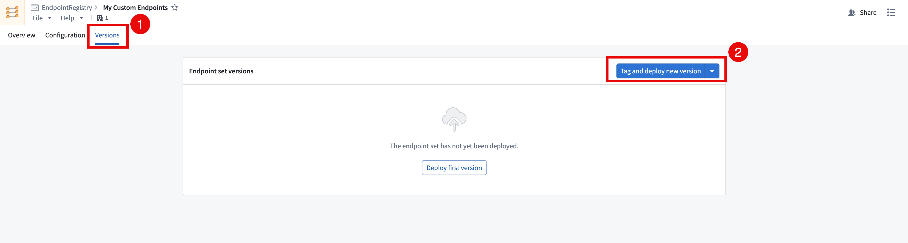
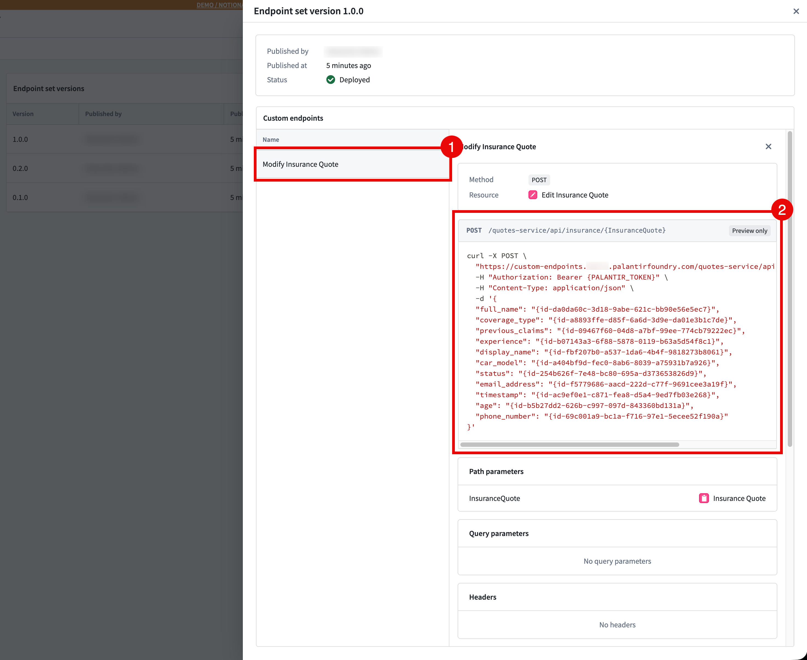
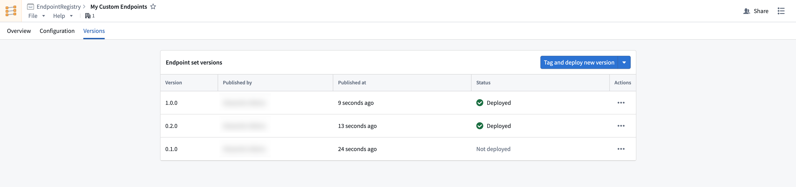

<!-- source: https://palantir.com/docs/foundry/custom-endpoints/publish/ · mirrored 2026-08-14 from Palantir Foundry docs -->

# Publish and deploy custom endpoints

After configuring your custom endpoints, you can test and deploy them by cutting a new release of your endpoint set. Each new release is a snapshot of your current configuration, and can be managed with semantic versioning. See [endpoint set publishing](/docs/foundry/custom-endpoints/core-concepts/#endpoint-set-publishing-and-releases) for more information.

## Publish and deploy a new endpoint set release

Follow the instructions below to publish a new endpoint set release:

1. Open the endpoint set to be published in the Custom Endpoints application and navigate to the **Versions** tab.
2. Select **Tag and deploy new version** in the top right of the **Endpoint set versions** table to create a new endpoint set release. To avoid automatically deploying this version, select **Tag without deploying**. <br><br>
   

## Test your custom endpoints

Versions should be accessible on approved subdomains immediately after the version is published and deployed. Follow the instructions below to test your custom endpoints:

1. Get the `FOUNDRY_TOKEN` environment variable in your terminal with a [user-generated token](/docs/foundry/platform-security-third-party/user-generated-tokens/) with the following command, or the equivalent for your operating system.

   ```bash
   export FOUNDRY_TOKEN=<token>
   ```

2. In the **Versions** tab of your endpoint set, select your **Deployed Version > Custom Endpoint** and copy the example CURL request provided. You can also view the endpoint configuration here. <br><br>
    <br><br>

3. Run the CURL command, and you should now be able to interact directly with the ontology using your custom endpoint.

For details on using custom endpoints in production, refer to [Using custom endpoints in your applications](/docs/foundry/custom-endpoints/use-custom-endpoints/).

## Manage releases through multi-version deployment

You can manage your releases, ensure stability, and test your endpoints with multi-version deployment. This offering allows beta, stable, and legacy versions to all be accessible on a single subdomain. You can access an endpoint's deployed version by passing in an `endpoint-api-version` header in your request.


