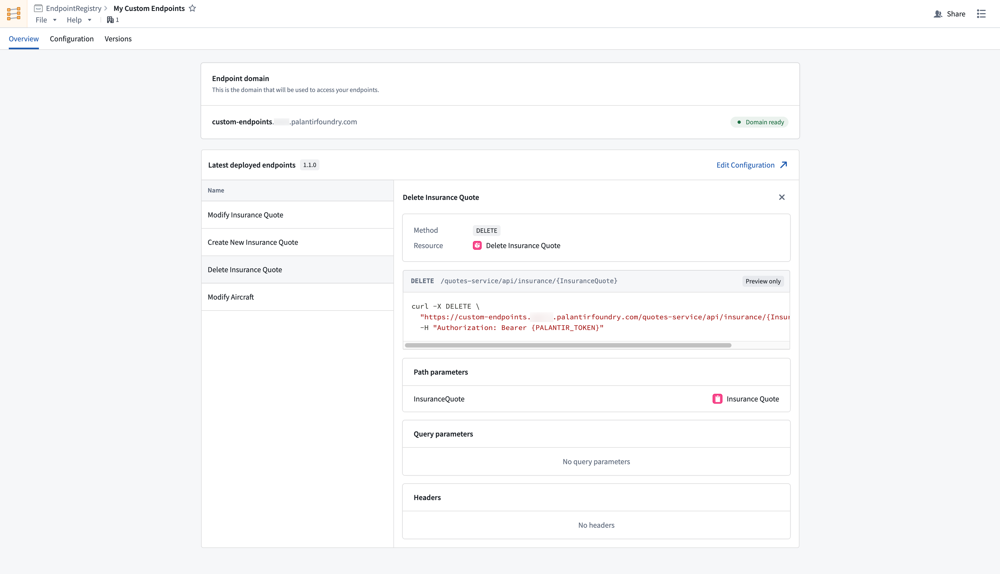

<!-- source: https://palantir.com/docs/foundry/custom-endpoints/use-custom-endpoints/ · mirrored 2026-08-14 from Palantir Foundry docs -->

# Use custom endpoints in your applications

:::callout{theme="warning"}
Custom endpoints are currently only supported by [unrestricted applications in Developer Console](/docs/foundry/developer-console/application-restrictions/#unrestricted-applications). Restricted applications do not currently support custom endpoints.
:::

After you have created, configured, published, and deployed your endpoint set to a subdomain, the next step is integrating existing endpoints with an [unrestricted custom application](/docs/foundry/developer-console/application-restrictions/#unrestricted-applications) so that third-party applications can authenticate and execute endpoints. Before registering your endpoint set with your application, you should [create, setup, and deploy a Developer Console application](/docs/foundry/developer-console/create-application/).

Each custom endpoint is backed by an ontology function or action. To give your Developer Console application permission to execute your custom endpoints, identify the backing ontology resources and add them to the [resource access restrictions](/docs/foundry/developer-console/permissions/#resource-access-restrictions) that your OAuth client needs permission to access.

Once your application has access to the required ontology resources, your custom endpoints should be accessible through API requests in your application's language.

Navigate to the endpoint set **Overview** tab and inspect deployed endpoints to view documentation for your custom endpoint configurations.

