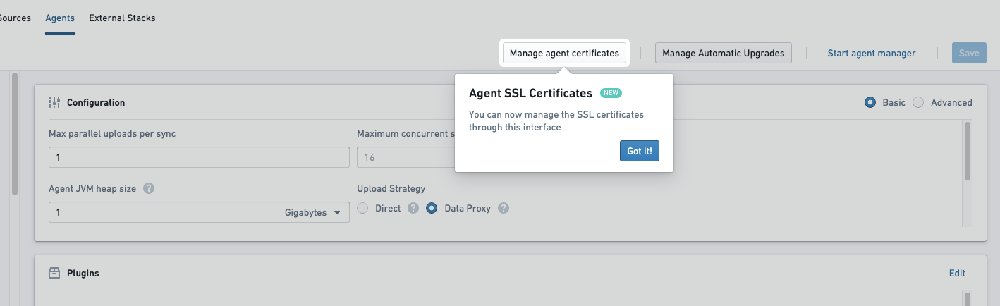
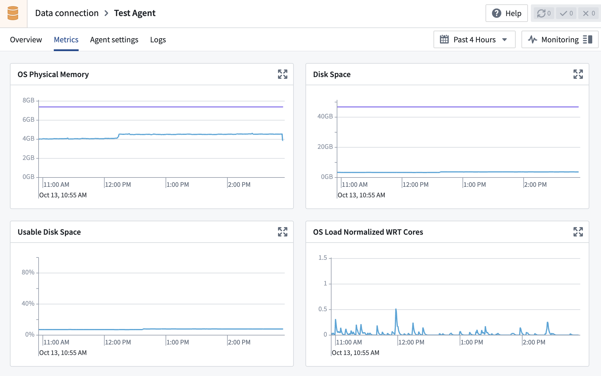
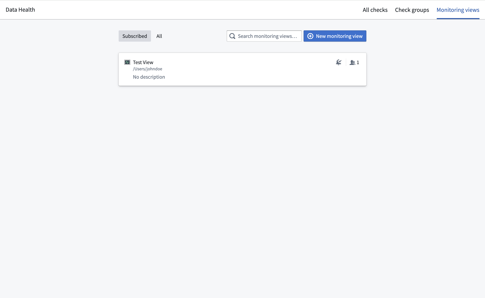
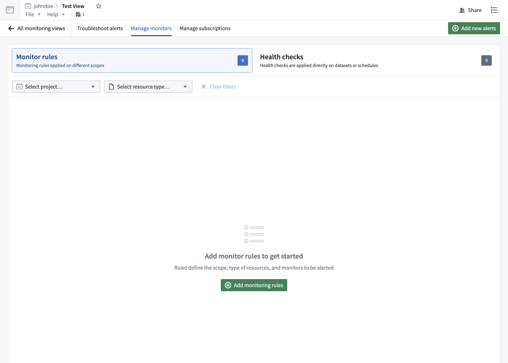
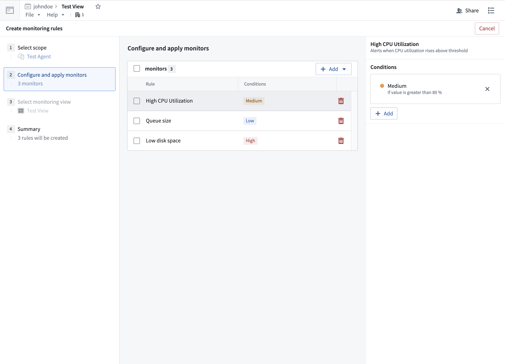
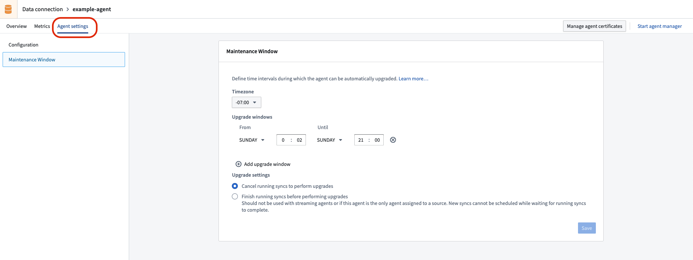
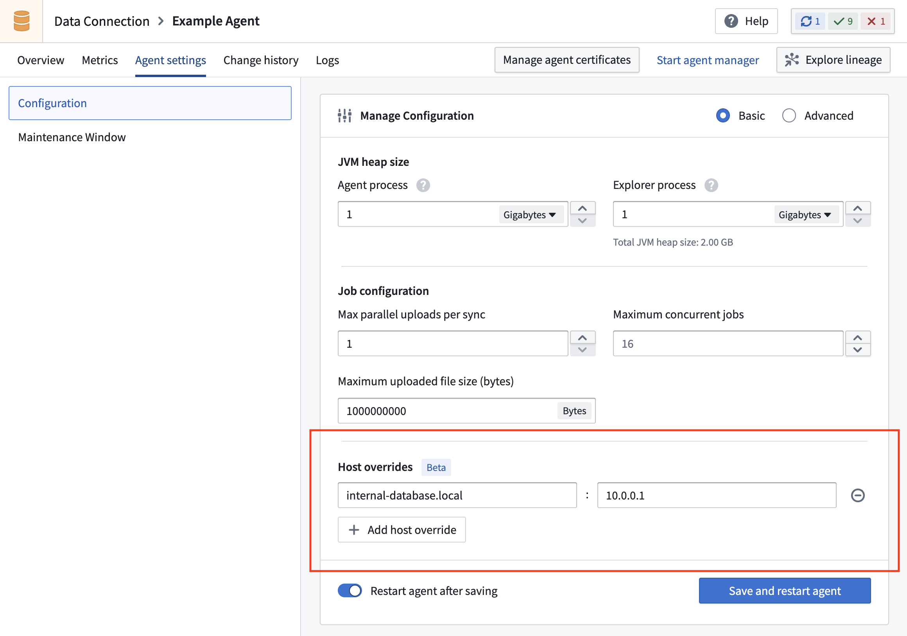
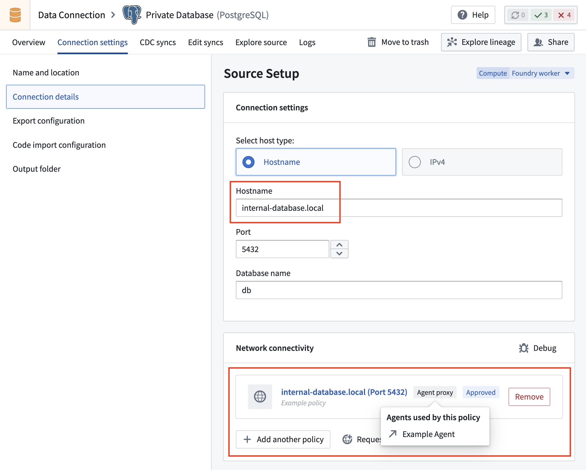

<!-- source: https://palantir.com/docs/foundry/data-connection/agent-configuration-reference/ · mirrored 2026-08-18 from Palantir Foundry docs -->

# Agent configuration reference

The following sections describe the various configurations available when creating, monitoring, and managing agents within your network. The following workflows will be explained:

* [Agent permissions](#agent-permissions)
* [Proxy configuration](#proxy-configuration)
  * [Agent Manager proxy configuration](#agent-manager-proxy-configuration)
  * [Bootstrapper proxy configuration](#bootstrapper-proxy-configuration)
  * [Source proxy configuration](#source-proxy-configuration)
* [Agent metrics and health monitoring](#agent-metrics-and-health-monitoring)
  * [Metrics](#metrics)
    * ["Time until next expiration" metrics](#time-until-next-expiration-metrics)
  * [Health monitoring](#health-monitoring)
* [Automatic upgrade windows](#automatic-upgrade-windows)
  * [Upgrade windows](#upgrade-windows)
  * [Stagger upgrades](#stagger-upgrades)
  * [Schedule dataset syncs](#schedule-dataset-syncs)
* [Reinstall an agent](#reinstall-an-agent)
* [Move an agent to a new directory](#move-an-agent-to-a-new-directory)
* [Move an agent to a new host](#move-an-agent-to-a-new-host)
* [Install on a Windows host](#install-on-a-windows-host)
* [Backup and caches](#backups-and-caches)
* [Configure host overrides](#configure-host-overrides)

Learn more about [agents](/docs/foundry/data-connection/core-concepts/) and how to [set them up](/docs/foundry/data-connection/set-up-agent/) in the Data Connection application.

## Agent permissions

:::callout{theme="warning"}
Permissions may be managed differently on enrollments provisioned before May 27, 2023. For questions about agent management for these enrollments, contact Palantir Support.

To start managing agent creation in Control Panel, users with `Organization administrator` permissions must be granted an additional workflow called `Change agent creation authentication method`. This workflow permission allows administrators to opt into strict enforcement of role-based agent creation management. This enforcement is done automatically for enrollments provisioned after the above date.
:::

Permission to create agents is administered in [Control Panel](/docs/foundry/administration/control-panel/). To create an agent, you must have either the `Organization administrator` or `Data flows administrator` role assigned to you. It is also possible to create a custom role and assign the `Create agent` workflow to that role. Organization roles are managed on the **Organization permissions** page in Control Panel.

[Learn more about managing roles in Control Panel.](/docs/foundry/administration/enrollments-and-organizations-permissions/)

In addition to the Organization-level role, you must be an `Editor` or `Owner` of the Project in which you want to save a newly-created agent.

:::callout{theme="neutral"}
After creation, project-based roles are used to control who may view, modify, and delete the agent or assign the agent as the [worker](/docs/foundry/data-connection/agent-worker/) for a specific source. This means that agent creators should ensure that the project where the agent is stored is configured with the correct roles.
:::

## Certificates

Agents communicate with both Foundry and your internal network. This means that agents need to have the correct certificates in their truststores for these connections to be established.

There are two situations that may require additional certificates to be configured on an agent:

* [Certificates to allow agent communication with Foundry](#certificates-to-allow-agent-communication-with-foundry)
* [Certificates to allow agent communication with your systems (agent worker only)](#certificates-to-allow-agent-communication-with-your-systems)

In both cases, certificates may be added from the agent management page in the Data Connection application.

### Add certificates to an agent

To add a certificate to an agent, navigate to the agent details page for your agent in Data Connection, then select **Manage agent certificates**.



From here, choose the certificate to be added, along with an alias if desired. Then, add the contents of the certificate. The certificate should be added as a string similar to the below example, including newlines but without a trailing newline character. The certificate shown below is the public certificate for `https://palantir.com`.

Note that you cannot enter a certificate chain; you must enter each certificate separately.

```
-----BEGIN CERTIFICATE-----
MIIGXjCCBUagAwIBAgIQASByQ6gv8Z6X7wEqsyBb1DANBgkqhkiG9w0BAQsFADBY
MQswCQYDVQQGEwJCRTEZMBcGA1UEChMQR2xvYmFsU2lnbiBudi1zYTEuMCwGA1UE
AxMlR2xvYmFsU2lnbiBBdGxhcyBSMyBEViBUTFMgQ0EgMjAyNCBRMjAeFw0yNDA2
MTcxNjUwMTVaFw0yNTA3MTkxNjUwMTRaMBkxFzAVBgNVBAMMDioucGFsYW50aXIu
Y29tMIIBIjANBgkqhkiG9w0BAQEFAAOCAQ8AMIIBCgKCAQEAvBalUG3JFYaSiRO2
enRnEwdeGUgtal9isJfB1++LxcPwo/DP2dncK+ur7URID0TVWOqu+4vXE2mmC9jz
Kx0o/URrMoz70i6qF6/Oyq6CuOHjZINiAN0ovNBBEPNGbSVD3Xq/eWgI7PNQ8hfI
9BJ/3WVA17oSG3zEXiWP3+CiL3Wm1Gn38oOt4URBMA0hgLqyOoU3ooqYIK8Fz2K/
OxAJvq45z2lonMZFFzj5thO5dBBch26mNAacO4MvI9mhUrMZtYvGBRZoXrph4EmF
TJDo2UTYiST0Tq6ibNW+NTuv66DrqFvzOpZybNuZsS6VrisYQ4huPN9jVz7RNFhJ
aeJvbQIDAQABo4IDYTCCA10wGQYDVR0RBBIwEIIOKi5wYWxhbnRpci5jb20wDgYD
VR0PAQH/BAQDAgWgMB0GA1UdJQQWMBQGCCsGAQUFBwMBBggrBgEFBQcDAjAdBgNV
HQ4EFgQUuAbgKrz0fIAXR1I/89IpUMN57AgwVwYDVR0gBFAwTjAIBgZngQwBAgEw
QgYKKwYBBAGgMgoBAzA0MDIGCCsGAQUFBwIBFiZodHRwczovL3d3dy5nbG9iYWxz
aWduLmNvbS9yZXBvc2l0b3J5LzAMBgNVHRMBAf8EAjAAMIGeBggrBgEFBQcBAQSB
kTCBjjBABggrBgEFBQcwAYY0aHR0cDovL29jc3AuZ2xvYmFsc2lnbi5jb20vY2Ev
Z3NhdGxhc3IzZHZ0bHNjYTIwMjRxMjBKBggrBgEFBQcwAoY+aHR0cDovL3NlY3Vy
ZS5nbG9iYWxzaWduLmNvbS9jYWNlcnQvZ3NhdGxhc3IzZHZ0bHNjYTIwMjRxMi5j
cnQwHwYDVR0jBBgwFoAUrw0C0MMbnlj47zdiLecDXZ5BSoowSAYDVR0fBEEwPzA9
oDugOYY3aHR0cDovL2NybC5nbG9iYWxzaWduLmNvbS9jYS9nc2F0bGFzcjNkdnRs
c2NhMjAyNHEyLmNybDCCAX0GCisGAQQB1nkCBAIEggFtBIIBaQFnAHUA5tIxY0B3
jMEQQQbXcbnOwdJA9paEhvu6hzId/R43jlAAAAGQJxs/FAAABAMARjBEAiATvomb
hMrUty8Vj703fTBSzY5qDxEMI473IigiGIiXugIgbj4/j24jloGdVoedM3jb6DFw
yAXkuZD3SMHBLsEvP9gAdgDd3Mo0ldfhFgXnlTL6x5/4PRxQ39sAOhQSdgosrLvI
KgAAAZAnGz7qAAAEAwBHMEUCIAHXbm9F2rwyxD36aHoGZRrnDtgg9UDRy5UtHK6D
OrmKAiEAjfomH4CGUrkBbwD8pzt9BbC6u6gPPveYiURxFIq//RUAdgB9WR4S4Xgq
exxhZ3xe/fjQh1wUoE6VnrkDL9kOjC55uAAAAZAnG0C6AAAEAwBHMEUCIQDDOg9s
KZqzbCu0mNBQMRAv6/2HkuLjZSGMxjq/F0R1/wIgKMHBSsNgeVED+LpTcIBYgp1q
SXgbwSizE6OD+1Ewol0wDQYJKoZIhvcNAQELBQADggEBAAr/tnc9dtTfwrczP7Ok
1+tLKmFRss4/1KQgLY8Tyy45Pag53ikn2n3tSPG1OpRTSmfPhPs9/UQRtMf7f2Gk
ObSXDVpPArtFBFDfZug+j22gVSYQr6zgFJu4Y9QD1GGtICqkmTScubfnjwdffTv6
5oNY4LbVGp5yctAd80OFUXspy+oVGsvv61a1pFO+s/NXleSrqDGL1oWcFW5Uj8GH
jnTM+Lt/HupqZ/ThVSkjMOug+hB875Yf8mWvadKYBX0Ga2s51cp8CI49FRswziY6
3oXPKfHHQybpIKhGosuSyzY8pL8UofHNp8gicAV80Vj6Mw+L8gWaAkCR6YnzQIyJ
9lc=
-----END CERTIFICATE-----
```

:::callout{theme="warning"}
After modifying certificates, the agent must be restarted before changes will take effect. If certificates are added  before the initial setup, they will be included in the download link after being added in Data Connection.
:::

For client certificates, refer to our [private key setup](/docs/foundry/data-connection/agent-worker/#add-a-private-key) documentation.

### Certificates to allow agent communication with Foundry

Certificates for connecting to your Foundry instance are included in the default agent install bundle. Generally, this means that no additional certificates will be required for your agent host to communicate with Foundry.

If traffic from your agent to Foundry is intermediated with an explicit or transparent proxy, certificates for the proxy may need to be added to the agent as part of initial setup. Since missing certificates in this scenario will prevent the agent from being managed by Foundry, these certificates must be added to the agent before downloading the initial install bundle.

If there are certificate-related errors on agent startup that prevent the agent from communicating with Foundry, these will appear in a logfile called `<bootvisor_directory>/var/service.log`.

If you encounter an error when attempting to set up your agent for the first time or know in advance that additional certificates will be required, you should:

1. Skip through the agent setup page without attempting to download and install on your agent host.
2. Add necessary certificates from the agent management page as described in the [section above](#add-certificates-to-an-agent), then download and follow the standard installation instructions.

If your additional certificate is for an explicit proxy, [additional configuration may be required](#proxy-configuration).

Once an agent successfully connects to Foundry, these certificates should not need to be changed unless your network configuration between the agent host and Foundry changes.

### Certificates to allow agent communication with your systems

When used as an [agent worker](/docs/foundry/data-connection/agent-worker/), additional certificates may be required if the agent processes need to communicate with systems using secure protocols like HTTPS, or TLS/SSL-protected protocols. New certificates may need to be added for each new source connection, and these certificates should be updated if they expire or are rotated.

If required certificates are missing, errors like the following will appear when attempting to use a source capability such as exploration:

```
Wrapped by: javax.net.ssl.SSLHandshakeException: sun.security.validator.ValidatorException:
PKIX path building failed: sun.security.provider.certpath.SunCertPathBuilderException:
unable to find valid certification path to requested target
```

### Agents in TLS-inspected environments

If you perform TLS inspection on traffic on the host where your agent is installed, you will need to manually import your root CA to the Agent Manager's truststore before the Agent Manager can connect to Foundry for the first time.

To do this, follow the instructions below:

1. Obtain the public certificate for the root CA used to re-sign inspected traffic. Your network team should be able to provide this. Alternatively, you can use OpenSSL on the agent's host to inspect the certificate chain and find the root certificate: `openssl s_client -showcerts -connect FOUNDRY_URL:443`.
2. Use SSH to access the agent's host and place the certificate somewhere accessible to the user that runs the Agent Manager. One such location may be `<agent-manager-install-directory>/var/security`.
3. Navigate to the Agent Manager's Java installation: `cd <agent-manager-install-directory>/jdk/amazon-corretto*`.
4. Import the certificate to the Agent Manager's truststore: `./bin/keytool -import -alias <CERT_NAME> -file /path/to/certificate.pem -keystore ../../var/security/truststore.jks` (when prompted, the password is `truststore`).
5. Start the Agent Manager. You should see `Connected to Agent Manager, but no connection from agent` on the agent detail page in Data Connection, confirming that the Agent Manager has successfully connected to Foundry.
6. To allow the agent to connect to Foundry, follow the [instructions above](#add-certificates-to-an-agent) to add the same certificate to the agent.

## Proxy configuration

When configuring your agent for the first time, or when connecting to a remote source, you may need to configure a **proxy** depending on your organization's network configuration. A proxy may be used to manage communication from the agent to Foundry, or it may be needed to reach data sources within your network.

For your agent to use a proxy, you will need to configure the proxy in both the **Agent** and **Bootstrapper** configurations found in the **Advanced** tab of the **Manage Configuration** window in the agent configuration page within Data Connection. Make sure to provide the hostname *without* `http://` at the beginning.

### Agent Manager proxy configuration

The Agent Manager proxy configuration must be added to the `<agent-manager-install-directory>/var/conf/runtime.yml` file on the host where the agent was installed. Below is an example Agent Manager configuration snippet with a `proxy-configuration` block:

```yaml
service-discovery:
    services:
    magritte-coordinator:
        ...
        proxy-configuration:
            hostAndPort: proxy-host.com:3128
            credentials: # these are optional
                username: USERNAME
                password: PASSWORD
```

This proxy will be used by the Agent Manager to connect back to Foundry's `magritte-coordinator`. It will not be used for connections from the agent to sources.

### Bootstrapper proxy configuration

Once you have configured the Agent Manager proxy you can then configure the bootstrapper proxy. To do this, navigate to the agent configuration page within Data Connection, toggle the **Advanced** option in the **Manage Configuration** section, and finally select the **Bootstrapper** tab. Below is an example bootstrapper configuration snippet with a `proxyConfiguration` block:

```yaml
coordinator:
    proxyConfiguration:
        host: HOST
        port: PORT
        credentials: # these are optional
            username: USERNAME
            password: PASSWORD
```

Once you have updated the configuration, you must save your changes and restart the agent for them to take effect.

This proxy will be used by the Bootstrapper for connecting back to Foundry's `magritte-coordinator`.  It will not be used for connections from the agent to sources.

### Source proxy configuration

For connecting from an agent to a data source through a proxy, configure the agent's JVM-level proxy on the Bootstrapper from the **Bootstrapper** tab in the **Advanced** section of the **Manage Configuration** page.

Use these JVM flags:

```yaml
agent:
  jvmArguments: >-
    -Dhttp.proxyHost=<PROXY URL> -Dhttp.proxyPort=<PROXY PORT>
    -Dhttps.proxyHost=<PROXY URL> -Dhttps.proxyPort=<PROXY PORT>
```

If you do not want to use the configured proxy for specific hosts, add the additional JVM flag `http.nonProxyHosts`. A full proxy configuration may look like the following:

```yaml
agent:
  jvmArguments: >-
    -Dhttp.nonProxyHosts=host1.com|*.host2.com
    -Dhttp.proxyHost=proxyhost.com -Dhttp.proxyPort=8000
    -Dhttps.proxyHost=proxyhost.com -Dhttps.proxyPort=8001
    ...
```

Note that quotes should not be used to encapsulate any of these configured values.

:::callout{theme="warning"}
This configuration affects all outbound network requests from the agent. We recommend using source-specific proxy configuration when available.
:::

## Agent metrics and health monitoring

Once you set up an [agent](/docs/foundry/data-connection/core-concepts/#agents) in Data Connection, you can view metrics and monitor health to maintain performance.

### Metrics

Navigate to the agent page in Data Connection, then select the **Metrics** tab. The metrics available for your agent include, but may not be limited to, the following:

* OS physical memory
* Disk space
* Usable disk space
* OS load normalized WRT cores
* CPU utilization
* Time until next expiration in agent keystore
* Time until next expiration in agent truststore
* Agent heap memory
* Percentage of heap used
* Agent uptime
* Agent threads
* Syncs/tasks upload since last agent restart
* Running syncs/tasks
* Agent syncs/tasks queued
* Syncs/tasks duration
* Agent last heartbeat time
* Agent Manager version stale time
* Agent version stale time



Hover over the metric cards for timestamped details, and select the top right corner of the card to expand a detailed view.

#### "Time until next expiration" metrics

The **Time until next expiration in agent keystore** and **Time until next expiration in agent truststore** metrics refer to the time until the earliest certificate expiration in the agent keystore and truststore, respectively. For example, if the agent's keystore has two certificates, one that expires in a week and one that expires in a month, the number would be `1w` as that is the closest expiration date.

The agent keystore and truststore include certificates added by users as well as those automatically added by the Agent Manager. Agent Manager certificates are automatically upgraded.

If the certificate has already expired, the metric will show `000ms`. If there are no certificates stored for the agent, the graph will be empty.

#### "Version stale time" metrics

The **Agent Manager version stale time** and **Agent version stale time** metrics refer to how out of date the agent and agent manager are relative to what is available on your environment.

The version out of date metrics are calculated as the number of days between when the agent or agent manager was last updated and the release date of the latest version available. The below example illustrates how these metrics and associated monitors are expected to behave:

| Day | Latest released version | Agent / Agent Manager current version | Version stale time metric value | Notes |
| --- | --- | --- | --- | --- |
| 0 | v1.0 | v1.0 | `0` | Agent updates to current latest version. |
| 1 | v1.0 | v1.0 | `0` | |
| 2 | v0.1 -> v2.0 | v1.0 | `0` -> `2` | Metric jumps to `2` when a new version is released by Palantir. |
| 3 | v2.0 | v1.0 | `3` | |
| 4 | v2.0 | v1.0 -> v2.0 | `4` -> `0` | Metric goes back to `0` after a successful update during [the maintenance window.](#automatic-upgrade-windows) |

In this example, the agent version stale time metric on the first two days is `0`. The metric then jumps to `2` when the new version becomes available, and will then continue to increase until the next agent maintenance window, and finally drop back to `0` once an update completes successfully during a maintenance window.

:::callout{theme="neutral"}
If a monitor is set to send alerts when a software version becomes too old, and Palantir's new version releases are spaced more than the allowed number of days apart, this monitor will start alerting as soon as the new version is available even if there has been no opportunity for a particular agent to update. These alerts will resolve automatically after the next successful update during a maintenance window.

In the example above, if the monitor is set to alert for stale time days `>2`, an alert will be issued on day 3 even though there has been no opportunity for the agent to upgrade to the latest version. The alert will automatically resolve after the successful update on day 4.
:::

### Health monitoring

Health monitors allow you to configure alerts of varying severities (high, medium, or low) for any metric when certain conditions or thresholds are met.

You can monitor an agent's health by [creating a monitoring view](/docs/foundry/monitoring-views/overview/#create-a-new-monitoring-view) in the **Data Health** application. A monitoring view is a collection of monitoring rules that are of particular interest to a subscribed group of users.

You can view existing monitoring views by selecting the **Monitoring views** tab.



After selecting a specific monitoring view, you can configure the health monitors of an agent by selecting **Manage monitors**. From this page, you can create a new monitoring rule.



In the **Create monitoring rules** page, you can configure specific rules and alerts of varying severities.



Learn more about [tracking data health with monitors](/docs/foundry/monitoring-views/overview/) and [integrating monitors with PagerDuty](/docs/foundry/monitoring-views/overview/#integrate-with-external-systems).

## Automatic upgrade windows

The Data Connection agent service is regularly updated with security, stability, and performance improvements. The best way to ensure that agents receive these important improvements in a timely manner is to configure upgrade windows for each agent in use. The sections below describe what happens during an upgrade window and provide best practice guidelines.

### Upgrade windows

An agent upgrade window is a set of time intervals during which it is considered safe for the agent to be temporarily offline. These time intervals recur weekly and can be defined on the **Maintenance Window** page in the **Agent settings** tab for the given agent in the Data Connection application.



The Data Connection coordinator monitors agents and their respective upgrade windows; they will perform automatic upgrades of agents during these upgrade windows when new versions are available.

As part of the upgrade, the agent will be restarted. This will terminate any running jobs and briefly prevent new jobs from running on the agent.

Agent upgrade windows should be at least 60 minutes long. However, the actual upgrade should be relatively short; it should take approximately the same amount of time as a restart of the agent.

### Stagger upgrades

To ensure minimal impact to data pipelines, we recommend assigning at least two agents to all Data Connection sources and to stagger upgrade windows for any given set of sources running on those agents. For example, one agent could have an upgrade window defined on Sundays, while the other has an upgrade window scheduled for Wednesdays. This ensures that during any given agent's upgrade window, jobs that are interrupted can be retried on the partner agent, and new jobs can continue to queue and run until the agent being upgraded is fully back online.

### Schedule dataset syncs

When staggered upgrade windows cannot be used, it is important to schedule upgrade windows during periods of low (ideally zero) activity. In this case, dataset syncs should be scheduled such that they finish before the start of the upgrade window or start several minutes after the window (to account for the restart occurring towards the end of the window).

## Reinstall an agent

If your agent has not upgraded or has been unhealthy for too long, the easiest solution is to reinstall the agent on the host. Reinstalling an agent is a safe operation and a similar process to initial installation.

The reinstallation process can be started by navigating to the agent overview page and selecting **Reinstall the agent**.

Follow the instructions in the reinstallation wizard as well as the additional steps below to ensure reinstallation is successful:

1. Ensure that the agent is not running before reinstalling. To do so, SSH into the agent host using your computer's command line tool, navigate to the agent folder (`magritte-bootvisor-*`) and stop it by running the following command:

   ```bash
   ./service/bin/init.sh stop
   ./service/bin/auto_restart.sh clear
   ```

2. If you are reinstalling the agent in its existing directory, create a backup of the old agent.

   ```bash
   mv magritte-bootvisor-* magritte-bootvisor-*-old
   ```

3. Copy encryption keys from the old agent to the new agent folder.

   ```bash
   cp $OLD_BOOTVISOR_DIR/var/data/source-encryption-key* $NEW_BOOTVISOR_DIR/var/data
   ```

4. Confirm that everything works as expected, and delete the back up agent `magritte-bootvisor-*-old` to free up disk space.

   ```bash
   rm -r magritte-bootvisor-*-old
   ```

## Move an agent to a new directory

Follow the steps below to move an agent to a new installation directory for the same machine.

1. In Data Connection, navigate to the **Syncs** page and ensure that no syncs are currently running.
   * Check if syncs are running by using the filter on the left of the page to view only those that currently have a `Running` status.
   * If syncs are running, either wait for them to complete or cancel them by selecting their status link (for example, `Running 14 minutes ago`), and then choosing **Cancel build** from the build page. Ensure that sync owners are appropriately notified if you need to cancel their syncs.
2. Navigate to the **Agents** page. Select the name of the agent you want to move.
3. In the Configuration panel, select **Advanced**. For each tab of the **Advanced** settings, change all references that use an absolute path. Look for anything that starts with `/` and modify these to what the new path will be.
   * Note: Kerberos settings require an absolute path.
4. Stop the agent in Foundry. To do so, select the dropdown arrow next to **Restart Agent** in the upper right corner of the screen, then select `Stop (Unsafe)`.
   * Note: The `Unsafe` label is meant to warn that stopping the agent will interrupt any running syncs, which is why we took the precautions detailed in Step 1.
5. On the terminal of your machine, SSH into the agent.
6. Change to the administrative user for the agent. Depending on your configurations, this could require entering `-- sudo -su palantir` or `-- sudo -su admin`.
7. In your terminal, navigate to the agent installation directory using `cd`.
8. Stop the agent by running `./service/bin/init.sh stop`.
9. If the agent was previously configured to autostart:
   1. For Linux, run `./service/bin/auto_restart.sh clear`.
   2. For Windows, remove any scheduled tasks that were set up while following instructions on [installing on a Windows host](#install-on-a-windows-host).
10. Wait a few minutes and check that there are no Java processes being run by the administrative user. If there are, stop them manually.
11. Optionally, remove the contents of `./var/data/binaries`, `./var/data/cache`, and `./var/data/processes` folders to reduce the amount of data being transferred.
12. Move the agent to the new directory folder by entering `mv <source directory> <new installation directory>`.
13. Navigate to the new agent installation directory. Restart the agent by running `./service/bin/init.sh start`.
14. If the agent was previously configured to auto-restart, re-enable it by following the [auto-restart setup instructions](/docs/foundry/data-connection/set-up-agent/#set-up-automatic-restarts).
15. Wait five minutes, then refresh the agent page in Foundry to ensure that the agent is connected and syncs are successful.

## Move an agent to a new host

When moving an agent to a new host, make sure that the new host meets the operating system requirements and has the same operating system and architecture as the previous agent. The new host must also have the same firewall network configurations as the old host. For example, if the agent was previously running on a linux distribution running on an x86\_64 architecture, the new host can have any distribution of linux, but must be running on the same architecture. The instructions below will not work to move an agent from Linux to Windows or to an ARM architecture. For these cases, get a new download link from the UI and proceed with a new install.

When reinstalling the agent using a new download link from the UI, existing source credentials will not be able to be decrypted and must be re-entered manually. To preserve these credentials, consider the following steps to migrate the source secrets from the old agent to the new one:

1. Navigate to the directory `<bootvisor dir>/var/data` on the old agent.
2. Copy the files `source-encryption-key` and `source-encryption-key.private` to the same directory (`<bootvisor dir>/var/data`) on the new agent.
   * If these files are lost or overwritten on the old agent before copying them, all source credentials will be lost, and they will need to be manually re-added to the new agent.

If the agent relies on other files in the file system, ensure they are also moved to the new agent installation to maintain proper functionality.

Follow the steps below to move an agent to a new host:

1. Follow steps 1 through 11, excluding step 3 in the instructions for [moving an agent to a new directory](#move-an-agent-to-a-new-directory). This will stop the agent and prepare it to be transferred to a new host.
2. Use [rsync ↗](https://en.wikipedia.org/wiki/Rsync) or any other file transfer tool to copy the agent folder from the old host to a location on the new host.
3. Follow previously skipped step 3 from the instructions on [moving an agent to a new directory](#move-an-agent-to-a-new-directory). For each file or folder referenced by an absolute path, copy that resource to a location on the new host and update the configuration to point to the new path.
4. Follow steps 13 through 16 from the [moving an agent to a new directory](#move-an-agent-to-a-new-directory) guide.

## Install on a Windows host

:::callout{theme="warning"}
Linux hosts are the preferred option for setting up an agent. You should not use a Windows host unless there is no way to procure a Linux host or run Linux in a VM on your Windows host.

Some capabilities may not work on Windows agents, particularly when using a Windows agent as an [agent worker](/docs/foundry/data-connection/agent-worker/). Specifically, [table exports](/docs/foundry/data-connection/export-overview/#table-exports) are not supported on Windows agents and will fail to run.
:::

Follow the steps in the [guide to setting up a agent](/docs/foundry/data-connection/set-up-agent/), but select Windows as your operating system on the [download and configure agent](/docs/foundry/data-connection/set-up-agent/#download-and-install-the-agent) step. Once you install your agent, you will need to set up a Windows scheduled task that restarts the Agent Manager on crash or machine restart, as follows:

1. Open Windows Task Scheduler as an Administrator.
2. Create a new scheduled task.
3. Under the **General** tab, perform the following:
   1. Set **When running the task, use the following user account** to `SYSTEM`.
   2. Make sure **Run whether the user is logged in or not** is selected.
   3. Make sure **Do not store password...** is *NOT* selected.
   4. Update **Configure for** to the correct operating system for the Windows virtual machine.
   5. Select **Run with highest privileges**.
4. Under the **Triggers** tab, create two triggers:
   1. Set up one trigger **on an event** and choose **on startup**.
      * Set **Delay task for** to **3 minutes** to ensure no conflicts with windows upgrade processes on startup.
      * Ensure the task is **Enabled**.
   2. Set up another trigger on a schedule:
      * Set the task to run daily.
      * Check the **Repeat task every** box, and choose **5 minutes** for a duration of **1 day**.
5. Under the **Actions** tab:
   1. Add a new **Start a Program** action.
   2. Copy the whole path to the `magritte-bootvisor-win` batch file in the box for **Program/script**.
      * The full path will be similar to `C:\example\path\to\folder\containing\magritte\agentmagritte-bootvisor-win-{version}\service\bin\magritte-bootvisor-win.bat`.
   3. Copy the whole path to the *enclosing folder* for the batch script into the box for **Start in (optional)**.
      * The full path will be similar to `C:\example\path\to\folder\containing\magritte\agent\magritte-bootvisor-win-{version}`.
      * Though Windows states this is optional, this step is mandatory as the agent runs commands with relative paths.
   4. There are no arguments, so leave **Add arguments (optional)** blank.
6. Select **OK** to save your task.
7. Attempt to manually run the task by right-clicking on the task and choosing **Run**.
   * This task should enter a **Running** status and remain there indefinitely indicating that the agent manager is running.
8. You should see the agent start up successfully. This can take a minute or two to reflect in the interface in Foundry. If the agent does not start successfully, check the **History** tab of the scheduled task for errors. You can also verify the operation's success by using the Windows command prompt to change directory into the specific folder and then executing the associated .bat file.

## Backups and caches

Agents may backup or cache files as part of installation, version upgrade, version downgrade, and ongoing usage. This includes earlier versions of the agent software and connector plugins. Security and stability fixes are delivered in the [latest version](#automatic-upgrade-windows). Once an agent has upgraded, the versions it replaced are retained on the host but are no longer loaded or run. Normally, backups and cached files may be safely ignored, and will be automatically deleted after 30 days. If they are using up a higher than desired amount of disk space on the agent host, it is safe to delete them. Perform any deletion outside of a [maintenance window](#automatic-upgrade-windows).

Backup and cache files will be found in the following sub-directories within the agent installation directory:

| Sub-Directory | Usage |
| ------------- | ----- |
| `/backups` | Used to store backups of the agent configuration when performing upgrades. |
| `/var/data/cache` | Used to cache data during normal operation of the agent. |
| `/var/data/maven` | Local cache of the connector plugin and artifact versions the agent has downloaded during installation and upgrades, stored by version. Only the version currently assigned to the agent is loaded; superseded versions remain cached but are not run, and they can be removed. |
| `/var/data/processes` | Holds a working directory for each agent process, including the connector plugins that process used. Only the currently running process is in use. To keep only the most recent inactive directories (the 10 most recent by default), inactive directories are removed automatically once they age past the retention period (30 days by default) or when host disk space runs low. They can also be deleted manually. |
| `/var/data/processes/<bootstrapper>/var/conf/agent/managed-plugins` | Connector plugins delivered by Foundry, with one `.jar` per connector. The highest version present is the one in use; superseded versions are moved to the neighboring `archive` directory and can be removed. |

To identify the currently running process directory under `/var/data/processes`, run `service/bin/init.sh status` from within each directory. The directory that reports as running is the one in use; the others are inactive and can be removed.

## Configure host overrides

Agents can be configured with custom hostname-to-IP address mappings that override standard DNS resolution, similar to entries in `/etc/hosts` on Unix systems. These host overrides allow the agent to resolve specific hostnames to IP addresses that differ from standard DNS lookups.

### How to configure host overrides for an agent

Follow the steps below to add host overrides for an agent directly from the Data Connection application:

1. Navigate to the **Agents** page in Data Connection and select the agent you want to configure.
2. Navigate to the **Agent settings** page and add a host override with the desired hostname and IP address mapping.
3. Save your changes and restart the agent for the configuration to take effect.



As an example, if your data source is only accessible at `10.0.0.1` within your private network:

1. Configure a host override that maps an ad-hoc domain (such as `my-private-internal-database.local`) to `10.0.0.1`. The chosen domain name can be anything, although we recommend a descriptive name of the system hosted at that IP.
2. Use this ad-hoc domain instead of `10.0.0.1` in your source and egress policy configuration.



Network connections from within Foundry are initiated using the domain name, while the agent resolves it to the correct private IP address at the network edge.

:::callout{theme="warning"}
Host override configurations affect DNS resolution at the agent level and apply to all connections made by that agent. These mappings take precedence over standard DNS lookups.
:::

### When to use host overrides

You should configure host overrides for the following scenarios:

1. **Source systems in private networks that can only be referenced by IP address:** Network requests initiated within Foundry must use non-private IP addresses to avoid infrastructure collisions. Therefore, when using an [agent proxy egress policy](/docs/foundry/administration/configure-egress/#agent-proxy-egress-policies) to connect to a source accessible only through private IP addresses without a resolvable domain name, use host overrides to resolve a placeholder domain to the correct private IPs within the private network.

2. **Local testing:** When testing connections to localhost or other local services during development.

Host overrides require agent version `9.2446.0` or newer. You can verify your agent version from the agent **Overview** page in Data Connection.
