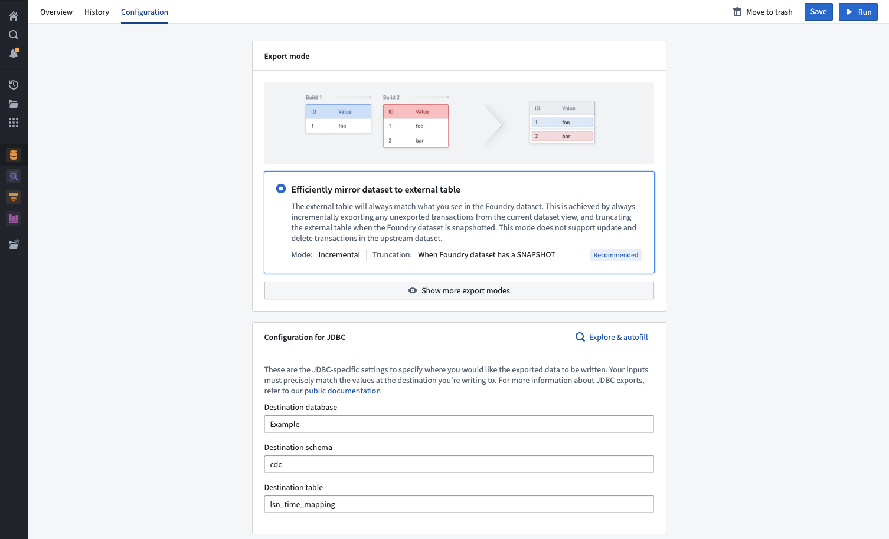
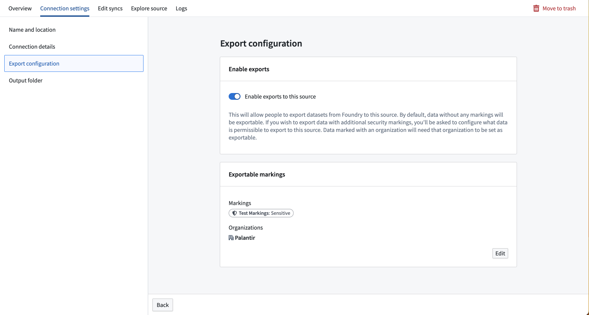
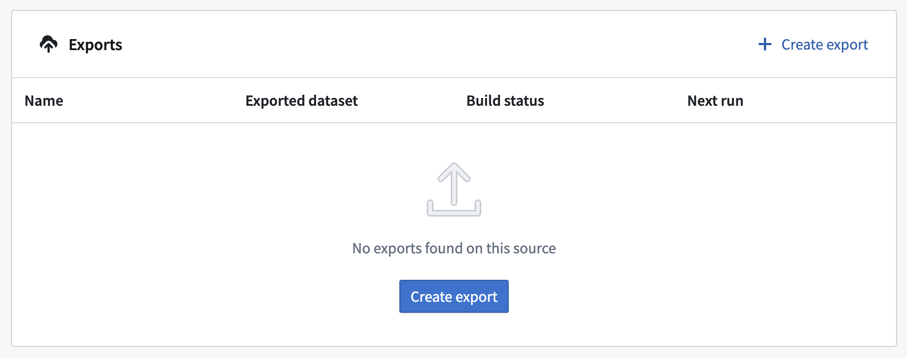
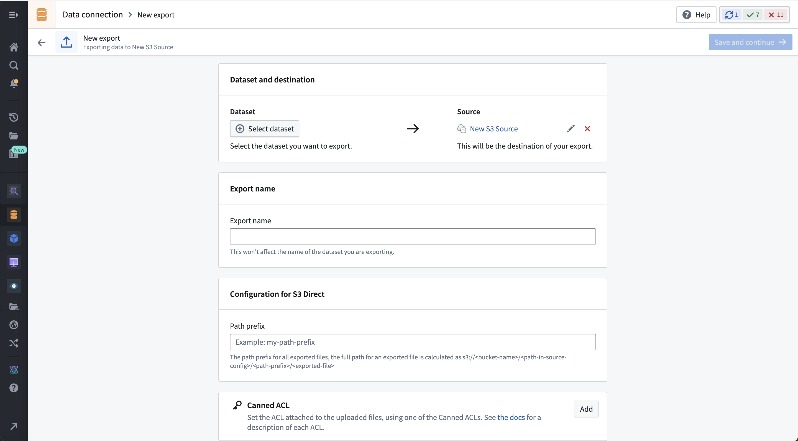
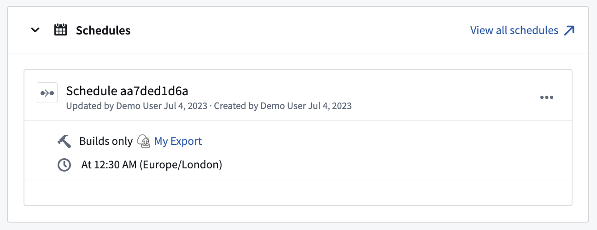

<!-- source: https://palantir.com/docs/foundry/data-connection/export-overview/ · mirrored 2026-08-18 from Palantir Foundry docs -->

# Exports

Data Connection supports exporting [datasets](/docs/foundry/data-integration/datasets/) and [streams](/docs/foundry/data-integration/streams/) from Foundry to external systems. This can be useful for a variety of purposes:

* Data cleaned and transformed in Foundry using data pipelines can be synced to systems such as data warehouses or data lakes. This pattern is described in greater detail in ["How Palantir Foundry Fuels Your Data Platform" ↗](https://blog.palantir.com/how-palantir-foundry-fuels-your-data-platform-c65c15c30e70).
* Inference results from machine learning models created using [batch deployments](/docs/foundry/model-integration/objectives/#batch-deployments) can be exported to other systems to enable operationalizing ML projects across the organization.
* Operational data captured from end users in the [Ontology](/docs/foundry/ontology/why-ontology/) can be written to other systems for analysis outside of Foundry.

:::callout{theme="warning"}
Data Connection exports are not yet supported for all source types. Review the individual source pages listed in the [source type overview](/docs/foundry/data-integration/source-type-overview/) documentation to check availability. Each source page will list either [**file export**](#file-exports), [**streaming export**](#streaming-exports), [**table export**](#table-exports), or [**legacy export task**](/docs/foundry/data-connection/export-tasks/) support if export capabilities are available. For example, the [Amazon S3](/docs/foundry/available-connectors/amazon-s3/) source type supports [file exports](#file-exports) while the [BigQuery](/docs/foundry/available-connectors/bigquery/) source requires export tasks. <br>
Some sources that do not yet support the file, streaming, or table export capability may support [legacy export task configuration](/docs/foundry/data-connection/export-tasks/). Export tasks are no longer recommended for source types that implement the updated export capability.
:::

:::callout{theme="warning" title="Updated export behavior"}
Prior to June 2025, exports have been marked as `failed` if there are no new files or rows to be exported during a build. From June 2025 onward, exports with no new files or rows to be exported will be marked as `success`. This change may impact workflows that depend on the original failure behavior; users will need to adjust affected workflows accordingly.
:::

## Export types

The behavior of exports will depend on the type of data the destination system can accept.

| Export type | Summary |
| ----------- | ------- |
| [File export](#file-exports) | Used for exporting to systems without a schema. Raw files from a dataset are copied on a schedule and written to the target system. |
| [Streaming export](#streaming-exports) | Used for exporting continuously to a system that supports event streaming. Records from a Foundry stream are pushed to the target system continuously. |
| [Table export](#table-exports) | Used for exporting to systems with a schema. Rows of a dataset are inserted on a schedule to the target system according to the selected [export mode](#table-export-modes). |

### File exports

An example of a system supporting file exports is [S3](/docs/foundry/available-connectors/amazon-s3/).

File exports write files from the selected Foundry dataset to the configured destination. By default, only files that were modified since the last successfully exported transaction on the upstream dataset will be written. This means that if a file was not updated in a given transaction, it will not be re-exported on the next scheduled or manual run of any downstream exports.

If the entire dataset must be re-exported, set up a new export on the same source or ensure your upstream transformation overwrites all files that must be exported.

By default, if a file already exists in the destination, export jobs will overwrite that file with the exported data. This behavior may vary by source type. To avoid accidentally overwriting data stored in the destination system, we recommend creating a dedicated sub-folder in which to land exported data from Foundry.

### Streaming exports

Exports to streaming destinations will stream records to the destination as long as the export job is running in Foundry. If the job is stopped and restarted, it will resume streaming records from where it left off.

The following source types support streaming exports:

* [Amazon Kinesis](/docs/foundry/available-connectors/amazon-kinesis/)
* Amazon SQS
* [Google Pub/Sub](/docs/foundry/available-connectors/pubsub/)
* [Kafka](/docs/foundry/available-connectors/kafka/)
* [PostgreSQL](/docs/foundry/available-connectors/postgresql/)
* Solace

#### Streaming export replay behavior

When configuring an export to a streaming destination, you must specify the desired behavior for when the stream is replayed in Foundry. Normally, streams are [replayed](/docs/foundry/pipeline-builder/outputs-deliver-pipeline/#additional-options-for-streaming-pipelines) after making breaking changes to the processing logic. In this case, previously processed records must be re-processed using the new logic in one of the following ways:

* **Export replayed records:** Re-export all records when the stream is replayed. Note that any previously exported records will be exported again, and the external system must be configured to handle duplicates.

* **Do not export replayed records:** Pause exports until the replayed offset matches the most recent offset in the export job. Because offsets are not guaranteed to match across replayed streams, this option often results in some number of dropped records that will never be exported.

### Table exports

:::callout{theme="neutral"}
As of June 2024, table exports are generally available but may not be available for all source types. When available, table exports are recommended over [export tasks](/docs/foundry/data-connection/export-tasks/). To check if a source type supports table exports, visit the new source page in Data Connection and look for the `Table exports` tag, or visit the documentation page for the relevant source type.
:::

Table exports allow exports to systems that contain tabular data with a known schema, where the external target schema matches the schema of a Foundry dataset you wish to export. Table exports will execute the system-specific `INSERT` statements or equivalent API calls to write rows into the target table according to the selected table export mode as described below.

#### Table export modes

The selected **export mode** specifies how data will be exported during a table export. The following export modes are available for all table exports and are also explained on the export setup page in Data Connection.

| Table export mode | Description |
| ----------------- | ----------- |
| Efficiently mirror dataset to external table (*recommended*) | The external table will always match what you see in the Foundry dataset. </br></br> This is achieved by always incrementally exporting any unexported transactions from the current dataset view and truncating the external table when there is a `SNAPSHOT` transaction on the Foundry dataset being exported. </br></br>This mode does not support `UPDATE` and `DELETE` transactions in the dataset being exported. |
| Full dataset without truncation | Always export a snapshot of the entire view of the Foundry dataset, without truncating the external table first. </br></br>Note: This option will almost always result in duplicates in the external table. This option can be useful when external systems consume and remove rows after each run or if you want to re-export already exported rows. |
| Full dataset with truncation | This option will truncate (drop) the target table, and then export a snapshot of the full current dataset view. </br></br>This will result in the external table always mirroring the Foundry dataset but is less efficient than the incremental option to "efficiently mirror to external table".</br></br>This option may be useful if edits to the external table happened between exports and you wish to always overwrite them. |
| Export incrementally | Exports *only* unexported transactions from the current view without truncating the target table. </br></br>This mode does not support `UPDATE` and `DELETE` transactions in the dataset being exported. This option mirrors the dataset with `APPEND` transactions only to avoid exporting the same data again. This mode may produce duplicate records in the target table if the upstream dataset has a `SNAPSHOT` transaction. |
| Export incrementally with truncation | This option truncates (drops) the target table, then exports only transactions from the current view that have not previously been exported. </br></br>This mode is useful when treating the target table like a message queue (for example, when another task picks up rows from the table and writes them elsewhere). </br></br>Note: This mode does not support `UPDATE` and `DELETE` transactions in the upstream dataset.
| Export incrementally and fail if not `APPEND` | Exports only unexported transactions from the current view, failing if there is a `SNAPSHOT`, `UPDATE`, or `DELETE` transaction (after the first run). </br></br> This option mirrors the Foundry dataset as long as it only contains `APPEND` transactions. It protects against potentially re-exporting all data in case there is a snapshot in the Foundry dataset and guarantees there will never be duplicate data exported to the target table. |

Export modes are not available for legacy export tasks.



#### Special considerations for table exports

* The dataset you export from Foundry must have a 1:1 match with the external source, including exact column names (case-sensitive) and data types. For example, exporting `COLUMN_ABC` of type `LONG` to a destination where `COLUMN_ABC` is of type `STRING` will fail at runtime.
* When setting up a table export, ensure that `DATABASE`, `SCHEMA`, and `TABLE` fields are filled out if required by your source. Missing any of these fields will cause the export to fail at runtime. Similarly, including unnecessary fields can also result in failure. For highest reliability, use explore source and autofill to select the destination in your source.
* When using an [agent worker](/docs/foundry/data-connection/set-up-agent/) with table exports, the agent must be running on a Linux host. Windows agents are not supported for running table exports.
* The underlying files for a dataset being exported to a tabular destination must be in Parquet format. CSV and other file types that support a schema will fail to export.
* The destination table must already exist in the source system; it will not be automatically created by Foundry.
* When using an export mode that does truncation, the credentials entered in the Foundry source configuration must have permissions to truncate the table in the external system.
* `Array`, `Map`, and `Struct` types are not supported for exports. If the dataset you are exporting contains a column with type `Array`, `Map`, or `Struct`, the export will fail.

#### SQL dialects in table exports

Table exports are currently supported for custom JDBC source types. Though Foundry provides dedicated connectors for specific systems such as Oracle, the table exports source capability will not appear as an option unless the connection is established via the [custom JDBC connection](/docs/foundry/available-connectors/custom-jdbc-sources/#custom-jdbc-sources).

When performing table exports to a custom JDBC source for which you've provided your own driver JAR file, you must confirm that Palantir's INSERT statement syntax for exporting data is compatible with the SQL dialect that your system will accept.

Below, you can find examples of the INSERT statements used by Palantir for exports to [custom JDBC sources](/docs/foundry/available-connectors/custom-jdbc-sources/#custom-jdbc-sources). These statements cannot currently be customized. If your system does not accept the statements used when running exports, you can fall back on code-based connectivity options to write to your system.

You must also ensure that the types used in your database are compatible with the supported types listed below.

##### Supported JDBC types

Supported JDBC source types include:

* `DECIMAL`
* `BIGINT`
* `BINARY`
* `BOOLEAN`
* `SMALLINT`
* `DATE`
* `DOUBLE`
* `FLOAT`
* `INTEGER`
* `VARCHAR`
* `TIMESTAMP`

##### Unsupported JDBC types

Unsupported JDBC source types include:

* `ARRAY`
* `MAP`
* `STRUCT`
* Other types not listed as supported above (such as less-common types like `GEOGRAPHY`)

If your dataset contains columns of unsupported types (such as `ARRAY`, `MAP`, or `STRUCT`), the export will fail.

##### INSERT statement examples

The examples below provide more information about the syntax used by table exports. If your source system does not support INSERT statements in this format, the INSERT statements will fail at runtime.

Assume that a `target_table` exists within our source system, with the same schema as the corresponding dataset in Foundry. Both the names and datatypes of the columns must match between the external source and Foundry. Below is a mock example of a dataset in Foundry:

| column1 | column2 | column3 |
|---------| ---------| ---------|
| value1 | value2 | value3 |
| value4 | value5 | value6 |
| value7 | value8 | value9 |

The `INSERT` statement for a single row follows the general format below:

```
INSERT INTO target_table (column1, column2, column3) VALUES ('value1', 'value2', 'value3');
```

Depending on source type, an insert statement will be applied against one or multiple rows of data. For example, Snowflake supports `batch inserts` and thus permits multiple rows to be written at once.

```
INSERT INTO target_table (column1, column2, column3) VALUES ('value1', 'value2', 'value3'), ('value4', 'value5', 'value6'), ('value7', 'value8', 'value9');
```

By contrast, a source like Apache Hive has limited support for `batch inserts` and will undergo an export via three subsequent insert statements.

```
INSERT INTO target_table (column1, column2, column3) VALUES ('value1', 'value2', 'value3');
INSERT INTO target_table (column1, column2, column3) VALUES ('value4', 'value5', 'value6');
INSERT INTO target_table (column1, column2, column3) VALUES ('value7', 'value8', 'value9');
```

##### TRUNCATE TABLE statement example

Export options like `Full dataset with truncation` will first truncate the target table at the external source, then run an insert statement. The actual code to accomplish this would look like the example below:

```
TRUNCATE TABLE table_name;
INSERT INTO target_table (column1, column2, column3) VALUES ('value1', 'value2', 'value3');
```

If a more specific dialect is needed, we recommend one of Foundry's [code-based connectivity options](/docs/foundry/data-connection/core-concepts/#use-in-code) such as [external transforms](/docs/foundry/data-connection/external-transforms/).

#### Multi-threaded table exports

Some source types support multi-threaded table exports, which can improve export performance. When using multi-threaded exports, Foundry creates a temporary staging table in the destination system to maintain atomicity. Data is written to this staging table in parallel, then copied to the final destination table when the export completes. The staging table is automatically deleted after the export finishes.

When using multi-threaded exports, credentials must have `CREATE`, `READ`, `UPDATE`, and `DELETE` permissions on tables in the destination system.

## Prepare data for export

In general, exports do not support any data transformations executed as part of the export job. This means that the dataset or stream you select to export should already be in your desired format, including filters, renamed or repartitioned files, and any other transformations of the data.

[Pipeline Builder](/docs/foundry/pipeline-builder/overview/) and [Code Repositories](/docs/foundry/code-repositories/overview/) are Foundry's tools for building data transformation pipelines; both applications should provide the complete tooling you need to prepare your data for export, including job scalability, monitoring, version-control, and the flexibility to write arbitrary logic as necessary.

### Controlling output file structure

Foundry datasets containing structured data store their underlying files under a `spark/` directory by default. If you need files to land in a specific directory structure when exported - for example, organized by date partition - you can use a [Python transform](/docs/foundry/transforms-python/overview/) to write the dataset with the desired layout before exporting.

The following Python transform uses the [filesystem API](/docs/foundry/transforms-python/unstructured-files/) to copy files directly to a date-based path:

```python
from transforms.api import transform, Input, Output
import datetime
import shutil

@transform(
    output_dataset=Output("/path/to/output/dataset"),
    input_dataset=Input("/path/to/input/dataset"),
)
def compute(input_dataset, output_dataset):
    dt = datetime.date.today().strftime("%Y%m%d")
    for file_status in input_dataset.filesystem().ls():
        relative_path = file_status.path[len("spark/"):] if file_status.path.startswith("spark/") else file_status.path
        with input_dataset.filesystem().open(file_status.path, "rb") as in_f:
            with output_dataset.filesystem().open(f"data_dt={dt}/{relative_path}", "wb") as out_f:
                shutil.copyfileobj(in_f, out_f)
```

With this transform, the exported dataset will contain files at paths such as `data_dt=20240101/part-00000-xxx.parquet` instead of `spark/part-00000-xxx.parquet`. Configure the file export to use this transformed dataset as the dataset to export. After the first build, select **Apply schema** on the dataset to make it viewable as tabular data in Foundry.

:::callout{theme="neutral"}
It is possible to allow Base64 decoding of stream records when exporting to Kafka. For more information on Kafka exports, review the full [Kafka connector documentation](/docs/foundry/available-connectors/kafka/#export-data-to-kafka).
:::

## Set up an export

### Enable exports for source

To export data, you must enable exports in the **Connection settings** section of the source to which you are exporting. Source types that support exports will show an **Export configuration** tab to the left of the screen. A Foundry user with the `Information Security Officer` role should navigate to this tab and toggle on the option to **Enable exports to this source**.

The `Information Security Officer` is a default role in Foundry; users can be granted the `Information Security Officer` role in [Control Panel](/docs/foundry/administration/enrollments-and-organizations-permissions/) under **Enrollment permissions**.

After enabling exports, you must provide the set of [markings](/docs/foundry/security/markings/) that may be exported to this source. If markings and organizations are not added in the export configuration, data with those markings or organizations will fail to export to this source. To add an exportable marking, a user must be both an `Information Security Officer` and have unmarking permission on the markings or organizations they wish to allow to be exported to this source.

As an example, you may have a dataset with a `Sensitive` marking in the `Palantir` organization. To export this dataset, you must add both the `Sensitive` marking and the `Palantir` organization to the set of **Exportable markings** for this source.

Exportable markings also control which resource metadata can appear in [Slack notifications from monitoring views](/docs/foundry/monitoring-views/external-systems/#configure-exportable-markings-for-resource-name-visibility).



:::callout{theme="warning"}
The credentials entered in the Data Connection source configuration must have write access on the table in the external system. For example, [S3](/docs/foundry/available-connectors/amazon-s3/) requires the `"s3:PutObject"` permission. Other [file exports](#file-exports) may require specific permissions to create directories if the target path does not already exist. [Table exports](#table-exports) may require additional permissions [when using an export mode that does truncation](#special-considerations-for-table-exports).

Review the individual source pages listed in the [source type overview](/docs/foundry/data-integration/source-type-overview/) documentation for source-specific considerations.
:::

### Create a new export

To create an export, first navigate to the **Overview** page of the source to which you want to export.

If this is the first export you are setting up for the given source, you will see an empty table and a button to create an export.



Select **Create export**, then select the dataset or stream to export and any source-specific export configuration options. These options will vary by source connector and are explained on the corresponding [source type](/docs/foundry/data-integration/source-type-overview/) pages in our documentation. If multiple branches exist on the exported dataset, only data on the master branch will be exported.

The example below shows the export configuration interface for the [S3](/docs/foundry/available-connectors/amazon-s3/) connector:



After saving the export, you will land on the export management page where you can do the following:

* Manually run the export.
* Set a schedule for the export.
* View export history.
* Modify configuration options.

:::callout{theme="warning"}
Streaming exports use a **start/stop** button instead of a **run** button. If a schedule is configured on a streaming export, it will behave similarly to schedules on other streams; if the stream is stopped when the schedule triggers, it will be automatically restarted. If the stream is not stopped when the schedule triggers, it will continue to run.
:::

:::callout{theme="warning"}
Some source export options may not be editable after initial setup. If immutable options must be changed, you must delete and re-create the export.
:::

## Scheduling exports

Exports should be scheduled to run regularly, exporting recent data to the external destination. Streaming exports do not need to be scheduled since they should simply be started or stopped.

To schedule an export, navigate to the **Overview** page for the export. Then, select **Add schedule** to open the export in [Data Lineage](/docs/foundry/data-lineage/overview/). From there, select **Create new schedule** to the right of your screen and configure as you would for any other job. Learn more about [available scheduling options](/docs/foundry/data-integration/schedules/).

View any schedules that trigger a specific export on the **Overview** page for that export, as shown below:



## Export history

Similar to [syncs](/docs/foundry/data-connection/set-up-sync/), exports run as jobs using the Foundry [build system](/docs/foundry/data-integration/builds/). The **History** view of an export shows the history of the jobs associated with it. Each job may be opened and viewed in the **Builds** application by selecting **View build report** to the upper right of the **Job details** section.

For streaming exports, the export history will also display if the streaming export job is currently running or stopped.

## Exports vs. export tasks

Table exports are intended to fully replace the now sunsetted [export tasks](/docs/foundry/data-connection/export-tasks/) that will eventually be deprecated according to the published [product lifecycle](/docs/foundry/platform-overview/development-life-cycle/#sunset). While much of the functionality offered by export tasks is available in the new export options, there are some differences in the features and configurations.

### Migrating from export tasks to table exports

Migrations from export tasks to new export options must be performed manually. Configure your export using the options documented below; once the new export process is working as expected, manually delete the export task that was previously used.

If a feature available in export tasks has no equivalent option in new exports, the recommended migration is to switch to using [external transforms](/docs/foundry/data-connection/external-transforms/). External transforms provide a flexible alternative for executing custom logic that interacts with an external system, and are intended to be used when the UI configuration options for source capabilities do not cover the required functionality.

### Feature comparison between exports and export tasks

| Export task option | Supported in new exports? | Details |
| ------------------ | ------------------------- | ------- |
| `parallelize: <boolean>` | Depends on the source type | This may be relevant on a per-source basis, and support for it will be documented in source-specific export settings if available |
| `preSql: <sql statements>` | Not supported | If this is needed for your use case, use [external transforms](/docs/foundry/data-connection/external-transforms/). |
| `stagingSql: <sql statements>` | Not supported | If this is needed for your use case, use [external transforms](/docs/foundry/data-connection/external-transforms/). |
| `afterSql: <sql statements>` | Not supported | If this is needed for your use case, use [external transforms](/docs/foundry/data-connection/external-transforms/). |
| `manualTransactionManagement: <boolean>` | Not supported | If this is needed for your use case, use [external transforms](/docs/foundry/data-connection/external-transforms/). |
| `transactionIsolation: READ_COMMITTED` | Not configurable | This may be available as a source configuration option, and it will be applied when performing exports. Check source-specific documentation to see if this configuration option is available. |
| `datasetRid: <dataset rid>` | Supported | The dataset or stream you wish to export |
| `branchId: <branch-id>` | Not configurable | Data is always exported from the `master` branch. |
| `table:`</br>    `database: mydb # Optional`</br>    `schema: public # Optional`</br>    `table: mytable` | Supported | These options are specific to [table exports](#table-exports) on the [JDBC source](/docs/foundry/available-connectors/custom-jdbc-sources/#export-data-to-jdbc-sources). |
| `writeDirectly: <boolean>` | Not configurable | New exports always use the option equivalent to `writeDirectly: true`. |
| `copyMode: <insert\|directCopy>` | Not configurable | New exports always use the option equivalent to `copyMode: insert`. |
| `batchSize: <integer>` | Depends on the source type | Batch size is supported for exports on the [JDBC source](/docs/foundry/available-connectors/custom-jdbc-sources/#export-configuration-options-for-jdbc-sources) but may not be supported for other source types. |
| `writeMode: <ErrorIfExists\|Append\|Overwrite\|AppendIfPossible>`</br></br>`incrementalType: <snapshot\|incremental>` | Supported | Together, these options are similar to the [table export modes](#table-export-modes) documented above. Not all combinations are valid for export tasks, and the combinations have been [normalized ↗](https://en.wikipedia.org/wiki/Database_normalization) into the six modes offered for table exports. |
| `exporterThreads: <integer>` | Not supported | If you need granular control over exporter threads, use [external transforms](/docs/foundry/data-connection/external-transforms/). |
| `quoteIdentifiers: <boolean>` | Not supported | This option is only relevant when creating tables in the target system, which is not supported in new exports. The table must exist before an export can be configured. |
| `exportTransactionIsolation: READ_UNCOMMITTED` | Not configurable | As with `transactionIsolation: READ_COMMITTED`, the transaction isolation will be taken from the source configuration if available and configured. |
