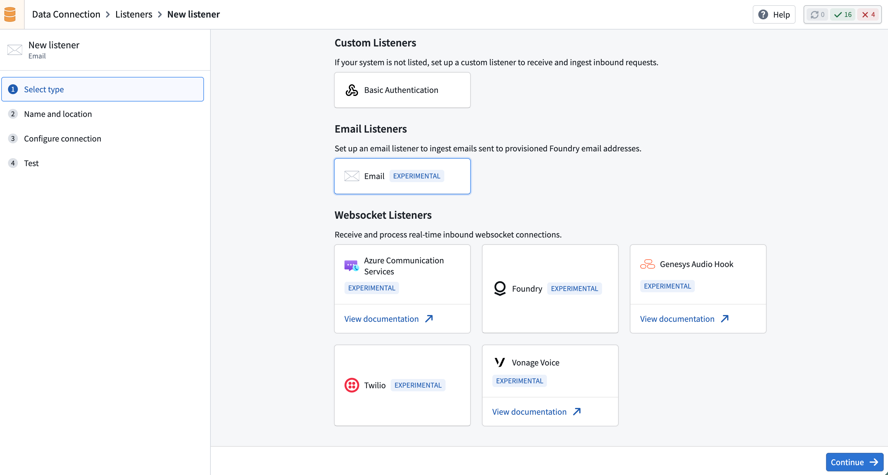
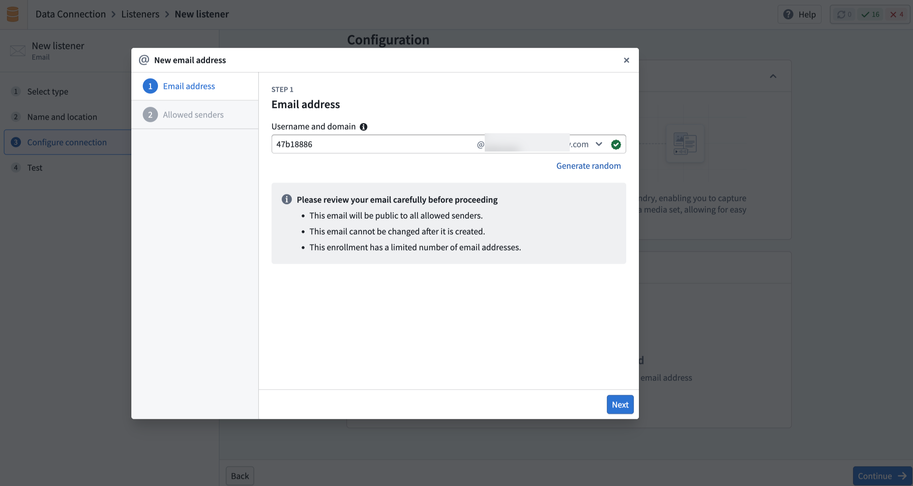
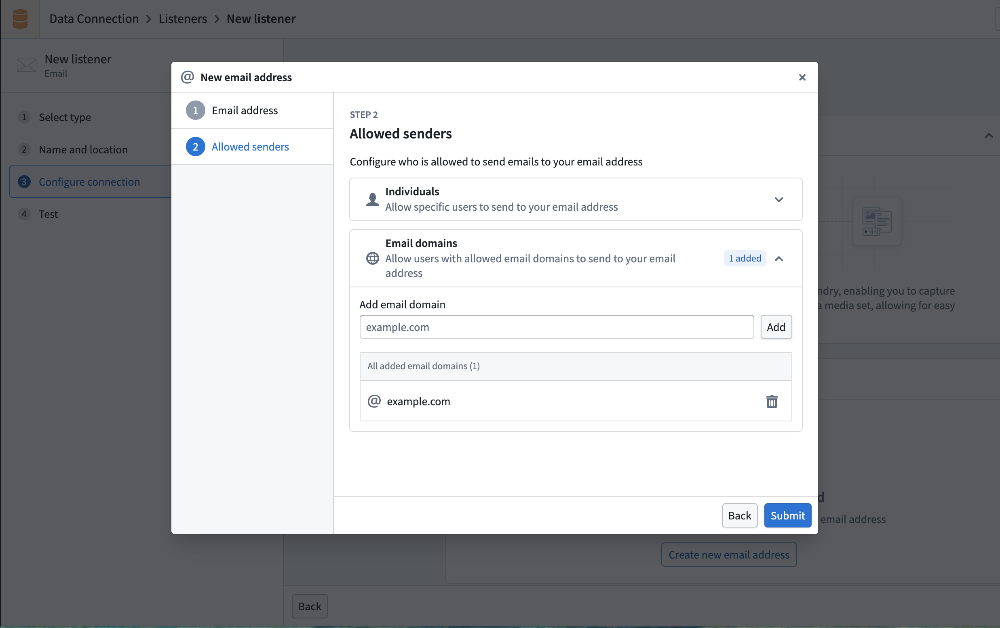
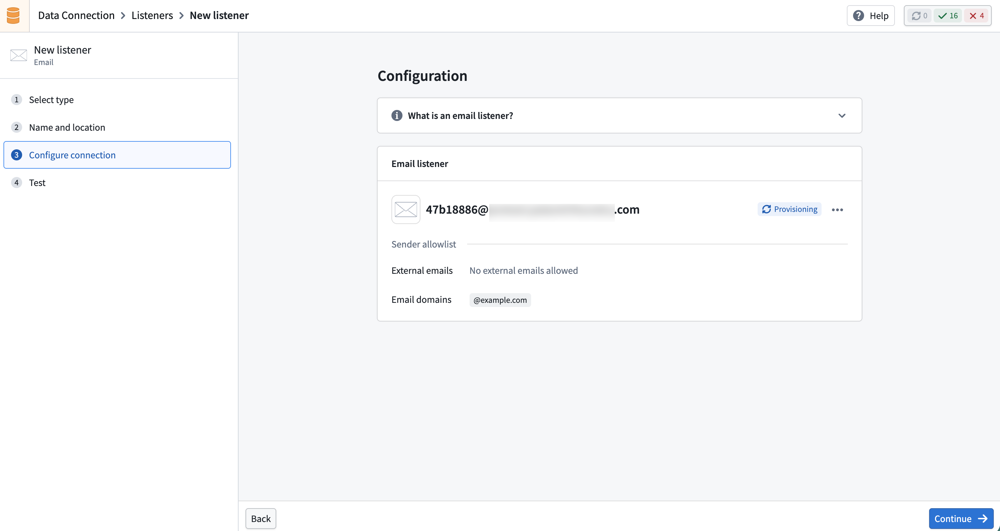
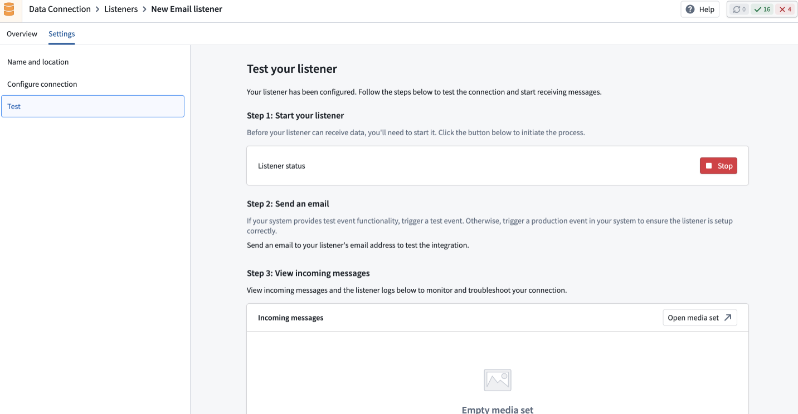
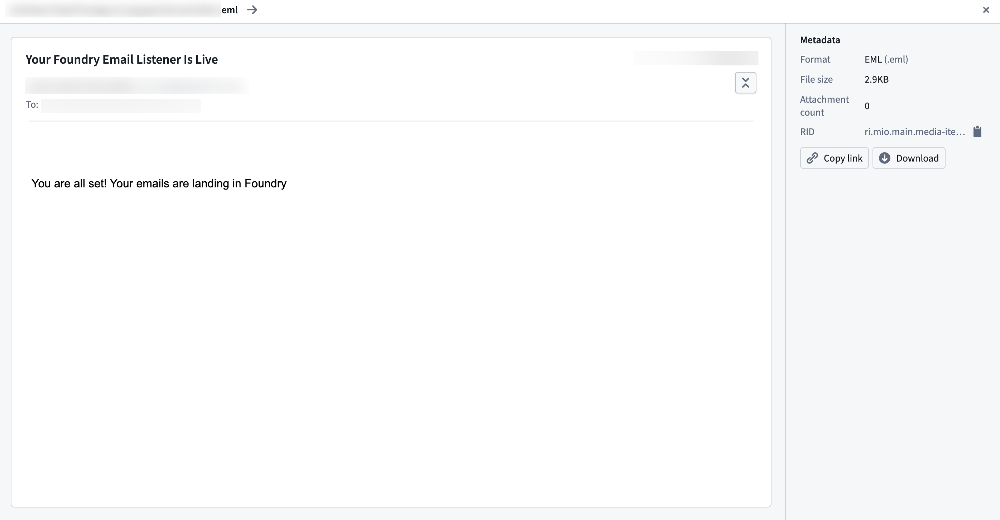

<!-- source: https://palantir.com/docs/foundry/data-connection/listeners-email/ · mirrored 2026-08-18 from Palantir Foundry docs -->

# Email listeners

:::callout{theme="neutral" title="Beta"}
Email listeners are in the [beta](/docs/foundry/platform-overview/development-life-cycle/) phase of development and may not be available on your enrollment. Functionality may change during active development. Contact Palantir Support to request access to email listeners.
:::

Email listeners receive inbound emails at dedicated, Foundry-managed email addresses. Incoming emails are validated, parsed, and forwarded to the platform for processing.

Unlike HTTPS and WebSocket listeners that receive connections from external systems over the network, email listeners receive standard email sent to a Foundry-managed address.

## Configure a listener

Navigate to **Data Connection > Listeners** to set up an email listener.

For information on securely configuring email listeners and incoming messages, refer to the [email listener security](/docs/foundry/data-connection/listeners-email-security/) documentation.

### 1. Create a new listener

Select **Create new listener** and choose the email listener type.

### 2. Configure connection

Configure a unique email address for the listener.

Then, configure the sender allowlist to control which senders can deliver email to the listener. You can allow specific email addresses or entire domains.

:::callout{theme="warning" title="Security"}
By default, email listeners do not accept email from any sender. You must explicitly configure which senders are permitted.
:::

After creation, the listener enters a **Provisioning** state and requires approval before it can begin receiving emails.

### 3. Activate the listener

Once the email address is approved and configured, activate the listener to begin receiving emails. Activated listeners process incoming emails and forward their content to a media set.

### 4. Test the listener

Send a test email to the listener address to verify that it is receiving and processing messages correctly.

## Listener states

Email listeners follow a lifecycle with the following states.

| State | Description |
|-------|-------------|
| **Provisioning** | The listener is being set up and is not yet processing emails. |
| **Active** | The listener is receiving and processing inbound emails. |
| **Inactive** | The listener is paused and can be reactivated. |
| **Rejected** | The approval request was denied. The listener can only be deleted. |

You can deactivate an active listener at any time to temporarily stop processing emails, and reactivate it when needed.

## Limitations

* Individual email messages are limited to 40 MB in size, including attachments.
* Certain executable and script attachment types are blocked for security purposes (for example, `.exe`, `.bat`, and `.js` files).
* Each enrollment is limited to a maximum of 10 email listeners. Contact Palantir Support if you require more.
