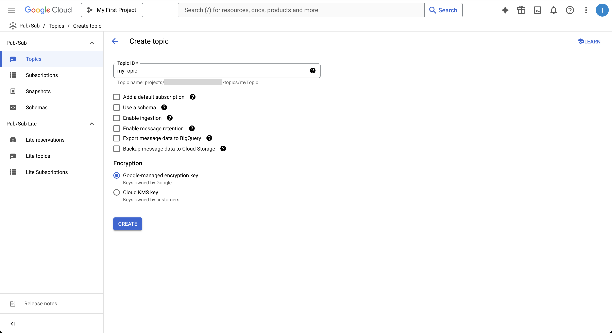
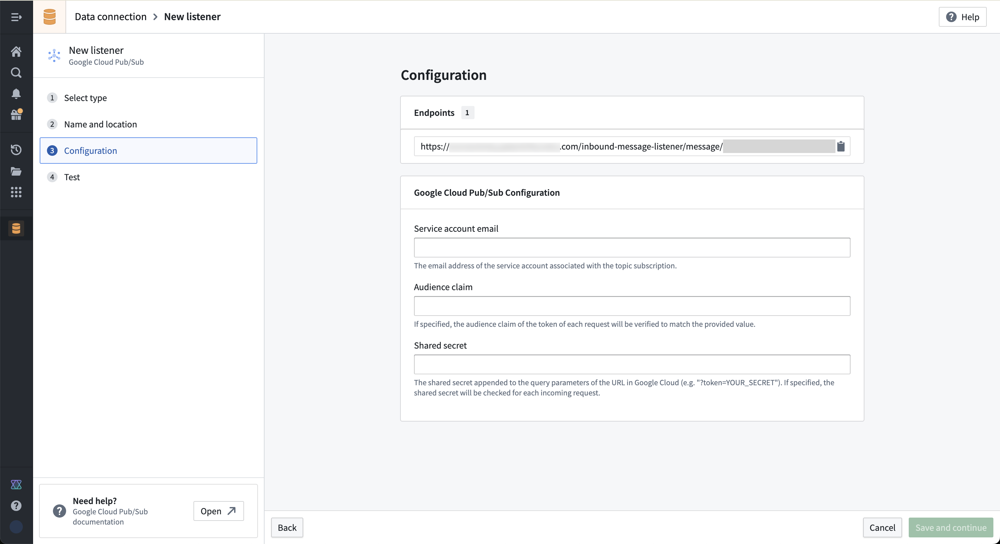
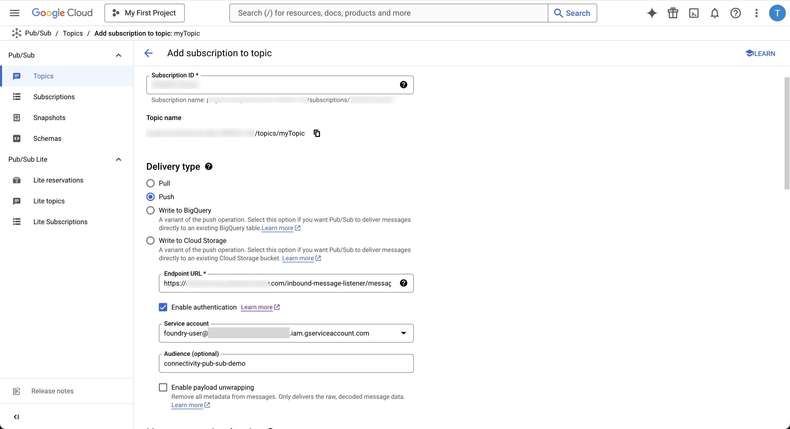
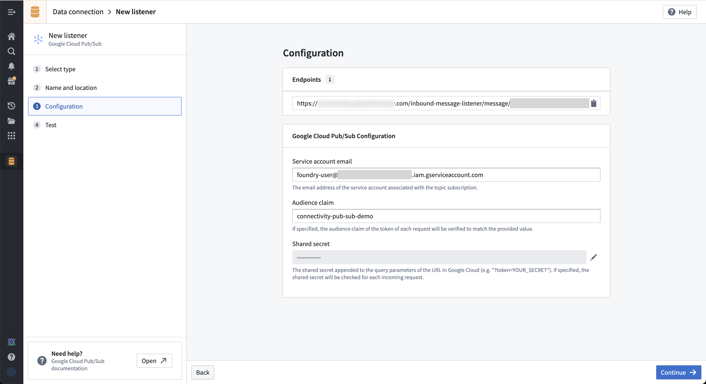
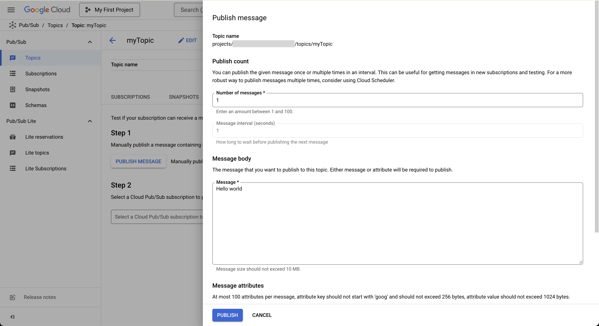
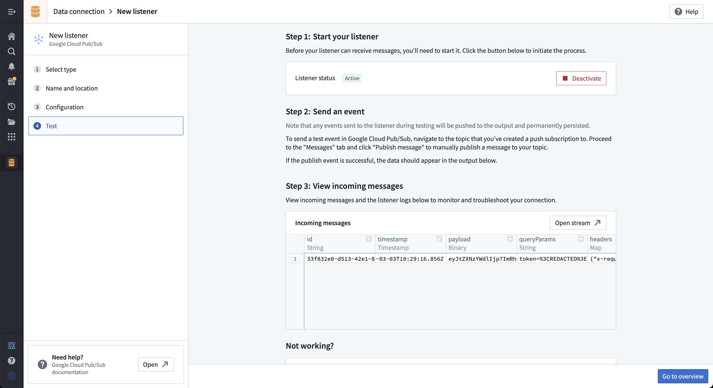

<!-- source: https://palantir.com/docs/foundry/data-connection/listeners-google-pub-sub/ · mirrored 2026-08-18 from Palantir Foundry docs -->

# Set up a Google Cloud Pub/Sub listener

This guide shows step-by-step how to configure a listener for Google Pub/Sub to get a real-time feed of events from a Pub/Sub topic to a Foundry streaming dataset.

Google Pub/Sub can be used in conjunction with various Google Cloud services to route events to Foundry. For example, it can be used for streaming emails from a Gmail account. [Review guidance provided by Google for streaming from Gmail ↗.](https://developers.google.com/gmail/api/guides/push)

[Learn more about Google Pub/Sub. ↗](https://cloud.google.com/pubsub)

## Prerequisites

Prior to configuration, ensure:

* Your enrollment's ingress policy has been appropriately configured to accept Google Pub/Sub requests. You can either allow-list the [IPs of your Google Cloud region ↗](https://www.gstatic.com/ipranges/cloud.json), or  the countries. [Learn how to Configure ingress.](/docs/foundry/administration/configure-ingress/) Note that the provider may alter the IPs anytime after the listener has been implemented and you would need to update ingress appropriately.

* You have access to Pub/Sub in the Google Cloud Console.

## Instructions

1. Create a Pub/Sub topic if you do not already have one. This is the stream of events that will be pushed to your Foundry Listener.   
      

2. Navigate to the **Listeners** tab in Data Connection. Create a Foundry Pub/Sub listener by selecting Google Cloud Pub/Sub from the listener type menu. This step will not finish setting up the listener, but is required to generate the listener URL which is then used in step 3.   
      

3. Create a subscription for your Google Pub/Sub topic from step 1.

   a. Select **Push** as the subscription type.

   b. Copy the URL generated from step 2 into the **URL**
   field for your push subscription.

   c. Tick the box to enable **Authentication**. [Review Pub/Sub authentication information on external documentation. ↗](https://cloud.google.com/pubsub/docs/push?authuser=1#authentication)

   * Select a service account to use for authentication.
   * To use a shared secret, enter your shared secret into the URL field as a query parameter after the listener endpoint URL. Example: `?token=<YOUR_TOKEN>`

   d. Save your subscription.   
      

4. Copy the **service account email address**, optional **audience claim**, and optional **shared secret** into the listener configuration as shown below then **Continue**.   
      

5. Administrator approval is now required from the Information Security Officer. Review the toggle description.

6. Select **Start** on the listener **Test** page to turn on your listener and start accepting events.

7. Send a test message to your topic, and see it appear in the listener test interface.   
      
      

:::callout{theme="neutral"}
The payload arrives base64 encoded. You can decode it in a streaming pipeline using the base64 decode transformation board in order to get a string representation of the message.
:::

***

*All screenshots of Google Cloud Pub/Sub™ are provided for reference purposes only and are the property of Google LLC.*
