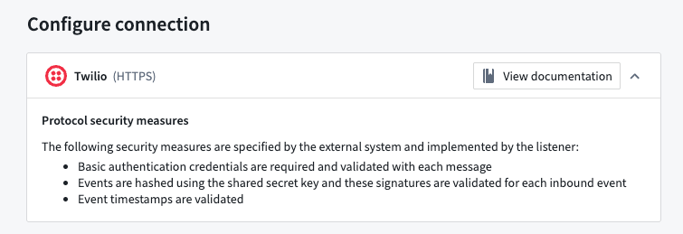

<!-- source: https://palantir.com/docs/foundry/data-connection/listeners-https-security/ · mirrored 2026-08-18 from Palantir Foundry docs -->

# HTTPS listener security

HTTPS listeners differ from standard Foundry data ingestion, so ensure that you understand these security paradigms before enabling your connections.

## Request authorization

Request interfaces for HTTPS listeners are defined by external systems, so they do not conform to standard Foundry authentication or authorization mechanisms. Instead, listeners implement the security protocols laid out by those external systems, which vary widely.

Palantir makes no guarantees about the suitability or effectiveness of these external system protocols. You are responsible for ensuring that you understand which guarantees each protocol does or does not provide for the incoming requests and data.

The specific protocols implemented for each listener can be found in the **Configuration** step of the listener setup wizard, as well as the external system's documentation.

## Redaction and data security

A minimal set of redactions is sometimes performed on incoming data. It is important to note that these redaction mechanisms are best effort, and Palantir cannot guarantee that sensitive data, such as tokens, will be completely redacted from request bodies.

For HTTPS listeners it is essential to *secure both your listener and the output stream*. This includes restricting access to both by placing them in a restricted project, as well as applying [markings](/docs/foundry/security/markings/) on the listener when necessary.

## Subdomains

HTTPS listeners can be mounted to dedicated subdomains, allowing for granular ingress control, comprehensive governance workflows, and isolation of less secure endpoints from the environment's primary enrollment domains. [Learn more about listener subdomains](/docs/foundry/data-connection/listeners-subdomains/).

## Endpoint rotation

If the listener's endpoint is compromised, it can be rotated to a new endpoint. [Learn more about endpoint rotation](/docs/foundry/data-connection/listeners-subdomains/#endpoint-rotation).
