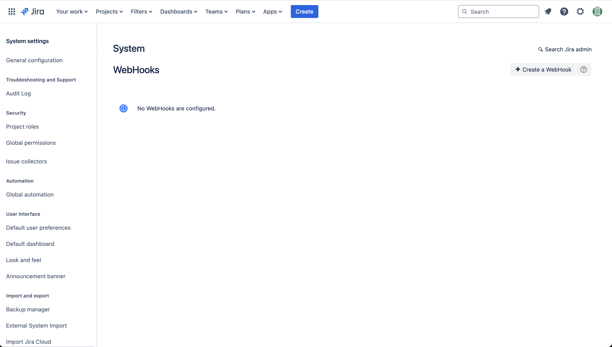
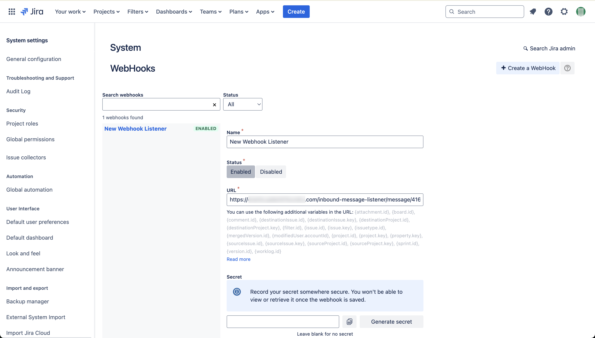
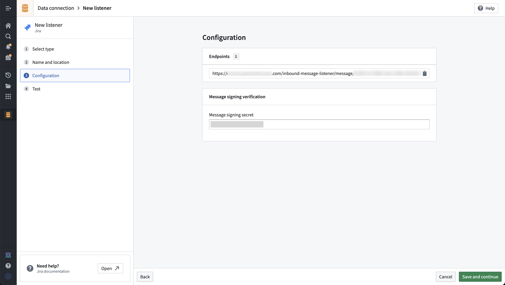
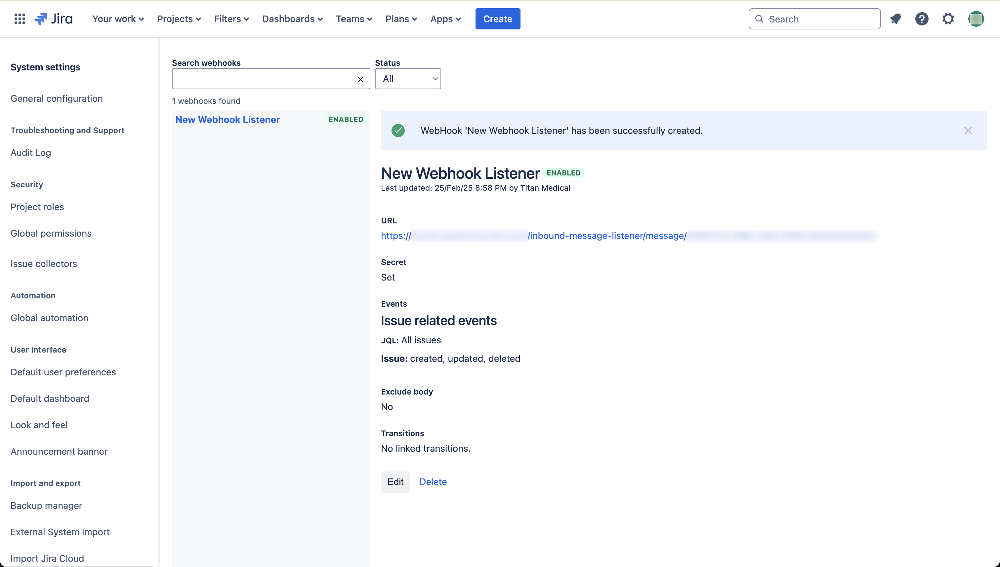
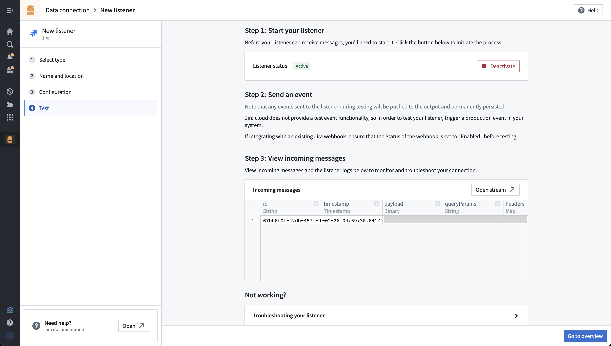
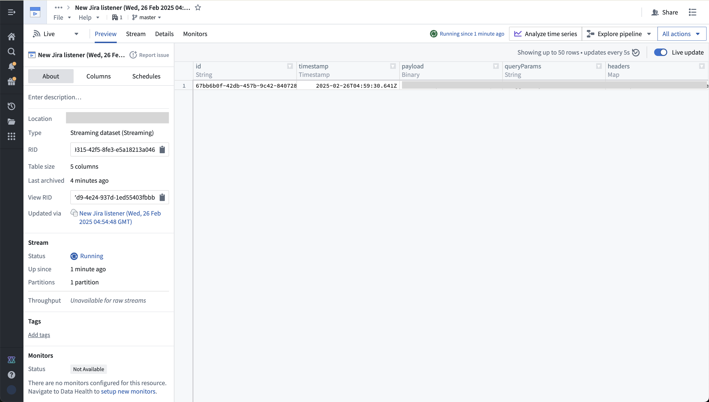

<!-- source: https://palantir.com/docs/foundry/data-connection/listeners-jira/ · mirrored 2026-08-18 from Palantir Foundry docs -->

# Set up a Jira listener

This guide shows step-by-step how to configure a listener for Jira Cloud, to get a real-time feed of events from Jira to a Foundry streaming dataset.

[Learn more about Jira. ↗](https://developer.atlassian.com/cloud/jira/platform/)

## Prerequisites

Prior to configuration, ensure:

* Your enrollment's ingress policy has been appropriately configured. [Learn how to Configure ingress.](/docs/foundry/administration/configure-ingress/). Review [Jira documentation pertaining to IP addresses and domains ↗](https://support.atlassian.com/organization-administration/docs/ip-addresses-and-domains-for-atlassian-cloud-products/).

* You must have your own instance of Jira with administrator access.

## Instructions

1. Create a WebHook in Jira. This can be done in the Jira admin panel by navigating to `https://<your jira domain>/plugins/servlet/webhooks#`. [Visit public Jira documentation on webhooks ↗.](https://support.atlassian.com/jira-cloud-administration/docs/manage-webhooks/)   
      
      

2. Create a Jira listener in the Palantir platform. This will generate the listener URL that you need to copy and paste into the Jira `URL` field when creating a WebHook.

   a. You should also generate a message signing secret in Jira, and copy to the message signing secret in the Foundry listener configuration. You can also set up without a signing secret.   
      

3. Choose the set of Jira events that should be sent to your listener and then select **Create**. The screenshotted example shows subscription for the issue created, updated, and deleted events:   
      

4. Save the listener configuration in Foundry to proceed. Administrator approval is now required from the Information Security Officer. Review the toggle description.

5. Select **Start** in the listener test screen to start your listener.   
      

6. You will need to allow inbound traffic from the system that is pushing data to your Foundry enrollment. This can be done in Control Panel by an Information Security Officer for your Foundry enrollment. [Documentation on managing ingress in the Palantir platform.](/docs/foundry/administration/configure-ingress/)

7. Test the new configuration by making a change to trigger an event to your listener. You should see it appear in the incoming messages view in data connection, as well as in the underlying stream that the listener outputs to.   
      

You can now use this streaming data in Foundry pipelines, to put data into the ontology, or monitor using Automate to trigger effects in real time.

***

*All screenshots of Atlassian Jira® are provided for reference purposes only and are the property of Atlassian Corporation Plc.*
