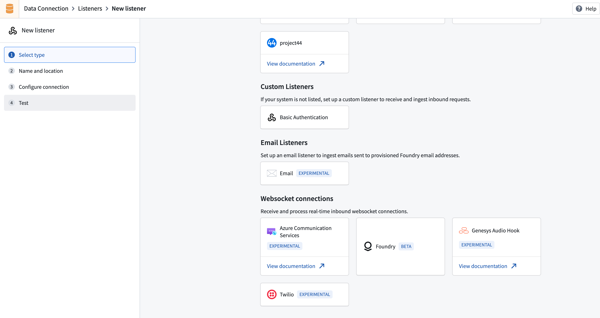
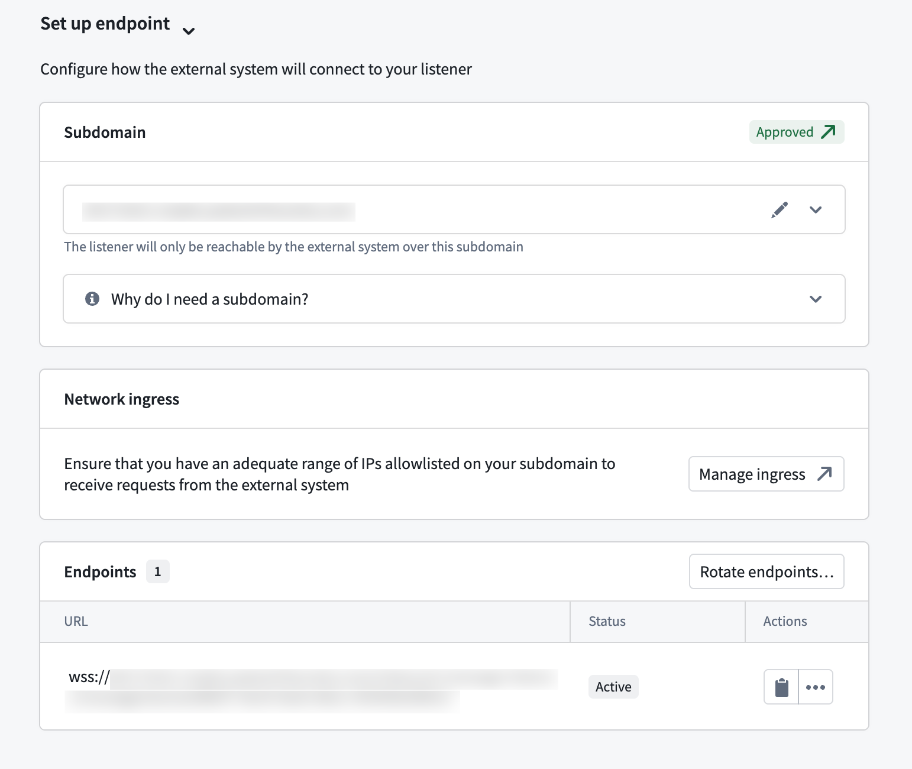
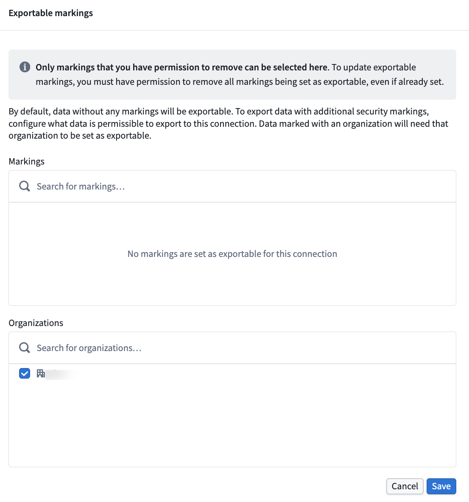
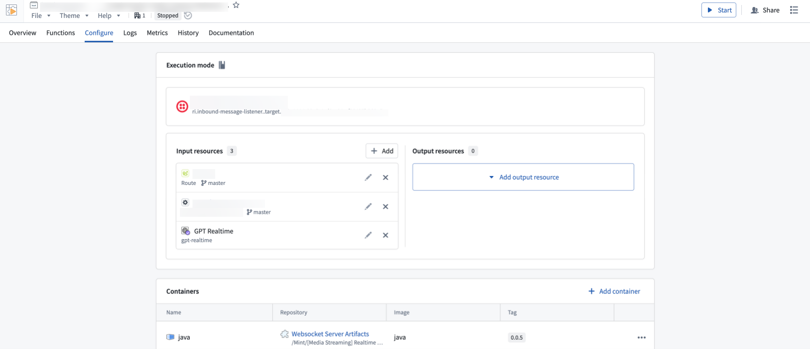

<!-- source: https://palantir.com/docs/foundry/data-connection/listeners-websocket/ · mirrored 2026-08-18 from Palantir Foundry docs -->

# WebSocket listeners

:::callout{theme="warning" title="Experimental"}
WebSocket listeners are an experimental capability that may not be available on your enrollment. To enable this capability, contact Palantir Support.
:::

WebSocket listeners are primarily designed for real-time audio and telephony workflows, enabling bidirectional communication between external services and Foundry. Unlike [HTTPS listeners](/docs/foundry/data-connection/listeners-https/) that receive webhook requests and write to streams, WebSocket listeners maintain persistent connections for continuous data streaming into a custom WebSocket server hosted in a [compute module](/docs/foundry/compute-modules/overview/). For security considerations specific to HTTPS listeners, see [HTTPS listener security](/docs/foundry/data-connection/listeners-https-security/).

Because WebSocket connections are bidirectional, your compute module can also send responses back to the source system during an active connection. For example, in a telephony workflow, you can process incoming audio and send generated audio back to the caller in real time.

## When to use WebSocket listeners

You can use WebSocket listeners in the following situations:

* The external system uses the WebSocket protocol for data delivery.
* The integration requires bidirectional communication, for example, sending responses back during a call.
* You are processing continuous audio streams from telephony systems.

## Set up a WebSocket listener

### 1. Create a WebSocket listener

1. Navigate to **Data Connection > Listeners**.
2. Select **Create new listener** and choose the WebSocket connector you need.

:::callout{theme="neutral" title="Connector availability"}
If the connector you require is not present, contact Palantir Support to enable it for your enrollment.
:::

### 2. Configure an endpoint

All WebSocket listeners must be mounted on a dedicated subdomain. You must configure your Foundry instance to accept inbound connections from the external system's IP ranges.

1. Create a listener subdomain in **Control Panel > Domains & certificates**. [Learn more about listener subdomains](/docs/foundry/data-connection/listeners-subdomains/).
2. Configure ingress to allow connections from your external system. Refer to the [Configure ingress documentation](/docs/foundry/administration/configure-ingress/).
3. Mount the subdomain to your listener. This requires approval before you can start receiving requests.

### 3. Configure security

Each WebSocket listener type has specific authentication requirements. Configure the appropriate credentials in the **Configure security** section of your listener's **Configure connection** page.

Next, navigate to the **Configure server** page and specify which exportable markings your listener should allow. [Learn more about WebSocket listener security](/docs/foundry/data-connection/listeners-websocket-security/).

### 4. Configure a compute module

WebSocket listeners route incoming data to a compute module for processing. When you create a listener, a compute module is automatically created for you—this is currently the only supported way to handle WebSocket connections in listeners.

To configure the compute module, follow the steps below:

1. From the listener's **Configuration** page, navigate to the linked compute module.
2. Add the Foundry resources your compute module needs as inputs and outputs. By default, the compute module has no permissions—you must explicitly grant access to each resource. [Learn more about configuring compute modules.](/docs/foundry/compute-modules/overview/)
3. Start your compute module and check the **Logs** tab to confirm everything is running as expected.

## Supported WebSocket listeners

The following WebSocket listener types are available:

* [Twilio Media Streams ↗](https://www.twilio.com/docs/voice/tutorials/consume-real-time-media-stream-using-websockets-python-and-flask): Streams real-time audio from Twilio voice calls over WebSocket connections.
* [Azure Communication Services ↗](https://learn.microsoft.com/azure/communication-services/how-tos/call-automation/audio-streaming-quickstart): Streams audio from Azure Communication Services call automation workflows.
* [Genesys AudioHook ↗](https://developer.genesys.cloud/devapps/audiohook): Streams real-time audio from Genesys Cloud voice interactions using the AudioHook protocol.

***

*All product names, logos, and brands mentioned are trademarks of their respective owners. All company, product, and service names used in this document are for identification purposes only.*
