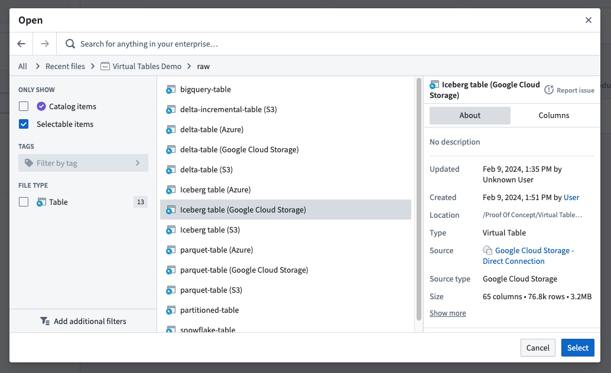

<!-- source: https://palantir.com/docs/foundry/data-connection/marketplace-virtual-tables/ · mirrored 2026-08-18 from Palantir Foundry docs -->

# Add virtual tables to a Marketplace product

Use [Foundry DevOps](/docs/foundry/devops/overview/) to include your [virtual table](/docs/foundry/data-integration/virtual-tables/) in a [Marketplace product](/docs/foundry/devops/core-concepts/#product) for other users to install and reuse. [Learn how to create your first product.](/docs/foundry/foundry-devops/create-products/)

## Supported features

All virtual tables may be packaged and synced.

Currently, packaging an individual source is not supported, nor is packaging a source that has auto-registration of virtual tables enable.

Installers must ensure the destination source contains a table at the same location with the same schema as the original source to guarantee compatibility and functionality.

## Adding virtual tables to products

To add a virtual table to a product, first [create a product](/docs/foundry/foundry-devops/create-products/), then [add outputs](/docs/foundry/foundry-devops/create-products/#add-outputs). Choose the **Add files** option to navigate to the virtual table from within the [Compass](/docs/foundry/compass/overview/) filesystem and add it to your product.

You can then select which virtual tables you would like to include in your product.

