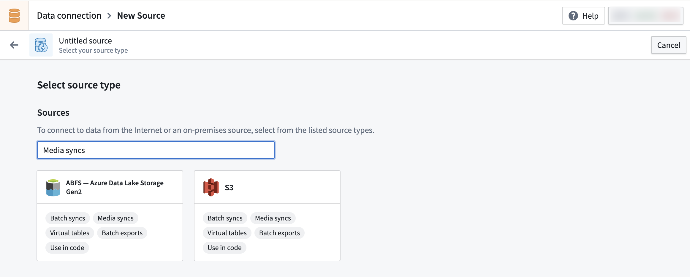
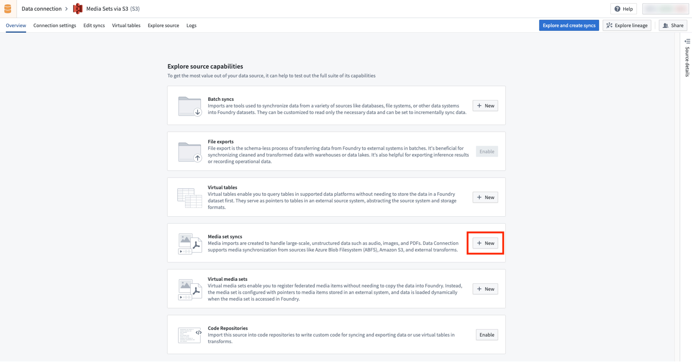
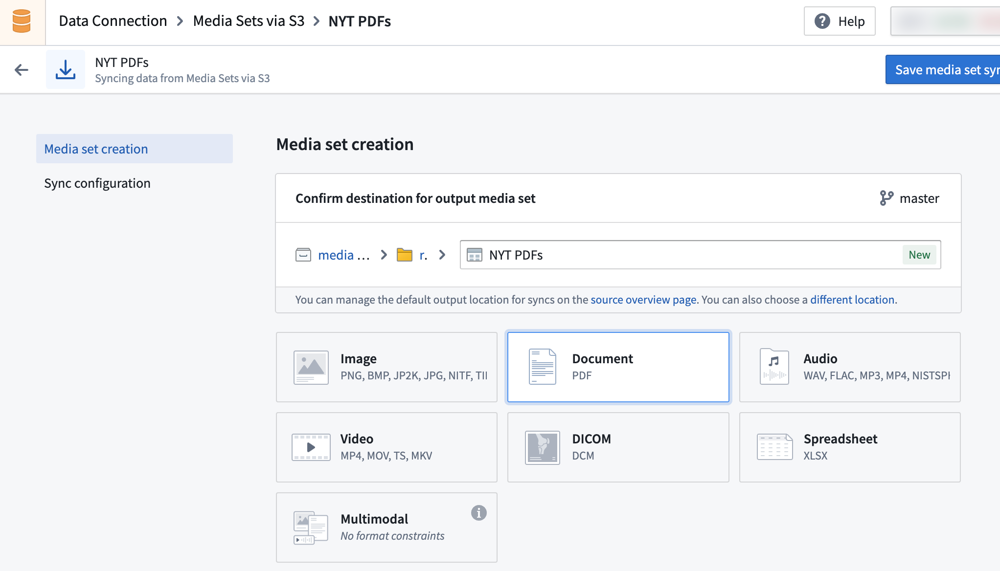
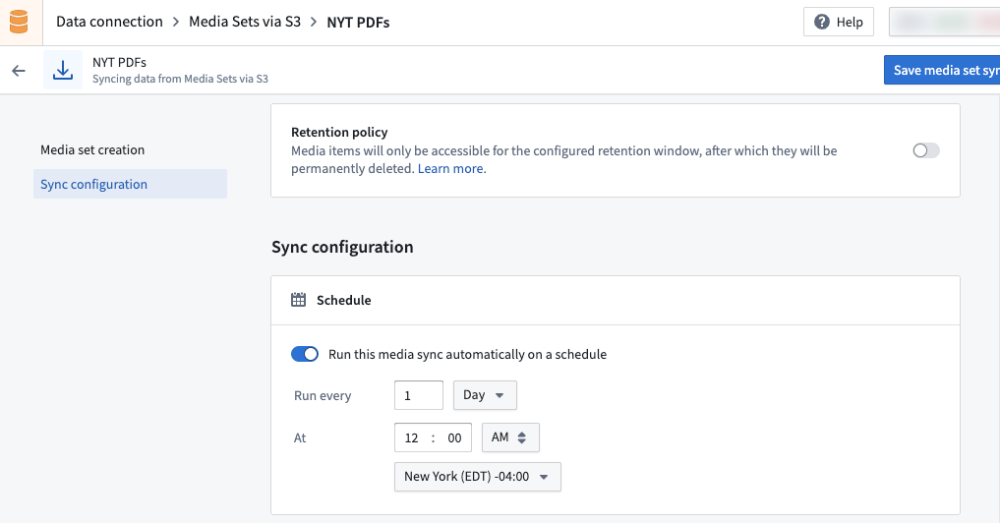
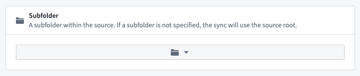
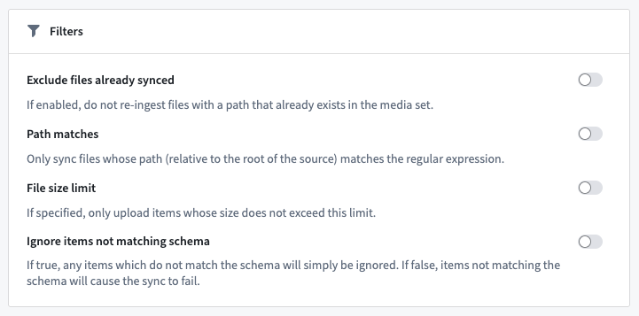
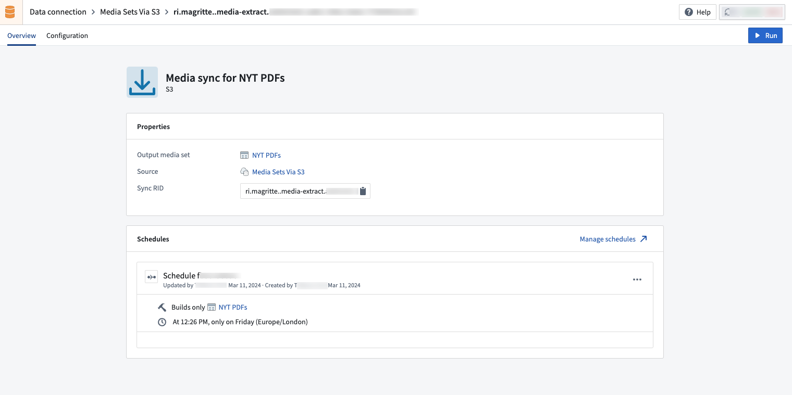

<!-- source: https://palantir.com/docs/foundry/data-connection/media-set-sync/ · mirrored 2026-08-18 from Palantir Foundry docs -->

# Media set syncs

This page discusses how to set up a media set source and sync into Foundry via Data Connection.

The following source types support media syncs:

* [Amazon S3](/docs/foundry/available-connectors/amazon-s3/)
* [OneLake and Azure Blob Filesystem (ABFS)](/docs/foundry/available-connectors/onelake-and-azure-blob-filesystem/)

A growing list of sources support media syncs. However, if your desired file-based source is not yet supported, you can ingest your files within a dataset and convert them into media sets via [Python transforms](/docs/foundry/transforms-python/media-sets/). For example, to ingest files from SharePoint Online into a media set, you can use the [SharePoint Online connector](/docs/foundry/available-connectors/sharepoint-online/) to sync files into a Foundry dataset, then create a Python transform that reads those files and writes them into a media set. The [SMB connector](/docs/foundry/available-connectors/smb/#read-files-from-smb-and-upload-as-media-sets) documentation includes a similar example.

## Set up a media set source and sync

:::callout{theme="neutral"}
For supported source types, you can also create a virtual media set sync instead of a regular media set sync. Virtual media sets read directly from the external source system without copying files into Foundry's backing store. To set up a virtual media set sync, follow the instructions below but select **Virtual media set sync** instead of **Media set sync**. Learn more about [virtual media sets](/docs/foundry/media-sets-advanced-formats/virtual-media-sets/).
:::

1. Find a supported source by navigating to the **Source** page via **+ New Source**. Then, search for **Media Sync** to find all supported sources.

2. Ensure you have permissions to import any necessary network policies and then set up supported source using the appropriate instructions below:

* [Amazon S3](/docs/foundry/available-connectors/amazon-s3/)
* [OneLake and Azure Blob Filesystem (ABFS)](/docs/foundry/available-connectors/onelake-and-azure-blob-filesystem/)

3. In the **Overview** page of the source, find the **Media set syncs** section to create a media set sync.

4. Set up the media set sync by selecting the desired media file types. See [supported media set schemas](/docs/foundry/media-sets-advanced-formats/media-overview/#supported-media-set-schemas).

5. Create the desired build schedule for your media sync ingest. You can edit the schedule after the initial configuration.

6. Select the relevant subfolder within your source. If your media files are at the root path, there is no need to add a subfolder configuration.

7. Set up your sync filters. Available sync filters include **Exclude files already synced**, **Path matches**, **File size limit**, and **Ignore items not matching schema**.

8. Choose **Save media set sync** when you have selected your initial configuration.

9. Select **Run** to trigger your first sync and view your media sync.

Once you have set up your media set sync, learn how to leverage your media set with [transforms in Pipeline Builder](/docs/foundry/pipeline-builder/transforms-transform-media/).
