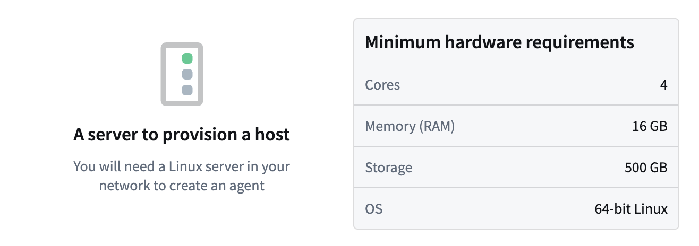
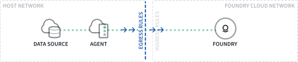
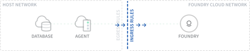

<!-- source: https://palantir.com/docs/foundry/data-connection/set-up-agent/ · mirrored 2026-08-18 from Palantir Foundry docs -->

# Set up an agent

An **agent** is a downloadable program installed within your organizational network and managed from Foundry's [Data Connection](/docs/foundry/data-connection/overview/) interface. Agents have the ability to connect to different data sources within your organizational network. They are used to enable [**agent-proxy egress policies**](/docs/foundry/data-connection/agent-proxy/) to provide network connectivity to privately-hosted sources, and to enable [**agent worker connections**](/docs/foundry/data-connection/agent-worker/) to read data from those sources and securely ingest to Foundry with a restricted access token.

This guide walks you through the steps required to create an agent. First, complete the following:

1. After logging in to Palantir, navigate to **Data Connection** using the left [sidebar](/docs/foundry/getting-started/orientation-and-nav/).
2. Select the **Agents** tab.
3. Select **New agent** in the upper right corner.

If you do not see the option to create a new agent, you may not have the required role to do so. [Learn more about managing the agent creation workflow in Control Panel.](/docs/foundry/data-connection/agent-configuration-reference/#agent-permissions)

Once you have the agent running and you want to connect a source to Foundry, you must obtain credentials for the source system that the agent can use to securely read data. Depending on your organization’s network setup, you may also need to configure network settings to allow the agent to reach the source system.

Review the sections below to start setting up your agent:

## Setup

### Create agent host

For the agent program to successfully run, it must be hosted in a suitable environment (ideally, an environment using Linux as an operating system).

The most commonly used hosting method for Foundry agents is provisioning a Linux virtual machine (VM) in a cloud environment. For example, you could provision a Linux VM in AWS, Azure, or GCP, but you could also host the agent on a Linux server belonging to your organization. Note that while it is possible to host Foundry agents on Windows, this is not recommended by Palantir and should only be used if it is not possible to host in a Linux environment.

:::callout{theme="neutral"}
The host you use for the agent should be used exclusively for running a single Foundry agent, not colocated with any other services or processes.
Running multiple Foundry agents on the same machine is not supported.
:::

Once you have a suitable location to host your agent, the next step is to ensure the host will meet the necessary hardware and OS requirements for a Foundry agent to work. These requirements include the following:

* **64-bit Linux** or other Linux operating system (recommended RHEL 8 or later, Ubuntu 22.04 or later, or equivalent)
  * Agents run on their own JDK that is compiled for Linux/x86-64. If necessary (for example, when running on AWS Graviton or another ARM-based CPU), it is possible to run an agent on a separate JDK by modifying the value of `javaHome` in `service/bin/launcher-static.yml`.

    :::callout{theme="neutral"}
    We generally do not recommend running agents on a separate JDK, and support for this may not be available in the future.
    :::

* **4 CPU** cores

* **16 GB** RAM

* **500GB** free disk space mounted at /opt (preferably SSD)

The recommended limits are as follows:

* **Core file size:** Hard and soft limit of 0
* **Open files:** Hard and soft limit of 262144
* **Running processes:** Hard and soft limit of 65536
* **Stack size:** Hard and soft limit of 32768 (KB)
* **Max locked memory:** Hard and soft limit of "unlimited"



### Configure agent network access

An agent only makes outbound connections to Foundry. To successfully establish network access, you must allow the following:

* [Egress on the agent host](#egress-on-the-agent-host)
* [Ingress in Foundry](#ingress-in-foundry)

After allowing egress and ingress, validate that your host can communicate with the Foundry Virtual Private Cloud (VPC), by executing the following command on the agent host:

```bash
curl -s https://<your domain name>/magritte-coordinator/api/ping > /dev/null && echo pass || echo fail
```

If everything is working as expected, you should see `pass` as an output; `fail` indicates an incomplete test of connectivity to the Foundry VPC.

#### Egress on the agent host

The agent requires network egress to reach the Foundry VPC, which is accessed through the Internet. If your network does not allow egress by default, this may require a specific configuration to allow the outbound connection from your agent (and/or its host) to your Foundry instance, such as opening a firewall or [configuring a proxy](/docs/foundry/data-connection/agent-configuration-reference/#proxy-configuration) for egress.

You can copy Foundry's domain name and port from the **Server Setup** tab in the agent setup workflow in Data Connection to appropriately configure egress network access.



#### Ingress in Foundry

Foundry must allow inbound traffic from your server's IP. You can manage ingress rules from the [**Network ingress** page in Control Panel](/docs/foundry/administration/configure-ingress/). Your Foundry domain will not be accessible from outside of your approved ingress rules.



### Secure an agent host with firewall

We strongly recommend configuring a firewall on the agent host to monitor and restrict network traffic to only destinations that are strictly necessary. Be sure to still allow the agent host to talk to Foundry. The available firewall and monitoring options depend on the operating system you use to run your agent, as well as your organization's security best practices.

### Set up automatic restarts

If you do not have automatic restarts set up, you will have outages whenever the agent crashes or the agent host restarts.

To set up automatic restarts for an agent manager if it crashes, run the command `${AGENT_MANAGER_DIR}/service/bin/auto_restart.sh` from the agent manager's service directory on the VM or machine terminal as a user with permission to create cron jobs.

If you need to halt the automatic restarts (when upgrading the agent manager, for example), you can do so by running `${AGENT_MANAGER_DIR}/service/bin/auto_restart.sh clear`.

### Save agent resource in a Project

Next, you must give your new agent a name and choose a Project in which to save it. In Foundry, an agent is considered a [resource](/docs/foundry/getting-started/projects-and-resources/) that is saved into a Project to allow for highly configurable permissions.

We recommend creating a new Project in which to store your agent.

Permissions in Foundry are an extensive topic. If you want to learn more, you can refer to these resources:

* [Recommendations for managing agent permissions](/docs/foundry/data-connection/agent-configuration-reference/#agent-permissions)
* [Guidance on how permissions should be set up end-to-end for data pipeline](/docs/foundry/building-pipelines/recommended-project-structure/)
* [A full reference of how agent permissions interact with Projects and roles](/docs/foundry/data-connection/permissions/#agents)

### Download and install the agent

Once you have your hardware provisioned for your agent, the next step is to download the agent software from Foundry and install it on the host. Follow the steps outlined in the in-platform guide on your host to download the package, extract it, and start the agent.

If you need to configure a proxy, more details are available in the [proxy configuration documentation](/docs/foundry/data-connection/agent-configuration-reference/#proxy-configuration).

After the agent has started successfully, follow the steps to [configure automatic upgrades](/docs/foundry/data-connection/agent-configuration-reference/#automatic-upgrade-windows) to ensure that your agent remains updated.

## Next steps

Now that you have created, installed, and started your agent, navigate to the agent page in Data Connection where you can [configure and monitor the agent permissions, health, and connectivity](/docs/foundry/data-connection/agent-configuration-reference/).

After your agent is set up, you can move on to [setting up a source](/docs/foundry/data-connection/set-up-source/) to connect your agent with your organization's data sources.
