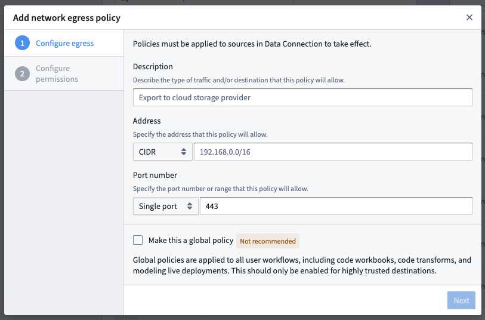
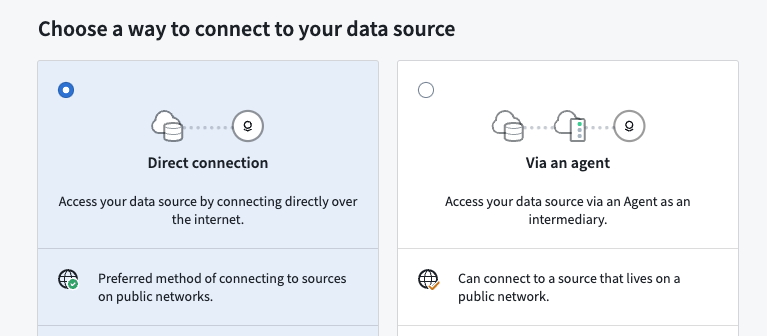
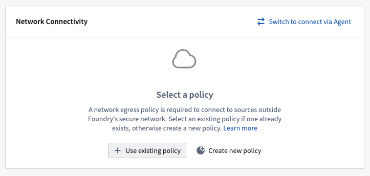
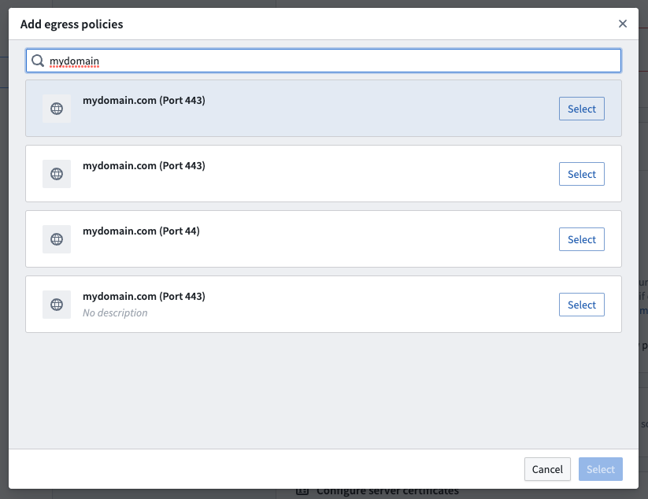

<!-- source: https://palantir.com/docs/foundry/data-connection/set-up-direct-connection/ · mirrored 2026-08-18 from Palantir Foundry docs -->

# Set up a direct connection

:::callout{theme="danger"}
This documentation is outdated and retained for historical reference only. For updated guidance on connection set up, refer to our documentation on [setting up a source](/docs/foundry/data-connection/set-up-source/).
:::

:::callout{theme="warning"}
Direct connections depend on Foundry's container infrastructure which is only available in Foundry's managed SaaS platform. As a result, cloud-based direct connections may not be available in your environment.
:::

If you are trying to connect to a data source which is accessible over the Internet, such as a REST API, an SFTP server, or an Azure storage account, you can configure a direct connection to avoid needing to [set up an agent](/docs/foundry/data-connection/set-up-agent/). Using a direct connection has a number of advantages:

* No need to provision, configure, and manage an agent and its host
* Avoids routing Internet-to-Foundry through your network
* Offers excellent uptime and performance as cloud-based Syncs do not depend on an agent software package or its host

If you are interested in configuring a cloud-based direct connection, follow these steps:

1. [Configure a network egress policy](#configure-a-network-policy) for your enrollment.
2. [Provision credentials](#provision-credentials) to connect to your data source.
3. [Create the Source in Data Connection](#create-the-source-in-data-connection).

## Configure a network policy

:::callout{theme="warning"}
You must have the *Information security officer* role on your [Enrollment](/docs/foundry/administration/enrollments-and-organizations/) to configure network egress. If you do not have permissions to configure egress, contact your Palantir representative for help.

The *Information security officer* role can be found in the Enrollment permissions section of the [Control Panel](/docs/foundry/administration/control-panel/). An administrator needs to have the *Enrollment administrator* role in order to see this section.
:::

To configure a network policy, navigate to Control Panel using the **Other workspaces** link in the [Workspace sidebar](/docs/foundry/getting-started/orientation-and-nav/#workspace-navigation-sidebar). In Control Panel, select **Network egress** in the sidebar. If you can't see this option, contact your Palantir representative to go through the following steps.

Add a network policy by selecting **Add network policy**. Add a description and connection details, similar to the details you provided when contacting Palantir:

* If you are connecting via HTTP(S), add the DNS hostname of your data source
* If you need to use a non-HTTP protocol, add a CIDR address and port

Keep the default **Optional** policy type selection, and select **Add network policy**.

## Provision credentials

In the majority of cases, Foundry will require authorized credentials (such as a username and password) to access Sources. It is best practice to use a service account specifically for Foundry.

Provision a service account for the Source following any internal guidelines and processes that your organization has for establishing service accounts. Note the credentials before proceeding to the next step.

## Create the Source in Data Connection

Once the above steps are done, you can proceed with creating the Source in Data Connection:

* After logging in, navigate to **Data Connection** using the [sidebar](/docs/foundry/getting-started/orientation-and-nav/).
* Select the **Sources** tab.
* Select **New source** in the top-right.
* Select the [source type](/docs/foundry/data-integration/source-type-overview/) corresponding to your data source.
* Select **Direct connection**, then select **Continue** in the bottom right.

### Save the Source in a Project

Next, name your Source and choose a [Project](/docs/foundry/compass/move-and-share-resources/) to place it in. We generally recommend creating a new Project for each Source, as this provides the cleanest way to permission datasets derived from this Source. Consult the [Source permission best practices](/docs/foundry/data-connection/permissions/#source-best-practices) for more information. Full guidance for how to structure data pipelines end-to-end in Foundry is available in the [recommended Project structure documentation](/docs/foundry/building-pipelines/recommended-project-structure/).

Select **Create source and continue** in the bottom right.

### Choose your network policy

On the next page, select the network policy you [configured earlier](#configure-a-network-policy) by clicking **Use existing policy** and searching for the policy name.

### Configure Source and add drivers

Add details about how to connect to your source. These details will depend on the [source type](/docs/foundry/data-integration/source-type-overview/) you are using and typically consist of basic credentials such as connection URLs, cloud provider regions, and so on.

[JDBC sources](/docs/foundry/available-connectors/custom-jdbc-sources/) may require adding and selecting **drivers** required to connect to your source. Although many drivers ship out-of-the-box with Foundry, you may need to upload and select a driver to proceed.

### Add credentials

Add the credentials you [provisioned](#provision-credentials) previously to allow the direct connection to connect to your data.

### Save and continue

Select **Save** in the bottom right to complete setting up your direct connection. Once your Source is fully set up, you can proceed to [set up a Sync](/docs/foundry/data-connection/set-up-sync/) to bring data into Foundry.
