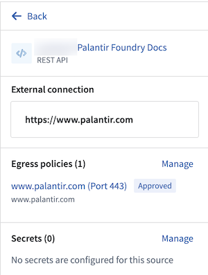

<!-- source: https://palantir.com/docs/foundry/data-connection/sources-in-python/ · mirrored 2026-08-18 from Palantir Foundry docs -->

# Sources in Python environments

Foundry provides the ability to connect to external systems in Python environments across the platform. These capabilities include [source-based external transforms](/docs/foundry/data-connection/external-transforms/), [external functions](/docs/foundry/functions/api-calls/), and [compute modules ↗](https://github.com/palantir/python-compute-module#sources-in-compute-modules). This page discusses common use cases and workflows for external systems in Python environments. For more information, visit Palantir's [external-systems ↗](https://github.com/palantir/external-systems/) open source library.

:::callout{theme="neutral"}
Source initialization is not included in any of the examples below, as this will vary between environments. To learn how to obtain an initialized source object, refer to the environment's (for example, a transforms repository, functions repository, compute module, etc.) relevant documentation on usage of sources. You may additionally find snippets in the source information panel side bar with instructions for usage.
:::

## HTTPS client

For REST-based sources, Palantir provides a preconfigured HTTPS client built on top of the Python requests library.

:::callout{theme="warning"}
Note that sources must be initialized with only one HTTP connection; sources initialized with more or less than one HTTP connection are considered invalid and a preconfigured client will not be created.
If you attempt to create a connection with an invalid source connection configuration, you will receive an error `Only single connection sources are supported.`

To find out how many connections your source has, refer to the source's sidebar panel in the `External connection` section of your given environment, as seen in the example below:


:::

```python
from external_systems.sources import Source, HttpsConnection
from requests import Session

my_source: Source = # Source is initialized differently based on the environment

https_connection: HttpsConnection = my_source.get_https_connection()

external_system_url: str = https_connection.url

http_client: Session = https_connection.get_client()

response = http_client.get(external_system_url + "/api/v1/example/", timeout=10)
```

:::callout{theme="warning"}
Changing the working directory (for example, using `os.chdir()`) before or during HTTPS client usage may break references to environment variables necessary for establishing secure connections.
:::

## Secrets

Source secrets can be referenced using `get_secret("<secret_name>")` on the source.

```python
from external_systems.sources import Source

my_source: Source = ...

my_secret: str = my_source.get_secret("SECRET_NAME")
```

### Session credentials

A first-class method to retrieve and renew generated session credentials is available for some Foundry source types.

#### Supported source configurations

* **S3:** Cloud Identity, OIDC
* **BigQuery:** OIDC
* **Snowflake:** OIDC

#### Example: S3

```python
import boto3

from external_systems.sources import AwsCredentials, Refreshable, Source, SourceCredentials

S3_BUCKET_REGION = <aws_region>
S3_BUCKET_NAME = <bucket_name>

s3_source: Source = ...

refreshable_credentials: Refreshable[SourceCredentials] = s3_source.get_session_credentials()

session_credentials: SourceCredentials = refreshable_credentials.get()

if not isinstance(session_credentials, AwsCredentials):
    raise ...

s3_client = boto3.client(
    "s3",
    region_name=S3_BUCKET_REGION,
    aws_access_key_id=session_credentials.access_key_id,
    aws_secret_access_key=session_credentials.secret_access_key,
    aws_session_token=session_credentials.session_token,
)

s3_response = s3_client.list_objects_v2(Bucket=S3_BUCKET_NAME)
```

#### Example: OIDC credentials

For sources configured with [OIDC authentication](/docs/foundry/data-connection/oidc/), such as [Snowflake](/docs/foundry/available-connectors/snowflake/), session credentials are returned as `OauthCredentials`. These contain a short-lived `access_token` and an `expiration` timestamp.

```python
from external_systems.sources import OauthCredentials, Refreshable, Source, SourceCredentials

my_source: Source = ...

refreshable_credentials: Refreshable[SourceCredentials] = my_source.get_session_credentials()

session_credentials: SourceCredentials = refreshable_credentials.get()

if not isinstance(session_credentials, OauthCredentials):
    raise ...

access_token: str = session_credentials.access_token
```

## On-premises connectivity with agent-proxy egress policies

[Foundry worker with agent-proxy policy](/docs/foundry/data-connection/architecture/#foundry-worker-with-agent-proxy-policy) sources allow connections in code to be established to on-premise systems as if the connections were made over the open Internet. For more details on how this is configured, refer to the [agent proxy documentation](/docs/foundry/data-connection/agent-proxy/).

### Socket connections

For non-HTTPS connections to external systems that require connections through Foundry's agent proxy, a preconfigured socket is provided. Below is an example of using this socket with an on-premise SFTP server connection.

#### On-premise SFTP server example

This example uses the [Fabric ↗](https://docs.fabfile.org/en/latest/) library.

```python
import fabric

from external_systems.sources import Source
from socket import socket

SFTP_HOST = <sftp_host>
SFTP_PORT = <sftp_port>

on_prem_sftp_server_source: Source = ...

username: str = on_prem_sftp_server_source.get_secret("username")
password: str = on_prem_sftp_server_source.get_secret("password")

proxy_socket: socket = on_prem_sftp_server_source.create_socket(SFTP_HOST, SFTP_PORT)

with fabric.Connection(
    SFTP_HOST,
    user=username,
    port=SFTP_PORT,
    connect_kwargs={
        "password": password,
        "sock": proxy_socket,
    },
) as sftp_conn:
    sftp_client = sftp_conn.sftp()
    file_list = sftp_client.listdir(".")
```

### Authenticated proxy URI

For more granular use cases, a pre-authenticated proxy URI is provided to allow connections to on-premises external systems.

#### Non-requests library example

In cases where the requests library client is not sufficient, you may need to use another HTTP client. This example uses the [HTTPX ↗](https://www.python-httpx.org/) library.

```python
import httpx

from external_systems.sources import Source
from typing import Optional

agent_proxy_source: Source = ...

authenticated_proxy_uri: Optional[str] = agent_proxy_source.get_https_proxy_uri()

source_url: str = agent_proxy_source.get_https_connection().url

with httpx.Client(proxy=authenticated_proxy_uri) as client:
    response = client.get(source_url + "/api/v1/example/", timeout=10.0)
```

## Source properties

For source types that are available via the [Foundry API](/docs/foundry/api/v2/connectivity-v2-resources/connections/get-configuration/), the configuration properties can also be directly accessed for use in code.

```python
from external_systems.sources import Source

snowflake_source: Source = ...

account_id: str = snowflake_source.source_configuration.get("accountIdentifier")
```
