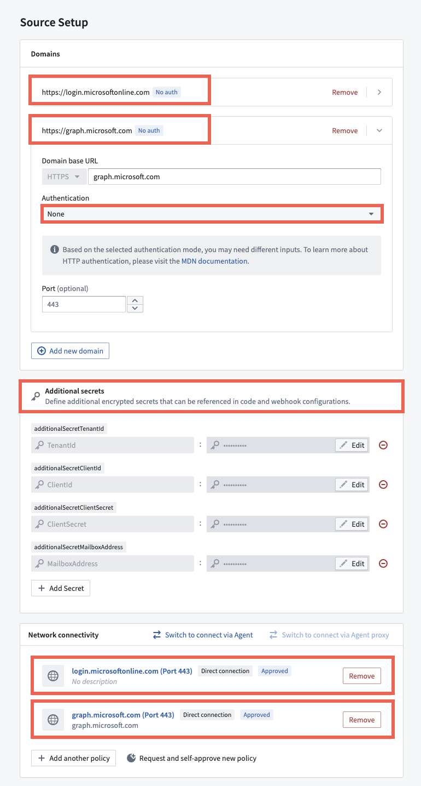
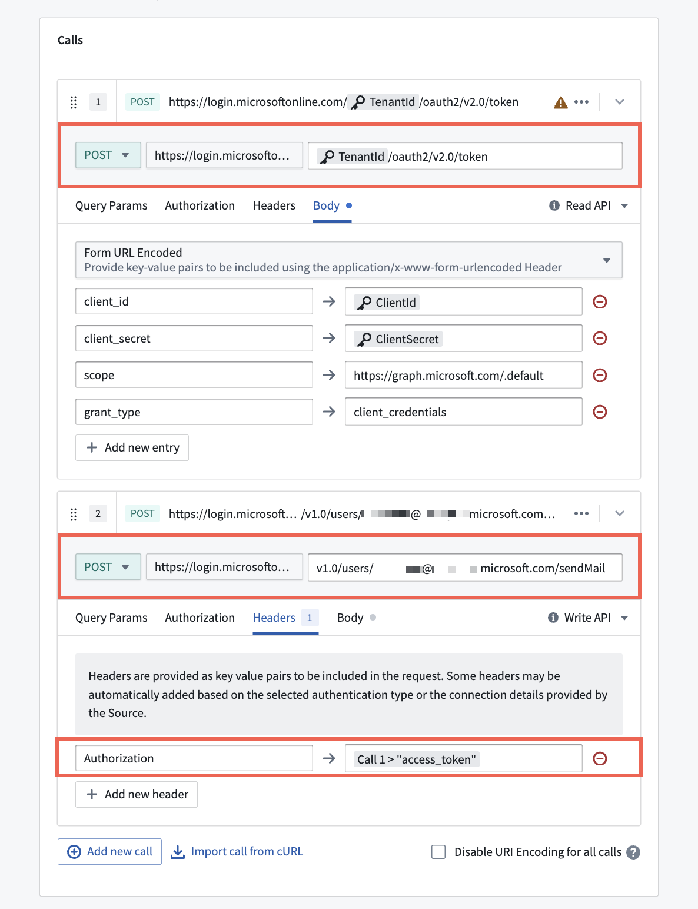

<!-- source: https://palantir.com/docs/foundry/data-connection/webhooks-microsoft-graph-api/ · mirrored 2026-08-18 from Palantir Foundry docs -->

# Set up a Webhook for the Microsoft Graph API

This guide shows step-by-step how to configure a webhook for the Microsoft Graph API to access Microsoft Cloud service resources from Foundry.

[Learn more about the Microsoft Graph API ↗](https://learn.microsoft.com/en-us/graph/use-the-api).

## Prerequisites

Prior to configuration, you must:

* Sign in to your Microsoft account by typing `login.microsoftonline.com` into your browser to authenticate and generate an access token you can use to create the webhook.
* Configure [network egress policies](/docs/foundry/administration/configure-egress/) for both `login.microsoftonline.com` and `graph.microsoft.com` to allow outbound connections from Foundry.

## Instructions

1. [Create a REST API source](/docs/foundry/data-connection/webhooks-setup/#create-a-source) for your webhook.
2. Include `login.microsoftonline.com` and `graph.microsoft.com` as the source's **Domains** without any **Authentication** restraints.
3. Set any necessary **Additional secrets**, such as  the `TenantId`, `ClientId` and `ClientSecret` that you will use to authenticate against `login.microsoftonline.com`. You will find these after you [register an application in Microsoft Entra ↗](https://learn.microsoft.com/en-us/graph/auth-register-app-v2).
4. Add the network egress policies you [created above](#prerequisites) in the **Network connectivity** section before choosing **Save and continue**.

After you configure your REST API source, you will next configure your webhook to make two `POST` requests that:

1. Login using the `login.microsoftonline.com` credentials created on the source to get a short-lived access token.
2. Make an API call to `graph.microsoft.com` using the access token in the response from the first call as the bearer token in the call's authentication header.

[Learn more about configuring Webhooks in Data Connection](/docs/foundry/data-connection/webhooks-reference/).
