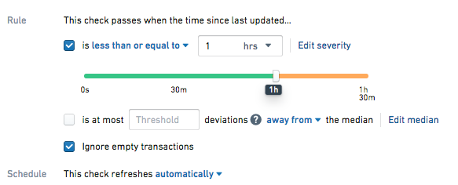
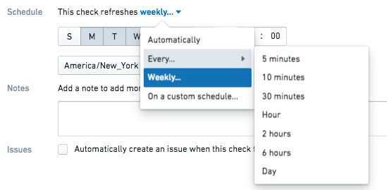

<!-- source: https://palantir.com/docs/foundry/data-health/check-evaluation/ · mirrored 2026-08-22 from Palantir Foundry docs -->

# Check schedules

Time-based checks can be configured to evaluate either automatically or on a manual schedule.

## Automatically

When configured to run automatically, a check runs at two times:

1. When a dataset is updated.
2. When a dataset passes the threshold you have configured.

A dataset update transaction will trigger the check to evaluate i) the dataset based on the configured check and ii) the elapsed time between the current time and the previously committed transaction. It will also reset the threshold for the next check by adding the time threshold minimum to the current time.

For example, suppose you set the [Time Since Last Updated Check](/docs/foundry/health-checks/checks-reference/#time-since-last-updated) threshold to be less than 1 hour (“This check passes when time since last updated is less or equal than 1 hour”).

### Check Passes

Suppose your dataset gets updated in 58 minutes. At this time, the check will run, producing a 'Passed' result, since it has been less than 60 minutes since the last transaction. The update transaction also caused the threshold for the next check to reset - it will now automatically run again 60 minutes from now to evaluate whether the dataset has been updated.

As long as the dataset continues to update in less than 60 minutes, the check will continue to pass on dataset update, and never reach the threshold you have configured.

### Check Fails

This time, suppose your dataset gets updated in 62 minutes. At 60 minutes since the last update, a check will run (as set by the one hour threshold) and fail, since it has been more than 60 minutes since the last transaction. When the dataset is updated at 62 minutes, the check will run again to update the time since last updated value to be the current time and the check will pass. Any [watchers](/docs/foundry/health-checks/watching-checks/) of the check will be notified.

## Manual Schedules

The manual schedule runs checks at a regular interval regardless of when the dataset is built. It can be set to run by minute, hourly, daily, weekly, or on a custom schedule.

