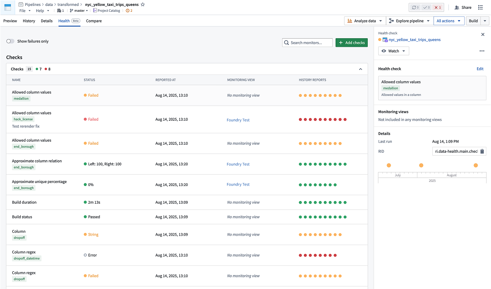

<!-- source: https://palantir.com/docs/foundry/data-health/overview/ · mirrored 2026-08-22 from Palantir Foundry docs -->

# Health checks

Health checks enable monitoring and alerting on common issues across datasets and other resource types. You can monitor for potential issues related to dataset status, time, size, content, and schema using customizable checks. When problems are detected, you will receive in-platform notifications and emails alerting you to the issue.

This section of documentation provides detailed references about available health check options. For high-level guidance on how to set up effective health checks, review the section on [maintaining pipelines](/docs/foundry/maintaining-pipelines/overview/). In particular, the page on [recommended health checks](/docs/foundry/maintaining-pipelines/recommended-health-checks/) may be helpful.

If you need to monitor resources that health checks do not cover, if you want coverage that scales when additional resources are added, or if you need an easier way to monitor many similar resources, consider using [monitoring views](/docs/foundry/monitoring-views/overview/) instead of health checks.

## Create and configure health checks

You can create checks for the following resources:

* Datasets
  * You can also [create checks through code](/docs/foundry/transforms-python/data-expectations-getting-started/).
* Schedules
* Tables

The checks that are available for a specific resource type can be found on the **Health** tab of the Data Health application. Review the [monitoring rules reference](/docs/foundry/monitoring-views/rules-reference/) to learn the available checks.

### Health tab

The location of the **Health** tab is resource-dependent.

* **For datasets:** While viewing a dataset in [Dataset Preview](/docs/foundry/dataset-preview/overview/), you can navigate to the **Health** tab to add new checks, modify existing checks and view historic check results.

* **For schedules:** With a schedule open in Data Lineage, select **Metrics > Health** to view health checks and monitoring views, each listed in its own view.

* **For tables:** While viewing a table in [Dataset Preview](/docs/foundry/dataset-preview/overview/), you can navigate to the **Health** tab to add new checks, modify existing checks and view historic check results.

### Add new health checks to multiple datasets

You can add the same health check to multiple datasets at once from [Data Lineage](/docs/foundry/data-lineage/overview/):

1. In **Data Lineage**, select the datasets you want to add health checks to on the lineage graph. You can select multiple datasets by holding `Cmd` (Mac) or `Ctrl` (Windows) while selecting.
2. Right-click on the selection and choose **Add health check**.
3. Configure the health check parameters. The check will be applied to all selected datasets.

## Viewing health

You can access health check status and details at different levels depending on your monitoring needs.

### Pipeline health

In [Data Lineage](/docs/foundry/data-lineage/overview/), datasets can be colored by their health check status. Additionally, the Data Health tab at the bottom of the page (toggled on in Settings) shows the health checks and their statuses for all datasets in the lineage graph.

### Platform-wide health

To see an overview of health checks for all datasets, select the **Data Health** application from the sidebar. In the Data Health application, you can filter or sort datasets by their status or name. You can also toggle to show only the datasets that you are watching. This page also lets you add new health checks by selecting **Add health check** in the top-right corner.
