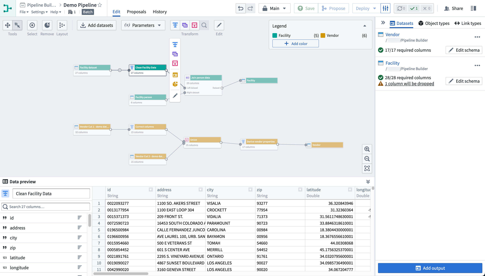
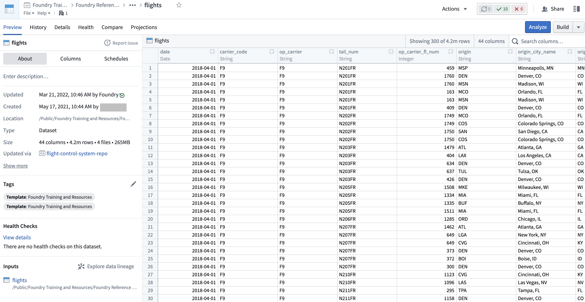
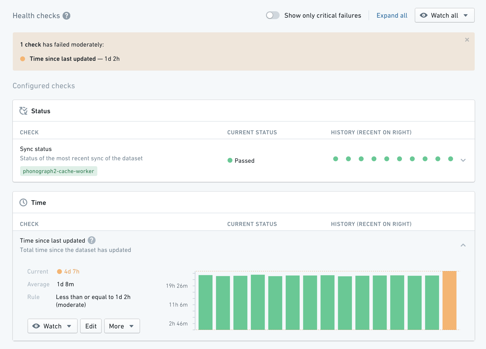
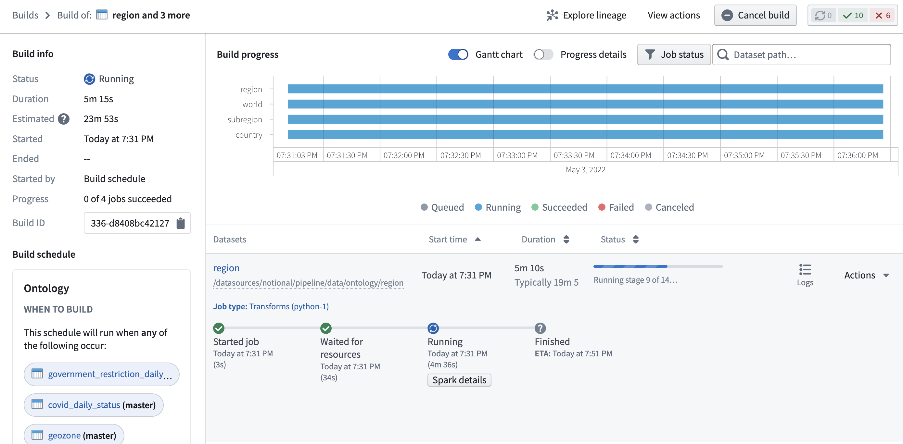

<!-- source: https://palantir.com/docs/foundry/data-integration/application-reference/ · mirrored 2026-08-06 from Palantir Foundry docs -->

# Application reference

This page provides a reference to the Foundry applications you may encounter while performing data integration workflows.

## Pipeline Builder

[**Pipeline Builder**](/docs/foundry/pipeline-builder/overview/) is Foundry's primary application for data integration. With Pipeline Builder, you can create end-to-end pipeline workflows, from data sources to final outputs. Users of Pipeline Builder can describe their workflow, transform data, edit schemas, and build outputs in a single easy-to-use application.

Pipeline Builder features an intuitive point-and-click interface and robust backend model that allows technical and less-technical users to define and deploy pipelines faster than in code-heavy applications. The streamlined builder interface allows users to apply data transforms alongside schema checks, saving time and costs typically spent on computation and checks at build time. Additional features like full version control and extensibility make Pipeline Builder an ideal application for safe collaboration.

## Code Repositories

[**Code Repositories**](/docs/foundry/code-repositories/overview/) is Foundry's primary interface for authoring code, most commonly used for creating data pipelines in Python, Java, and SQL. Code Repositories provides an integrated development environment (IDE) on top of a `git` server, enabling collaboration and governance of pipeline logic, as well as native support for writing, testing, and previewing data transformation logic. Code Repositories can also be used for authoring [machine learning models](/docs/foundry/integrate-models/model-asset-code-repositories/) and Ontology [Functions](/docs/foundry/functions/overview/).

If you are interested in data science and code-based analysis, [Code Workbook](/docs/foundry/code-workbook/overview/) may be a better fit for your use case. [Learn more about the differences between Code Workbook, Code Workspaces, and Code Repositories.](/docs/foundry/code-workbook/code-products-comparison/)

## Data Lineage

[**Data Lineage**](/docs/foundry/data-lineage/overview/) is an application that shows how data flows through Foundry. You can use it to explore how any resource in Foundry is connected to other resources, across the boundaries of individual Projects or use cases. This includes support for data sources, datasets, analyses, Ontology object and link types, and user-facing applications. In addition to exploring connections, you can use Data Lineage to view previews of data, see the logic used to derive any piece of data, and manage scheduled pipelines.

## Data Connection

[**Data Connection**](/docs/foundry/data-connection/overview/) is the application used to sync data into Foundry and manage associated resources including source credentials. After initial setup, Data Connection makes it simple to explore data sources and sync new data for use case development, while complying with the full range of governance controls required for managing source systems and use cases at scale.

## Dataset Preview

[**Dataset Preview**](/docs/foundry/dataset-preview/overview/) is an application used to view and understand [datasets](/docs/foundry/data-integration/datasets/). Opening a dataset from any other application shows you the contents of the dataset, along with a range of contextual information. This includes information about dataset ownership, how the dataset has changed over time, any applicable health checks, and further details.

## Data Health

[**Data Health**](/docs/foundry/health-checks/overview/) is used to manage [data quality](/docs/foundry/data-integration/health-checks/) across all data pipelines. Pipeline maintainers can perform health checks to quickly understand the performance and reliability of their pipelines, as well as subscribe to alerts on [monitoring views](/docs/foundry/monitoring-views/overview/) to enable a broad set of data pipeline maintenance workflows.

## Builds

**Builds application** — formerly called Job Tracker — allows you to view all [builds](/docs/foundry/data-integration/builds/) occurring across Foundry and explore details about each build, including information about execution progress, scheduling, and past success and failure rates. Builds application also enables you to access granular information about the Spark execution engine underlying execution, which enables debugging and optimization workflows.

