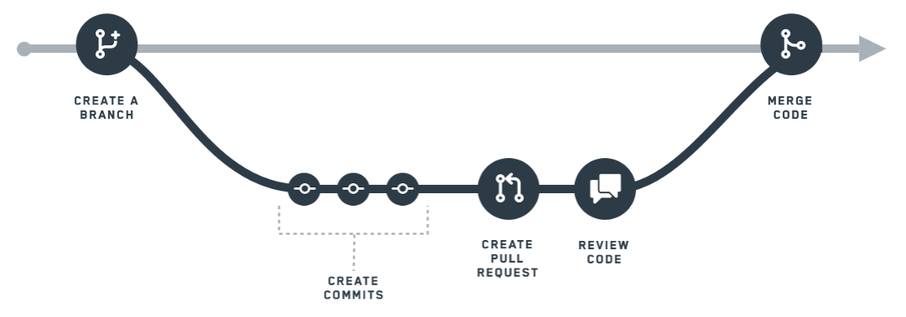

<!-- source: https://palantir.com/docs/foundry/data-integration/branching/ · mirrored 2026-08-22 from Palantir Foundry docs -->

# Branching

Software developers typically use version control systems to coordinate work in a codebase. This enables multiple engineers to contribute to the same code safely.

Within Foundry, we think about data the way software developers think about code: you need a way to allow many people to make changes and interact with the same data without interfering with someone else's work. We took best practices from software development and applied them to writing data pipelines, harnessing a common feature of version control systems called **branching**.

At a high level, **branching** allows you to take a fork in the road and work on data in your own branch. Then, once you are happy with your changes, you can push your changes out of your branch back to the main road.

## Branching workflow

How to use a branching workflow to make changes to data pipeline code in Foundry:

1. **Create a branch**. In Foundry, the **`master` branch** refers to the primary data pipeline. When you want to work on your own changes, you create your own branch, which creates an environment for you to experiment and test out ideas without worrying about affecting the `master` branch.
2. **Create commits**. Within your branch, you can make changes to data transformations. Changes, which include additions and removals, are called **commits**. Your commits are tracked so that there is a clear history of all the changes you have done on your branch.
3. **Create a pull request**. Once you are done working in isolation, you will want to push your changes back to the master branch. To start this process, you create a **pull request**. A pull request signals to your team that you have made changes you would like them to review and validate for the `master` data pipeline.
4. **Review code**. After you create a pull request, your team will have the chance to review your commits. Every organization will have a different process or team for reviewing pull requests.

Foundry branching implements an industry-standard Git-like version control paradigm. As such, the Code Repositories application was designed to have one active developer for each individual branch on a file. If other users are working on your **`personal` branch**, your changes may be overwritten. To avoid this, we strongly recommend having each person work in a separate branch.

The rest of this page describes the technical details of how branches work in Foundry. If you are interested in learning how to use branching in practice, follow the tutorial for creating a simple batch pipeline in [Pipeline Builder](/docs/foundry/building-pipelines/create-batch-pipeline-pb/) or [Code Repositories](/docs/foundry/building-pipelines/create-batch-pipeline-cr/).

## Branching technical details

In Foundry, branching for data is implemented using features at two different levels: branching within an [individual dataset](#dataset-branches), and branching when [building datasets](#branches-in-builds).

## Dataset branches

As discussed in the page on [datasets](/docs/foundry/data-integration/datasets/), datasets have version history in the form of a series of [transactions](/docs/foundry/data-integration/datasets/#transactions). Conceptually, dataset branches are similar to branches in Git—*datasets*, *branches*, and *transactions* are analogous to Git *repositories*, *branches*, and *commits*.

Similar to branches in Git, dataset branches are simply a pointer to the most recent transaction on that branch. As a result, a branch can be interpreted as a linear sequence of transactions ordered by commit time. When a dataset is changed on a branch by committing a transaction, the transactions and views of all other branches are unaltered. Unlike Git, there is no support for merging dataset branches.

Each dataset branch has exactly one **parent branch**, unless it is a **root branch**. In practice, most datasets in Foundry have a single root branch called `master`, and child branches are created from this single root branch.

Below are all the supported operations related to dataset branches:

* **Creating a new branch**. A root branch can be created with no parent branch and no transactions.
* **Creating a child branch**. A child branch can be created from another branch, or from any transaction. The new branch points to the same transaction as the parent branch. Subsequently, transactions can be started on both the parent and child branches, and their transaction pointers will move independently.
* **Starting a new transaction on a branch**. Starts a transaction and moves the branch pointer to the new transaction.
* **Deleting a branch**. Deletes the branch pointer, but not any of the transactions on the branch. See the note about parent branches in the guarantees below.

### Dataset branch guarantees

Foundry maintains the following guarantees for dataset branches:

* **One open transaction per branch**. Every branch can have at most one open (as in, opened and neither committed or aborted) transaction, and this transaction is always the latest transaction on the branch. A dataset with one branch can thus have at most one open transaction. If a branch points to an open transaction, then a new branch can be created off of this branch, but no further transactions can be started until the transaction is closed.
* **On every branch, transactions are ordered by start and commit time**. This guarantee is a consequence of previous constraint. Note, however, that no guarantee is given regarding the temporal order of transactions on different branches.
* **Every non-root branch has exactly one parent branch**. In case "intermediate" branches—branches with child branches—are deleted, the child branches are re-parented under the deleted branch's parent (or no parent if it was a root branch). Note that no transactions are rearranged in this process; re-parenting merely changes the branch ancestry record.

## Branches in builds

Dataset branching provides the foundational semantics for *versioning data*. Foundry combines dataset branching with Git branching to support branching over logic and data simultaneously, to enable data engineers to safely experiment with changes to data pipelines before introducing them to production.

Tying branches of logic in Git to branches of data in datasets is done through Foundry's [build](/docs/foundry/data-integration/builds/) system. Every build runs on a user-specified branch, and the jobs within the build modify datasets on that branch only. As a result, branches in builds provide a way to isolate the changes of different users from each other.

Foundry builds perform two main functions involving branches, as described below:

* First, they [compile the build graph](#job-graph-compilation) by collecting job specifications, or JobSpecs, from appropriate branches.
* Second, they [resolve job inputs and outputs](#input-and-output-resolution) with respect to the user-defined build branch and a sequence of *fallback branches*.

#### Job graph compilation

When you author data transformations in Foundry in a branch of a [Code Repository](/docs/foundry/code-repositories/overview/), committing your code publishes JobSpecs to the appropriate branch of the build system. When a build is run on that branch, the build traverses the JobSpecs and their dependencies on your branch to determine which logic should be executed.

A build usually specifies *branch fallbacks* that govern from which branch it retrieves JobSpecs in case no JobSpec is set on the build branch. For example, if you run a build on `develop` with a fallback chain of `develop --> master`, if there is no published JobSpec for a given output dataset, the JobSpec will be read from the `master` branch instead.

Dataset icon color provides information about JobSpecs and branching. If a dataset's icon is gray, this indicates that no JobSpec exists on the master branch. If the dataset icon is blue, a JobSpec is defined on the master branch.

#### Input and output resolution

For all datasets designated as *outputs* by the JobSpecs in a build, a transaction is opened on the build branch. If this branch does not exist on a dataset, then it is created off the first branch in the fallback chain, or as a root branch if no fallback branch exists. Job inputs are read from the build branch if possible, but otherwise use the first existing branch in the fallback chain.

### Example: Building on branches

To understand how branches work in builds, step through an example workflow:

1. Suppose that datasets A, B, and C exist on the `master` branch.
2. A data engineer creates a branch called `feature` in their Code Repository. This creates a branch in the underlying Git repository.
3. The data engineer modifies the code that produces datasets B and C. When the data engineer commits their code, checks in the repository publish JobSpecs to both datasets on the `feature` branch.
4. The data engineer initiates a build on the `feature` branch. As the `feature` branch was created off the `master` branch in the Git repository, the fallback chain for this build is `feature --> master`. The JobSpecs published in step (3) is read, and two jobs corresponding to the user’s code are started. Transactions are opened on both datasets B and C on the `feature` branch. The two jobs execute serially as follows:
   1. *Job 1*: The `master` branch of dataset A is used as input because of branch fallbacks. Computation produces new data, which is written to dataset B in the currently open transaction. The transaction is committed.
   2. *Job 2*: Next, this job begins. The `feature` branch of dataset B is used as input. Computation produces new data, which is written to dataset C in the currently open transaction. The transaction is committed.
5. Finally, because all jobs in the build succeeded, the build is successful.

After modifying code, committing, and running a build, the data engineer has produced new data on the `feature` branch of datasets B and C. Notice that dataset A was completely unaffected by this process, and the `master` branch of datasets B and C is also unaltered.

### Build branch guarantees

Builds in Foundry provide the following guarantees for branches:

* Build resolution only succeeds if the specified branch fallback sequence is compatible with the branch ancestries in the involved datasets.
* A build never modifies any dataset branches other than the build branch.
* A build never creates branches on input datasets.
