<!-- source: https://palantir.com/docs/foundry/data-integration/external-transforms-source-based/ · mirrored 2026-08-06 from Palantir Foundry docs -->

# External transforms

:::callout{theme="neutral"}
[Data Connection sources](/docs/foundry/data-connection/set-up-source/) can now be directly imported into code repositories and are the preferred method to interact with external systems, superseding [credentials-based legacy external transforms](/docs/foundry/data-connection/external-transforms-legacy/)
:::

External transforms allow connections to external systems from [Python transforms](/docs/foundry/transforms-python/overview/) repositories.

:::callout{theme="warning"}
External transforms do not support sources using [outbound applications](/docs/foundry/administration/configure-outbound-applications/) for authentication.
:::

External transforms are primarily used to perform [batch sync](/docs/foundry/data-connection/set-up-sync/), [export](/docs/foundry/data-connection/export-overview/), and [media sync](/docs/foundry/data-connection/media-set-sync/) workflows when one of the following is true:

* An existing Data Connection source type is not available.
* The desired capability is not available for the target source type.
* The capability offered through the Data Connection user interface does not have the desired features.

Solutions to these situations may include the following:

* Connecting to REST APIs, both over the Internet and within a private network.
* Connecting to databases to arrange customized query logic not currently possible in the Data Connection user interface.
* Transforming data as needed during sync or export. This could include batching files together before writing to Foundry, handling custom encryption/decryption of data during transfer, and more.

Any transforms that use [virtual tables](/docs/foundry/data-integration/virtual-tables/) are also considered to be external transforms, since the transforms job must be able to reach out to the external system that contains the virtualized data. To use [virtual tables](/docs/foundry/data-integration/virtual-tables/#virtual-tables-in-code-repositories) in Python transforms, follow the instructions below for details on how to set up the source.

## Setup guide

In this setup guide, we will walk through creating a Python transforms repository that connects to the [free public dictionary API ↗](https://dictionaryapi.dev/). The examples then use this API to explain various features of external transforms and how they can be used with the API.

:::callout{theme="neutral"}
The dictionary API used in this setup guide is unaffiliated with Palantir and may change at any time. This tutorial is not an endorsement, recommendation, or suggestion to use this API for production use cases.
:::

### Prerequisite: Create a Python transforms repository

Before following this guide, be sure to first create a Python transforms repository and review how to author Python transforms as described in [our tutorial](/docs/foundry/transforms-python/getting-started/). All features of Python transforms are compatible with external transforms.

### Prerequisite: Create a Data Connection source

Before you can connect to an external system from your Python repository, you must create a Data Connection source that you can import into code. For this tutorial, we will create a REST API source that connects to the dictionary API mentioned above.

#### Option 1: Create source in the external systems sidebar

The quickest way to create a source for use in external transforms is from a Python transforms code repository. Once you have initialized a repository, complete the following steps to set up a generic source:

:::callout{theme="neutral"}
If you are working in a Python transforms repository in a [VS Code workspace](/docs/foundry/vs-code/overview/), the **External systems** settings are located in the **Settings** tab of the top navigation bar.
:::

1. From the left side panel, open the **External systems** tab.
2. Select **Add > Create new**.

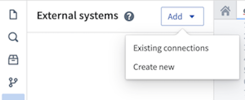

3. Choose a name for your source and a Project in which to store it. Upon creation, the newly created source will show up in the left side panel. Any egress policies, secrets and exportable markings can be directly configured from this panel.

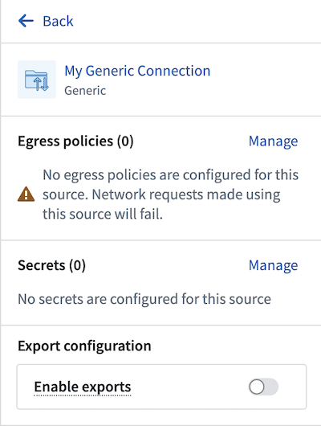

4. For this tutorial, you should add an [egress policy](/docs/foundry/administration/configure-egress/) for the dictionary API: `api.dictionaryapi.dev`. You will not need any secrets since this API does not require authentication, and export controls may be skipped for now. However, they will be required to [use Foundry data inputs with this source](#use-foundry-inputs-in-external-transforms).

5. Since this connection is to a REST API, you will be automatically prompted to convert your generic connector to a REST API source so that you can use the built-in Python requests client.

#### Option 2: Create a source in Data Connection

You may also create a source from the Data Connection application or use an existing source you have already configured. To use this option, follow the steps below:

1. Navigate to the Data Connection application within Foundry and choose **New Source**. From the list of options, select **REST API**.

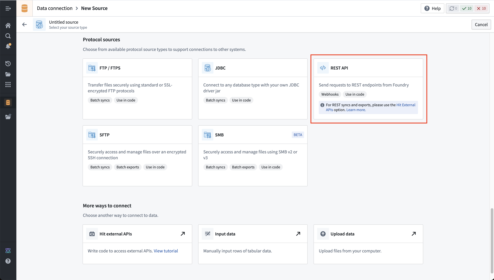

2. Review the **Overview** page, then select **Continue** in the bottom right. You will be prompted to choose the connection worker: pick a [Foundry worker](/docs/foundry/data-connection/core-concepts/#foundry-worker) to connect to the dictionary API, because [agent worker](/docs/foundry/data-connection/core-concepts/#agent-worker) connections are not supported for external transforms.

3. Choose a name for your source, and select a Project to which it should be saved.

4. Fill out the **Domains** section with the connection information of the API source. The configuration for the dictionary API example is shown below:

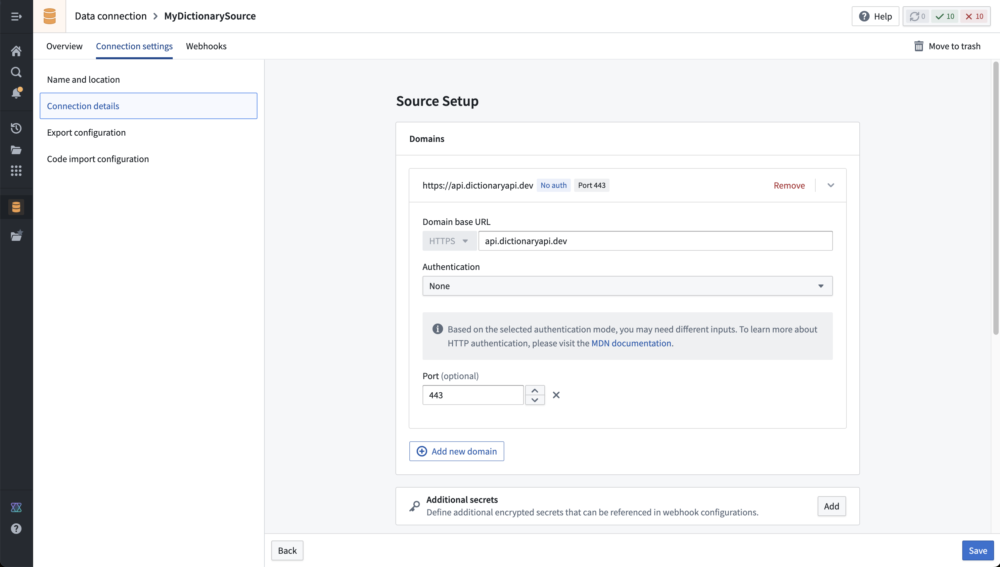

5. For this example, we also need to create the necessary egress policy. The policy will be automatically suggested in the **Network Connectivity** section if you completed the previous step:

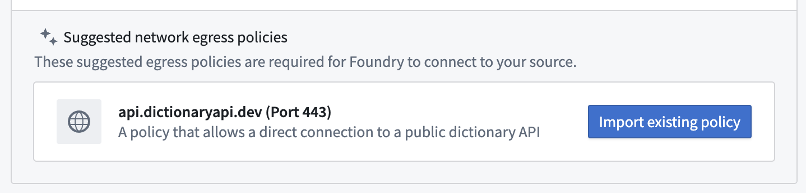

6. Select **Save**, then **Save and continue** to complete the source setup.

### Prerequisite: Import the `transforms-external-systems` library in your repository

To use external transforms, you must first import the `transforms-external-systems` library in your repository. Libraries are installed using the **Libraries** tab in the left side panel, searching for the desired library, then selecting **Install**.

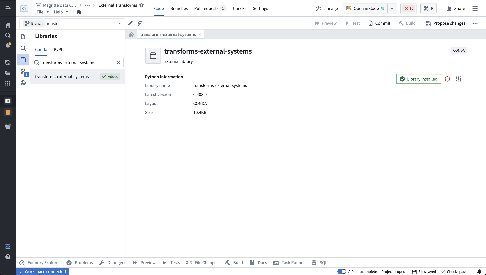

[Learn more about installing and managing libraries.](/docs/foundry/code-repositories/libraries/).

### Prerequisite: Import a source into code

:::callout{theme="neutral"}
REST API sources with multiple domains may not be imported. Instead, you should create a separate REST API source per domain if multiple domains are required in the same external transform.
:::

1. First, you must allow the REST API source to import into code. To configure this setting, navigate to the source in Data Connection, then to the **Connection settings > Code import configuration** tab.

2. Toggle on the option to **Allow this source to be imported into code repositories**. Any code repositories that import this source will be displayed on this page.

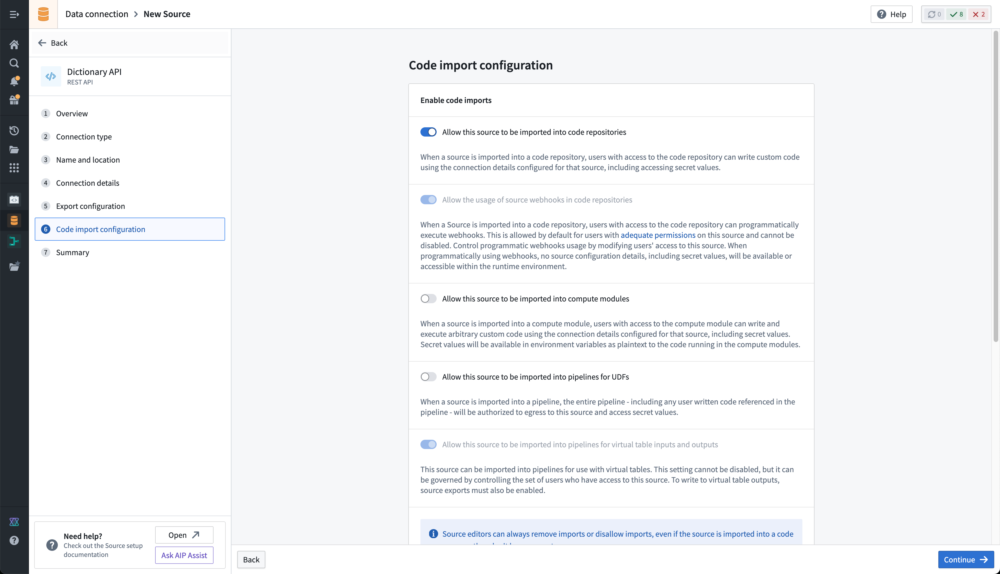

3. You are now ready to return to your code repository and import the source. In the repository, navigate to the left side panel and select the **External Systems** tab represented by the globe icon. Within the side panel, select **Add**, then search for the Dictionary API source that you previously created. Select this source, then **Confirm selection** to import.

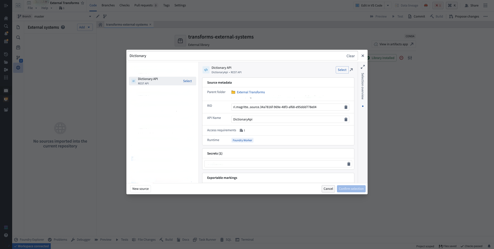

:::callout{theme="neutral"}
You must have at least `Editor` access to the source to be able to import it in the repository. Read more about [permissions](/docs/foundry/data-connection/permissions/#external-transforms-pipelines-and-compute-modules)
:::

## Write external transforms

Once you set up a Python transforms repository that imports your Dictionary API source, you are ready to start writing Python transforms code that uses the source to connect externally.

:::callout{theme="neutral"}
Review our [external transforms examples](#end-to-end-examples) to find fully configured examples of typical read or write workflows on top of common systems.
:::

### Import and configure the `@external_systems` decorator

To use external transforms, you must import `external_systems` decorator and `Source` object from the `transforms.external.systems` library:

```python
from transforms.external.systems import external_systems, Source
```

You should then specify the sources that should be included in a transform by using the `external_systems` decorator:

```python
@external_systems(
    dictionary_api_source=Source("ri.magritte..source.e301d738-b532-431a-8bda-fa211228bba6")
)
```

Sources will automatically be rendered as links to open in Data Connection and will display the source name instead of the resource identifier.

### Access source attributes and credentials

Once a source is imported into your transform, you can access attributes of the source using the built-in connection object using the `get_https_connection()` method. The example below shows how we can grab the base URL of the Dictionary API source we configured in the previous step.

```python
dictionary_api_url = dictionary_api_source.get_https_connection().url
```

Additional secrets or credentials stored on the source can also be accessed from the source. To identify the secret names that can be accessed, navigate to the left panel in your transform.

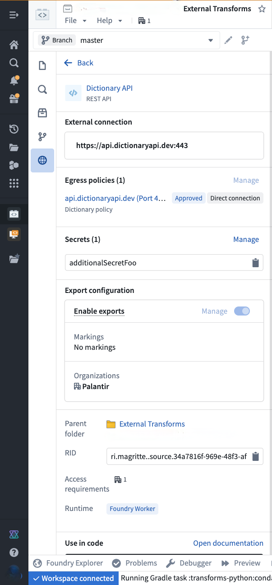

Use the following syntax to access secrets in code:

```python
dictionary_api_source.get_secret("additionalSecretFoo")
```

:::callout{theme="neutral"}
Currently, it is not possible to access source attributes that are not credentials unless the source provides an HTTPS client. For example, on a [PostgreSQL source](/docs/foundry/available-connectors/postgresql/) you will not be able to access the `hostname` or other non-secret attributes.
:::

### Use the built-in HTTP client

For sources that provide a RESTful API, the source object allows you to interact with a built-in HTTPS client. This client will be pre-configured with all of the details specified on the source, including any server or client certificates, and you can simply start making requests to the external system.

```python
dictionary_api_url = dictionary_api_source.get_https_connection().url
dictionary_api_client = dictionary_api_source.get_https_connection().get_client()

# dictionary_api_client is a pre-configured Session object from Python `requests` library.
# Example of GET request:
response = dictionary_api_client.get(dictionary_api_url + "/api/v2/entries/en/" + word, timeout=10)
```

Alternatively, you can use your own client or source-specific Python libraries and use the source object to [retrieve attributes and credentials](#access-source-attributes-and-credentials).

:::callout{theme="warning"}
Changing the working directory (for example, using `os.chdir()`) in your transforms or UDFs may break references to environment variables necessary for establishing secure connections.
:::

:::callout{theme="neutral"}
When connecting to an on-premise system using an [agent proxy runtime (sunset)](/docs/foundry/data-connection/agent-proxy-runtime/), you *must* use the built-in client since that will be automatically configured with the necessary agent proxy configuration.
:::

### Example: Import data from the Dictionary API

The below example illustrates a complete transform that runs through a list of words and retrieves their phonetic transcription from the Dictionary API.

```python
from pandas import DataFrame
from transforms.api import transform
from transforms.api import Output, Input, TransformContext, transform_pandas
from transforms.external.systems import external_systems, Source
import pandas as pd
import logging

logger = logging.getLogger(__name__)


@external_systems(
    dictionary_api_source=Source(
        "<source_rid>"
    )
)
@transform_pandas(Output("<output_dataset_rid>"))
def compute(dictionary_api_source) -> DataFrame:
    dictionary_api_url = dictionary_api_source.get_https_connection().url
    dictionary_api_client = dictionary_api_source.get_https_connection().get_client()

    words = ["apple", "dog", "cat"]

    phonetics = []

    for word in words:
        logger.info("Fetching word from api.dictionaryapi.dev : " + word)

        response = dictionary_api_client.get(
            dictionary_api_url + "/api/v2/entries/en/" + word
        ).json()

        phonetics += [{"word": word, "phonetic": response[0]["phonetic"]}]

    return pd.DataFrame(phonetics)

```

## Use Foundry inputs in external transforms

External transforms often need to use Foundry input data. For example, you might want to query an API to gather additional metadata for each row in a tabular dataset. Alternatively, you might have a workflow where you need to export Foundry data into an external software system.

Such cases are considered *export-controlled* workflows, as they open the possibility of exporting secure Foundry data into another system with unknown security guarantees and severed data provenance. When configuring a source connection, the source owner must specify whether or not data from Foundry may be exported, and provide the set of security markings and organizations may be exported. Foundry provides governance controls to ensure developers can clearly encode security intent, and Information Security Officers can audit the scope and intent of workflows interacting with external systems.

### Configure export controls on the source

Exports are controlled using [security markings](/docs/foundry/security/markings/). When configuring a source, the export configuration is used to specify which security markings and organizations are safe to export to the external system. This is done by navigating to the source in the data connection application, and then navigating to the **Connection settings > Export configuration** tab. You should then toggle on the option to **Enable exports to this source** and select the set of markings and organizations that may potentially be exported.

Doing this requires permission to remove markings on the relevant data and Organizations, since exporting is considered equivalent to removing markings on data within Foundry.

The setting to **Enable exports to this source** must be toggled on to allow the following:

* Use datasets, media sets, and streams as an input to Python transforms code importing this source.
* Use virtual tables registered on this source in Python transforms.

Below you can see an example export configuration for the Dictionary API source, allowing data from the `Palantir` organization with no additional security markings to be exported to the Dictionary API:

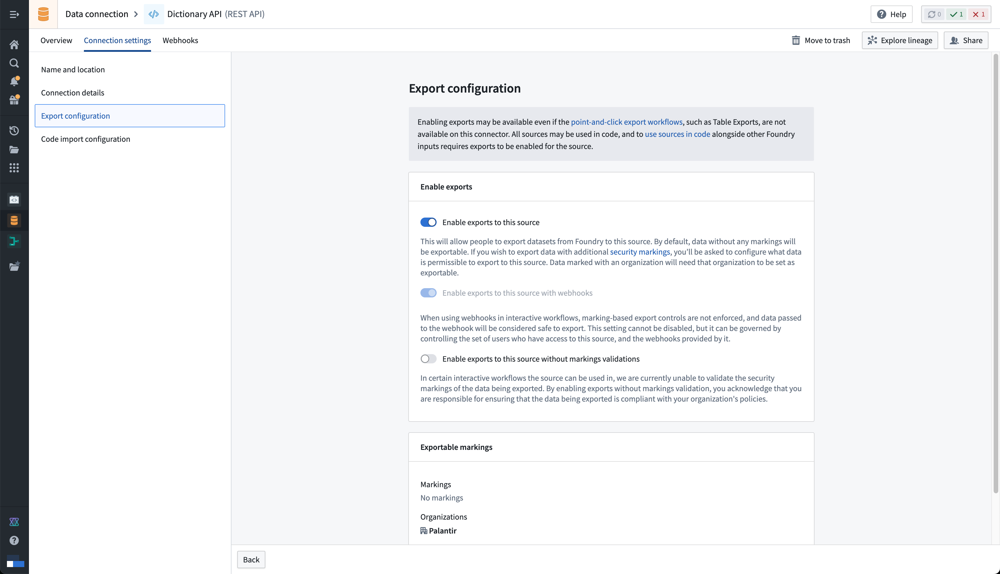

:::callout{theme="neutral"}
Note that **Enable exports to this source** must be toggled on *even if you are not actually exporting data to this system*, since allowing Foundry data inputs into the same compute job with an open connection to this system means that data *could* be exported.
:::

### Example: Use Foundry imports alongside data from the Dictionary API

In this example, we use an input dataset of words instead of a static hard-coded list. It also illustrates basic error handling based on the status code of the response.

```python
from pandas import DataFrame
from transforms.api import transform
from transforms.api import Output, Input, TransformContext, transform_pandas
from transforms.external.systems import external_systems, Source, ResolvedSource
import pandas as pd
import logging

logger = logging.getLogger(__name__)


@external_systems(
    dictionary_api_source=Source(
        "<source_rid>"
    )
)
@transform_pandas(
    Output("<output_dataset_rid>"),
    words_df=Input("<input_dataset_rid>"),
)
def compute(dictionary_api_source: ResolvedSource, words_df: DataFrame) -> DataFrame:
    dictionary_api_url = dictionary_api_source.get_https_connection().url
    dictionary_api_client = dictionary_api_source.get_https_connection().get_client()

    words = words_df["word"].tolist()

    phonetics= []

    for word in words:
        logger.info("Fetching word from api.dictionaryapi.dev: " + word)

        response = dictionary_api_client.get(
            dictionary_api_url + "/api/v2/entries/en/" + word
        )

        if response.status_code == 200:
            data = response.json()[0]

            if "phonetic" in data:
                phonetic_transcription = data["phonetic"]
            else:
                logger.warning(f"No phonetic transcription found for {word}.")
                phonetic_transcription = None
        else:
            logger.warning(f"Request for {words} failed with status code {response.status_code}.")
            phonetic_transcription = None

        phonetics += [{"word": word, "phonetic": phonetic_transcription}]

    return pd.DataFrame(phonetics)
```

## End-to-end examples

Review the documentation below the find complex end-to-end examples for common systems:

* REST API sources
  * [OAuth Client Credentials grant](/docs/foundry/available-connectors/rest-apis/#oauth-client-credentials-grant)
  * [Self-signed server certificates](/docs/foundry/available-connectors/rest-apis/#use-self-signed-server-certificates)
* Foundry API
  * [Call the Foundry API from code](/docs/foundry/available-connectors/foundry/#call-the-foundry-api-from-code)
* File-based systems
  * [Amazon S3](/docs/foundry/available-connectors/amazon-s3/#use-s3-sources-in-code)
  * [SMB](/docs/foundry/available-connectors/smb/#use-smb-sources-in-code)
* Custom Python SDKs
  * [BigQuery](/docs/foundry/available-connectors/bigquery/#use-bigquery-sources-in-code)
  * [Snowflake](/docs/foundry/available-connectors/snowflake/#use-snowflake-sources-in-code)
  * [SharePoint](/docs/foundry/available-connectors/sharepoint-online/#use-sharepoint-sources-in-code)
  * [SFTP](/docs/foundry/available-connectors/sftp/#use-sftp-sources-in-code)
  * [Kafka](/docs/foundry/available-connectors/kafka/#use-kafka-sources-in-code)
* Agent host file access
  * [Directory (SSH)](/docs/foundry/available-connectors/directory/#ingest-files-from-agent-hosts-using-external-transforms)
* JDBC-based systems
  * [PostgreSQL](/docs/foundry/available-connectors/postgresql/#use-postgresql-sources-in-code)
  * [Microsoft SQL Server](/docs/foundry/available-connectors/microsoft-sql-server/#use-microsoft-sql-server-sources-in-code)

## Permissions

Before using external transforms, make sure to familiarize yourself with the [Data Connection - Permissions reference](/docs/foundry/data-connection/permissions/) page.

## Comparison of external transforms and legacy external transforms

The following are some key workflow differences between external transforms and legacy external transforms:

* The tab for importing sources will always automatically show for external transforms. Previously, tabs for adding egress policy and credentials would only show after an Information Security Officer had toggled on the ability to use external systems in repository settings.
* Settings to allow external connections and the use of inputs are no longer located in repository settings. Instead, these are controlled on each individual source.
* Credentials, egress policies, and exportable markings are no longer specified in code. Instead, these settings are taken from the sources that are imported into the transform and applied automatically to the job.
  * If this configuration is changed at the source level, it will automatically be picked up by transforms that import the source without any code change or version bump required. This allows centralized governance of credentials, egress, and exportable Markings which will propagate immediately to downstream workflows.
  * Changes will take effect as of the start of a build and will not affect running builds.
* The decorator has changed from `@use_external_systems()` to `@external_systems()`.

Key advantages of external transforms include the following:

* Support for connecting to systems not accessible from the Internet
* Support for rotating/updating credentials without requiring code changes
* Support for sharing connection configuration across multiple repositories
* Out-of-the-box Python clients for selected source types
* Improved and simplified governance workflows for enabling and managing external transform repositories
* Visualization of external transforms connected to external sources in [Data Lineage](/docs/foundry/data-lineage/overview/)

## Migrate to external transforms

There is currently no automatic migration path to update external transforms to external transforms. However, the manual action required is expected to be minimal for most workflows.

The following are the main steps to manually migrate to external transforms:

1. Identify the set of credentials, egress policies, and export control Markings used in your existing legacy external transforms code.
2. Identify or configure Data Connection sources that connect to the systems you wish to connect to from your external transforms. Ensure these sources are configured to allow imports into code.
3. Import the relevant sources from step 2 into your existing Python transforms repository.
4. Change your code to import and use the new `@external_systems()` decorator with source references, then remove any instances of the `@use_external_systems()` decorator. This will likely involve updating any references to credentials in your transforms logic to instead reference credentials retrieved from the sources you are now importing.
5. Test your changes on a branch to ensure that your transforms continue to build successfully.
6. After merging your updated transforms code, you can now un-toggle the repository settings.

Transforms cannot contain both external transforms and their legacy version. To remedy this, you can migrate all legacy external transforms to use source-based external transforms instead (preferred), or split your transform into multiple transforms. Transforms can be split into one that uses the `use_external_systems` decorator and another that uses the `external_systems` decorator.

## Capabilities

### `lightweight` external transforms

External transforms are also compatible with the single-node (lightweight) [compute engines](/docs/foundry/transforms-python/compute-engines/). Using lightweight compute can dramatically increase the execution speed for transforms operating on small and medium-sized data.

The below example shows how the `@lightweight` decorator can be added to a transform along with the `@external_systems` decorator. For more information on the options for configuring lightweight transforms, see the [Python transforms documentation](/docs/foundry/api-reference/transforms-python-library/api-transform/#transforms.api.transform.using).

```python
@lightweight
@external_systems(
    dictionary_api_source=Source("<source_rid>")
)
```

For more in-depth examples, refer to [sources in Python](/docs/foundry/data-connection/sources-in-python/).

### Sources using agent proxy policies

External transforms support connecting to on-premise and privately hosted systems through Data Connection agents using [agent proxy policies](/docs/foundry/administration/configure-egress/#agent-proxy-egress-policies).

The example below demonstrates how to connect to a PostgreSQL database using a Spark sidecar transform. For more information, see the [Spark sidecar transforms documentation](/docs/foundry/transforms-container/transforms-sidecar/).

Note that Spark sidecar transforms may not be needed for simpler use cases than the example below; other examples that do not need Spark sidecar transforms can be found [elsewhere on this page](/docs/foundry/data-connection/external-transforms/#external-transforms).

#### Create a source using an Agent network policy

To configure external transforms with private network access:

1. **Create a [PostgreSQL source](/docs/foundry/available-connectors/postgresql/) with direct connection runtime:** When creating your Data Connection source, select **Direct connection** as the runtime option.
2. **Configure network policy:** In the source's network connectivity settings, create a network policy that defines the routing through your Data Connection agent. Select **Agent proxy** and then choose the agents that should be used to proxy.

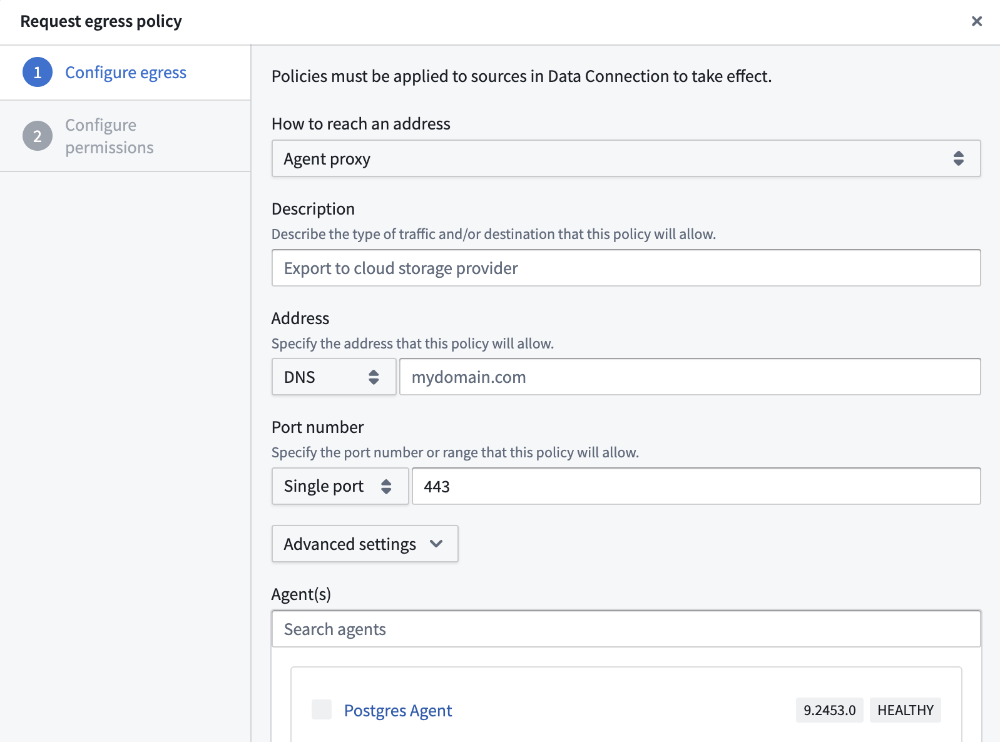
3\. **Enable code imports:** In the code import configuration panel, toggle on **Allow this source to be imported into code repositories**.


4\. Bootstrap a transform code repository and import the source.

#### Example: PostgreSQL connection via Spark sidecar

This example shows how to query a PostgreSQL database using a containerized Flask API within a sidecar container.

##### Dockerfile

```dockerfile
FROM python:3.8-slim
WORKDIR /usr/src/app
COPY requirements.txt ./
RUN pip install --no-cache-dir -r requirements.txt
COPY . .
EXPOSE 1234
USER 5001
CMD ["python", "app.py"]
```

##### requirements.txt

```
flask
psycopg2-binary
```

##### Flask application (app.py)

```python
from flask import Flask, jsonify
import psycopg2

app = Flask(__name__)

@app.route('/tables', methods=['POST'])
def tables():
    data = request.get_json()
    password = data.get('password')

    connection_params = {
        "dbname": "<databasename>",
        "user": "<user>",
        "password": password,
        "host": "postgres.com",
        "port": "5432",
    }


    data = {"schema": [], "table": []}
    with psycopg2.connect(**connection_params) as conn:
        with conn.cursor() as cur:
            cur.execute(
                "SELECT table_schema, table_name FROM information_schema.tables WHERE table_type = 'BASE TABLE'"
            )
            tables = cur.fetchall()
            for schema, table in tables:
                data["schema"].append(schema)
                data["table"].append(table)

    return jsonify(data)
```

##### Transform implementation

```python
import requests
from transforms.sidecar import sidecar
from transforms.external.systems import external_systems, Source
from transforms.api import transform_df, Output

@external_systems(
    my_source=Source("<source_rid>")
)
@sidecar(image="simple", tag="0.0.1")
@transform_df(
    Output("<output_dataset_rid>"),
)
def compute(my_source, ctx):
    password = my_source.get_secret("PASSWORD")
    response = requests.post("http://localhost:1234/tables", json={"password": password})
    data = [(response.text,)]
    columns = ["table_schema_json"]
    return ctx.spark_session.createDataFrame(data, columns)

```

## Advanced patterns

### Write data to Parquet files with memory-aware buffering

When an external transform fetches many records from an external source, holding all records in memory before writing can cause out-of-memory errors. The `BufferedParquetWriter` class below periodically flushes accumulated rows to Parquet files once a configurable memory threshold is exceeded. The pattern works with any external data source and uses `filesystem().open()` to write raw files and `put_metadata()` to finalize schema inference.

```python
import gc
import logging
from datetime import datetime

import pyarrow as pa
import pyarrow.parquet as pq
from pympler import asizeof

from transforms.api import Output, transform, LightweightOutput
from transforms.external.systems import external_systems, Source, ResolvedSource

logger = logging.getLogger(__name__)


class BufferedParquetWriter:
    """Buffers rows in memory and flushes them to Parquet files when the buffer
    exceeds a configurable size threshold."""

    def __init__(self, output: LightweightOutput, schema: pa.Schema, flush_threshold_mb: int = 64):
        self.output = output
        self.schema = schema
        self.flush_threshold_bytes = flush_threshold_mb * 1024 * 1024
        self.buffer = []
        self.buffer_size_bytes = 0
        self.file_index = 0
        self.row_size_estimate = None

    def append(self, row: dict):
        """Add a row to the buffer. If the buffer exceeds the threshold, flush to disk."""
        self.buffer.append(row)

        # Estimate row size from the first row, then use that estimate going forward
        if self.row_size_estimate is None:
            self.row_size_estimate = asizeof.asizeof(row)
        self.buffer_size_bytes += self.row_size_estimate

        if self.buffer_size_bytes >= self.flush_threshold_bytes:
            self.flush()

    def flush(self):
        """Write buffered rows to a Parquet file and clear the buffer."""
        if not self.buffer:
            return
        self.file_index += 1
        table = pa.Table.from_pylist(self.buffer, schema=self.schema)
        timestamp = datetime.now().strftime("%Y%m%d_%H%M%S")
        filename = f"output_{timestamp}_{self.file_index}.parquet"
        with self.output.filesystem().open(filename, "wb") as f:
            pq.write_table(table, f)
        logger.info(f"Flushed {len(self.buffer)} rows to {filename}")
        self.buffer = []
        self.buffer_size_bytes = 0
        gc.collect()

    def finalize(self):
        """Flush any remaining rows and trigger schema inference."""
        self.flush()
        if self.file_index > 0:
            self.output.put_metadata()


# Define the schema for your output records
OUTPUT_SCHEMA = pa.schema([
    ("id", pa.string()),
    ("name", pa.string()),
    ("value", pa.float64()),
])


@external_systems(
    my_source=Source("<source_rid>")
)
@transform.using(
    output=Output("<output_dataset_rid>"),
).with_resources(
    memory_gb=4,
)
def compute(my_source: ResolvedSource, output: LightweightOutput):
    output.set_mode("replace")
    writer = BufferedParquetWriter(output, OUTPUT_SCHEMA, flush_threshold_mb=64)

    # Replace the loop below with your data fetching logic.
    # For example, iterate over pages from an API, rows from a database cursor,
    # or messages from a message queue.
    # Each call to append() adds data to the writer, which automatically
    # flushes to a Parquet file when the buffer exceeds the threshold.
    for record in fetch_records_from_source(my_source):
        writer.append({
            "id": record["id"],
            "name": record["name"],
            "value": record["value"],
        })

    # Write any remaining buffered rows and finalize schema inference.
    writer.finalize()
```

### Export a dataset as CSV

When you need to export data from Foundry as CSV, for example to deliver files to an external system that expects CSV format, you can use an external transform that reads an input dataset and writes a CSV file to the output using `filesystem().open()`. The output dataset can then be exported through [Data Connection](/docs/foundry/data-connection/export-overview/).

```python
import csv

from transforms.api import Input, Output, transform, LightweightInput, LightweightOutput


@transform.using(
    source_data=Input("<input_dataset_rid>"),
    csv_output=Output("<output_dataset_rid>"),
)
def compute(source_data: LightweightInput, csv_output: LightweightOutput):
    OUTPUT_FILENAME = "export.csv"

    # Read the input dataset as a Polars DataFrame.
    df = source_data.polars()
    fieldnames = df.columns

    # Write the data as a CSV file.
    with csv_output.filesystem().open(OUTPUT_FILENAME, "w") as f:
        writer = csv.DictWriter(f, fieldnames=fieldnames)
        writer.writeheader()
        for row in df.iter_rows(named=True):
            writer.writerow(row)
```
