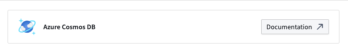
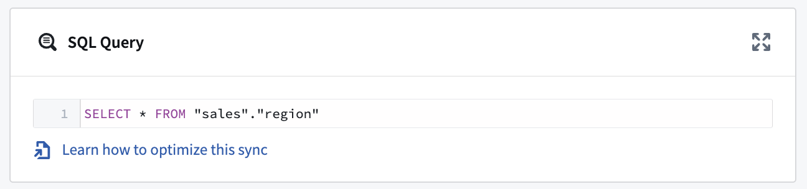
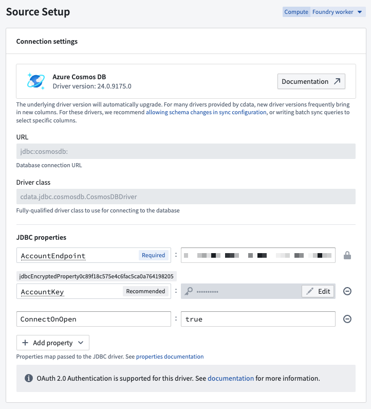
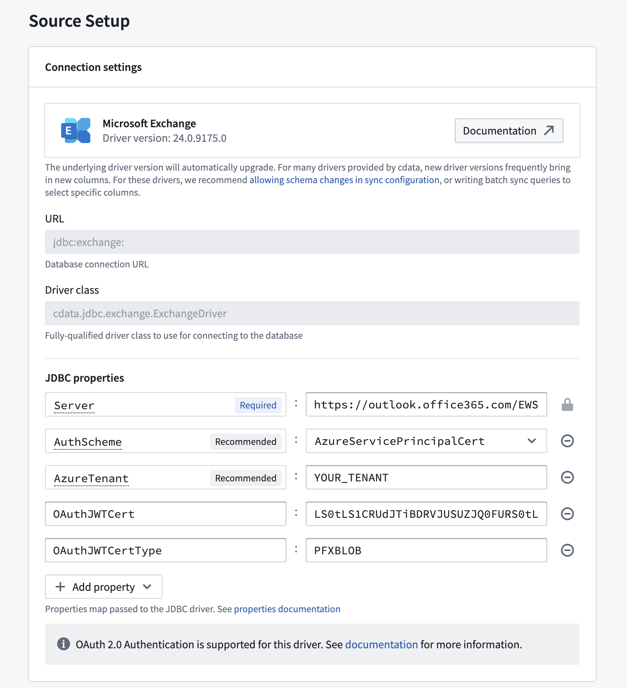
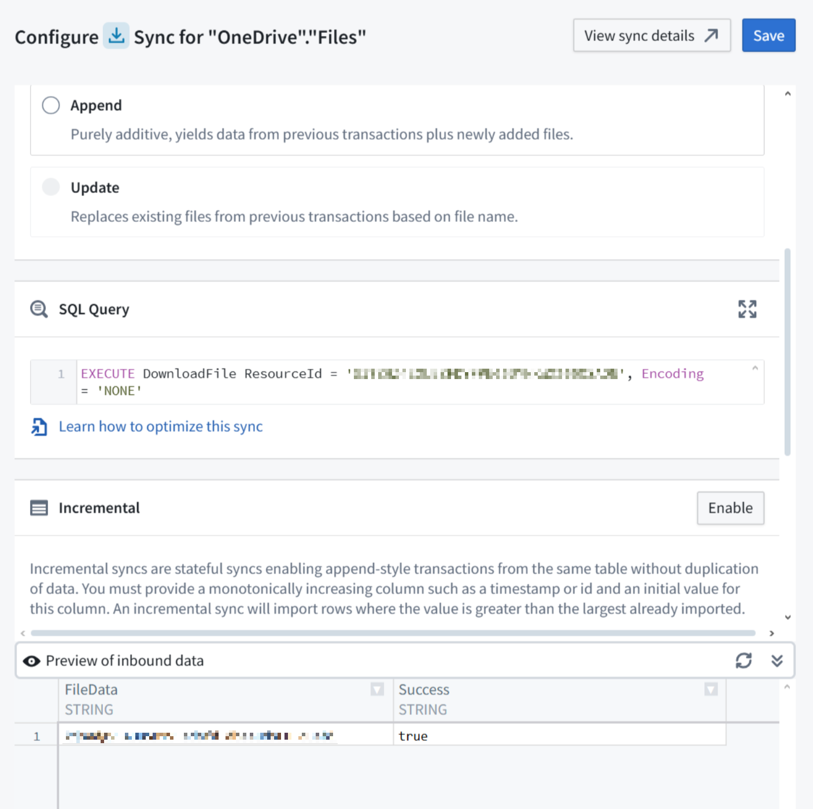
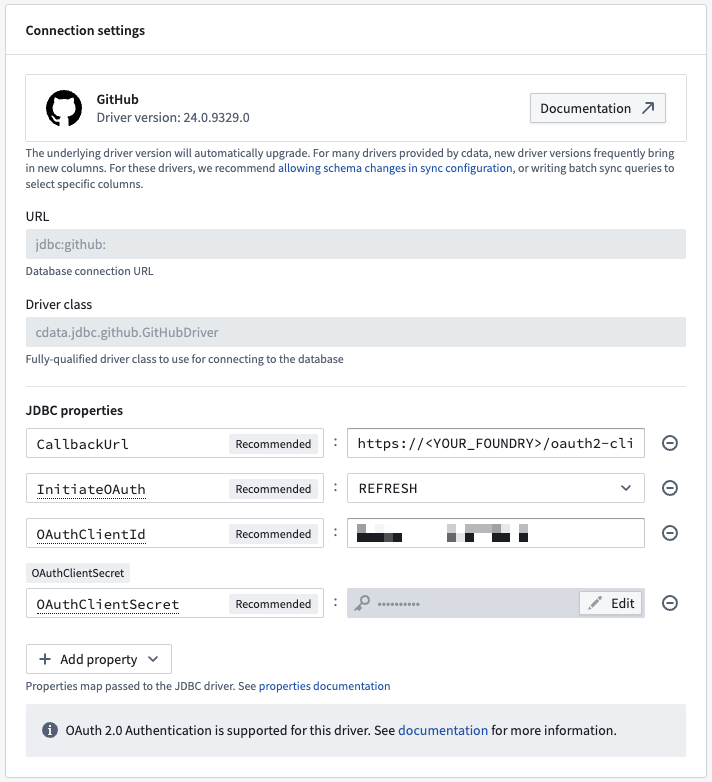
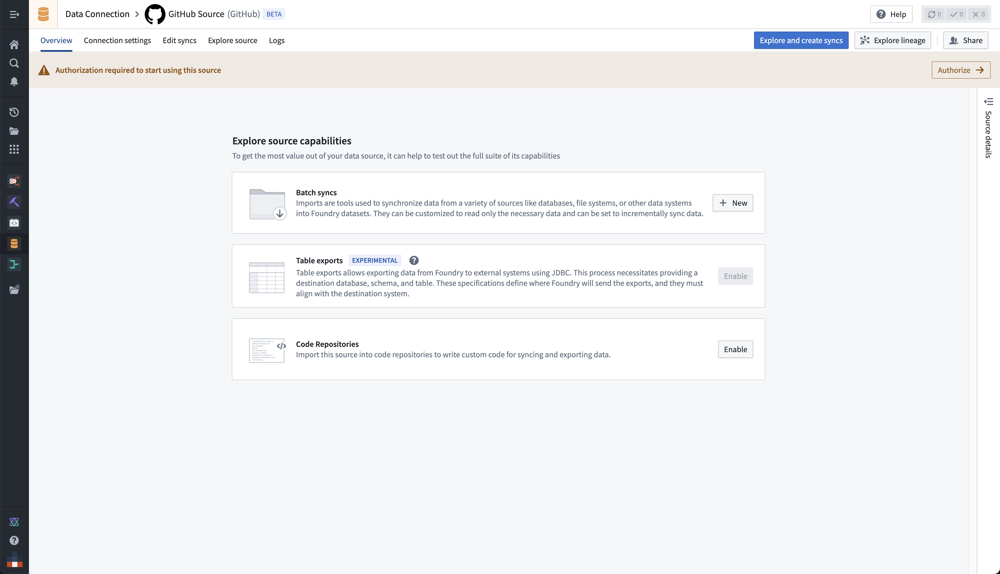
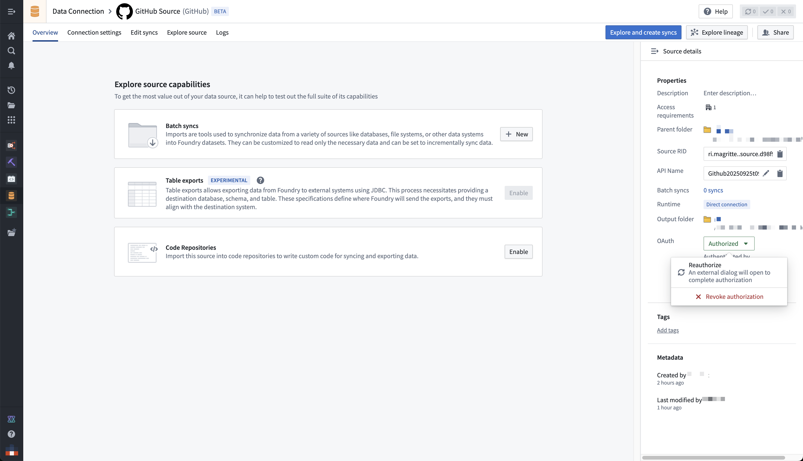

<!-- source: https://palantir.com/docs/foundry/data-integration/foundry-provided-drivers/ · mirrored 2026-08-06 from Palantir Foundry docs -->

# Palantir-provided drivers for JDBC sources

You can connect your Foundry enrollment to various external sources using a JDBC driver that appears as Foundry sources in Data Connection. These sources are wrappers around JDBC drivers that allow for customization, and they come with recommended and required properties and links to official documentation.

If you want to upload your own JDBC driver to Foundry, review the documentation on configuring [a custom JDBC driver](/docs/foundry/available-connectors/custom-jdbc-sources/)

## Setup

1. Open the Data Connection application and select **+New Source** in the upper right corner of the screen.

2. Find your specific source from the listed options. [View a complete list of Foundry-provided drivers.](#available-drivers)

3. Choose to run the source capabilities on a [Foundry worker](/docs/foundry/data-connection/core-concepts/#foundry-worker) or on an [agent worker](/docs/foundry/data-connection/core-concepts/#agent-worker).

4. Select **Documentation ↗** to review official documentation for the driver source.   
      

5. Follow the additional configuration prompts to continue the setup of your connector using the information in the sections below.

## Configuration options

|Parameter |Required? |Description |
|--- |--- |--- |
|`URL` |Yes |The JDBC URL that is used by the driver. Comes pre-populated with a template that may need to be modified to ensure correct behavior. Refer to the source system's documentation for the JDBC URL format, and review the [Java documentation ↗](https://docs.oracle.com/javase/tutorial/jdbc/basics/connecting.html) for additional information.  |
|`JDBC properties` |Yes |Lists out all required and recommended properties that the driver needs. Hovering over a required or recommended property will allow you to navigate to the official documentation. You can add any additional properties by choosing the **+ Add property** button.  |
| | | |

### JDBC properties

You can add [properties ↗](https://docs.oracle.com/en/java/javase/11/docs/api/java.base/java/util/Properties.html) to your JDBC connection to configure behavior. Certain properties are mandatory for a particular driver. These mandatory properties are populated by default and must be set before you can save your source. You can also view recommended properties that you can add by selecting **+Add property** and viewing the **Recommended** section.

Hover over the name of a `Required` or `Recommended` property to visit the official documentation page for the selected driver.

## Configure Foundry-provided driver syncs

### SQL queries

A single SQL query can be executed per sync. This query should produce a table of data as an output, which will be saved to the output dataset in Foundry.

Exceptionally, this query can invoke stored procedures that produce data as a result. [Read below](#stored-procedures) for more details.

## Configuration options for CData-provided drivers

Many of the Foundry-provided drivers are developed by [CData ↗](https://www.cdata.com/drivers/). CData provides full documentation for each driver including, in-depth instructions for generating credentials on the source system. You can navigate to these instructions from the documentation page for any CData driver.

The sections below contain information about CData-specific configuration options that can help you successfully connect to external systems.

### Automatically perform test connection on source exploration

By default, CData drivers defer performing the connection until actual queries are made. This can result in mistaken assumptions around source exploration, since the display of static metadata tables stored in the driver may lead you to think that exploration was successful, when in reality the connection to the underlying system was not successful due to missing credentials, missing egress policies, or other issues.

You can force the driver to perform a no-operation test connection, even when only exploring the source, by setting the **ConnectOnOpen** JDBC property to `true`. This is recommended to ensure that all connection issues are uncovered when exploring the source.

:::callout{theme="warning"}
`ConnectOnOpen: true` can not be used alongside [OAuth 2.0 authentication](#oauth-20-authentication).   
`ConnectOnOpen: true` can be the reason the connection fail when the credentials used to connect are very scoped down and are not allowed perform the no-operation command used for the test connection.
:::

### Certificate authentication

Many CData drivers support certificate authentication, in particular for Azure-based systems.

To connect using a certificate, you must define the following JDBC properties in addition to the connection-specific configuration requirements:

* **AuthScheme:** `AzureServicePrincipalCert`
* **OAuthJWTCertType:** `PFXBLOB`
* **OAuthJWTCert:** `base64-encoded_cert/pfx/pem_file_content`
* (Optional) **OAuthJWTCertPassword:** `password_for_the_cert/pfx/pem_file`

To transform the certificate file into Base64 format on a Windows machine, use the following command: `[Convert]::ToBase64String([IO.File]::ReadAllBytes("\path\to\file.pfx"))`

### Stored procedures

Some CData drivers connecting to file-based source systems like [Amazon Marketplace](/docs/foundry/available-connectors/amazon-marketplace/) or [Microsoft OneDrive](/docs/foundry/available-connectors/microsoft-onedrive/) rely on the ability to invoke stored procedures to ingest data.

Running the stored procedure will produce a table where the file content is stored as a Base64 encoded string. You can decode it in a downstream data transformation, for example in Pipeline Builder using a [Base64 decode](/docs/foundry/pb-functions-expression/base64DecodeV1/) board.

### OAuth 2.0 authentication

Some CData drivers support [OAuth 2.0 ↗](https://oauth.net/2/) authorization code grant flow. This enables secure connections to external systems by allowing users to authenticate with their own credentials and perform actions on their behalf. The [list of available drivers](#available-drivers) details which ones support OAuth 2.0 authentication.

:::callout{theme="warning"}
OAuth 2.0 authentication is only supported when running the source on a [Foundry worker](/docs/foundry/data-connection/core-concepts/#foundry-worker). Sources running on an [agent worker](/docs/foundry/data-connection/core-concepts/#agent-worker) do not support OAuth 2.0 authentication.
:::

To use OAuth 2.0 authentication:

1. Add the **CallbackUrl** JDBC property to the source configuration. The property value will auto-fill with a URL of the form `https://<YOUR_FOUNDRY_URL>/workspace/oauth2-clients/callback`.

2. In the external system, register a custom OAuth application and provide the callback URL.
   * The specifics of how to register a custom OAuth application will depend on each external system. For [GitHub ↗](https://github.com/), for example, navigate to **Settings > Developer Settings > OAuth Apps**. Then select **New OAuth App**.

3. Copy the generated **OAuth client id** and **OAuth client secret** and paste them in your source configuration JDBC properties.   
      

4. Once the configuration is saved, navigate to the source overview page. Select **Authorize** in the top banner labeled **Authorization required to start using this source** to start the OAuth flow.   
      

   You can renew or revoke authorization from the right-side panel on the source overview page.   
      

:::callout{theme="neutral"}
Starting, renewing, or revoking the OAuth flow requires the `Owner` role on the source by default. Users with only `Viewer` or `Editor` will see a permission denied error when selecting **Authorize**. If you need to grant these operations without granting full `Owner` permissions, define a custom role that includes the source administration operations.
:::

## Available drivers

| Driver | Supports OAuth 2.0 Authentication |
|---|---|
| [Act! CRM](/docs/foundry/available-connectors/act!-crm/) | FALSE |
| [Act-On](/docs/foundry/available-connectors/act-on/) | TRUE |
| [ActiveCampaign](/docs/foundry/available-connectors/activecampaign/) | FALSE |
| [Acumatica](/docs/foundry/available-connectors/acumatica/) | FALSE |
| [Adobe Analytics](/docs/foundry/available-connectors/adobe-analytics/) | TRUE |
| [Adobe Commerce](/docs/foundry/available-connectors/adobe-commerce/) | FALSE |
| [ADP](/docs/foundry/available-connectors/adp/) | TRUE |
| [Airtable](/docs/foundry/available-connectors/airtable/) | TRUE |
| [AlloyDB](/docs/foundry/available-connectors/alloydb/) | FALSE |
| [Amazon DynamoDB](/docs/foundry/available-connectors/amazon-dynamodb/) | FALSE |
| [Amazon Marketplace](/docs/foundry/available-connectors/amazon-marketplace/) | TRUE |
| [Apache CouchDB](/docs/foundry/available-connectors/apache-couchdb/) | FALSE |
| [Apache HBase](/docs/foundry/available-connectors/apache-hbase/) | FALSE |
| [Apache Hive](/docs/foundry/available-connectors/apache-hive/) | FALSE |
| [Apache Phoenix](/docs/foundry/available-connectors/apache-phoenix/) | FALSE |
| [Authorize.Net](/docs/foundry/available-connectors/authorize-net/) | FALSE |
| [Avalara](/docs/foundry/available-connectors/avalara/) | FALSE |
| [Azure Active Directory](/docs/foundry/available-connectors/azure-active-directory/) | FALSE |
| [Azure Cosmos DB](/docs/foundry/available-connectors/azure-cosmos-db/) | TRUE |
| [Azure Data Catalog](/docs/foundry/available-connectors/azure-data-catalog/) | TRUE |
| [Azure DevOps](/docs/foundry/available-connectors/azure-devops/) | TRUE |
| [Azure Synapse](/docs/foundry/available-connectors/azure-synapse/) | TRUE |
| [Azure Table Storage](/docs/foundry/available-connectors/azure-table-storage/) | TRUE |
| [Basecamp](/docs/foundry/available-connectors/basecamp/) | TRUE |
| [BigCommerce](/docs/foundry/available-connectors/bigcommerce/) | TRUE |
| [Blackbaud Raisers Edge NXT](/docs/foundry/available-connectors/blackbaud-raisers-edge-nxt/) | TRUE |
| [Bugzilla](/docs/foundry/available-connectors/bugzilla/) | FALSE |
| [Bullhorn CRM](/docs/foundry/available-connectors/bullhorn-crm/) | TRUE |
| [Cassandra](/docs/foundry/available-connectors/cassandra/) | FALSE |
| [Certinia](/docs/foundry/available-connectors/certinia/) | TRUE |
| [Cloudant](/docs/foundry/available-connectors/cloudant/) | TRUE |
| [CockroachDB](/docs/foundry/available-connectors/cockroachdb/) | FALSE |
| [Confluence](/docs/foundry/available-connectors/confluence/) | TRUE |
| [Couchbase](/docs/foundry/available-connectors/couchbase/) | FALSE |
| [Databricks](/docs/foundry/available-connectors/databricks/) | FALSE |
| [DocuSign](/docs/foundry/available-connectors/docusign/) | TRUE |
| [Domino](/docs/foundry/available-connectors/domino/) | TRUE |
| [eBay](/docs/foundry/available-connectors/ebay/) | TRUE |
| [eBay Analytics](/docs/foundry/available-connectors/ebay-analytics/) | TRUE |
| [EnterpriseDB](/docs/foundry/available-connectors/enterprisedb/) | FALSE |
| [Epicor Kinetic](/docs/foundry/available-connectors/epicor-kinetic/) | TRUE |
| [Exact Online](/docs/foundry/available-connectors/exact-online/) | TRUE |
| [Facebook](/docs/foundry/available-connectors/facebook/) | TRUE |
| [Facebook Ads](/docs/foundry/available-connectors/facebook-ads/) | TRUE |
| [FreshBooks](/docs/foundry/available-connectors/freshbooks/) | TRUE |
| [Freshdesk](/docs/foundry/available-connectors/freshdesk/) | FALSE |
| [GitHub](/docs/foundry/available-connectors/github/) | TRUE |
| [Gmail](/docs/foundry/available-connectors/gmail/) | TRUE |
| Google Ad Manager | FALSE |
| Google Ads | FALSE |
| Google Analytics | FALSE |
| Google Calendar | FALSE |
| [Google Campaign Manager](/docs/foundry/available-connectors/google-campaign-manager/) | TRUE |
| [Google Contacts](/docs/foundry/available-connectors/google-contacts/) | TRUE |
| [Google Data Catalog](/docs/foundry/available-connectors/google-data-catalog/) | TRUE |
| [Google Directory](/docs/foundry/available-connectors/google-directory/) | TRUE |
| [Google Drive](/docs/foundry/available-connectors/google-drive/) | TRUE |
| [Google Search](/docs/foundry/available-connectors/google-search/) | FALSE |
| [Google Spanner](/docs/foundry/available-connectors/google-spanner/) | TRUE |
| [GraphQL](/docs/foundry/available-connectors/graphql/) | TRUE |
| [Greenplum](/docs/foundry/available-connectors/greenplum/) | FALSE |
| [Highrise](/docs/foundry/available-connectors/highrise/) | TRUE |
| [IBM Cloud Data Engine](/docs/foundry/available-connectors/ibm-cloud-data-engine/) | TRUE |
| [IBM Cloud Object Storage](/docs/foundry/available-connectors/ibm-cloud-object-storage/) | TRUE |
| [Instagram](/docs/foundry/available-connectors/instagram/) | TRUE |
| [Jira Service Management](/docs/foundry/available-connectors/jira-service-management/) | TRUE |
| [Kintone](/docs/foundry/available-connectors/kintone/) | FALSE |
| [LDAP](/docs/foundry/available-connectors/ldap/) | FALSE |
| [LinkedIn](/docs/foundry/available-connectors/linkedin/) | TRUE |
| [LinkedIn Marketing Solutions](/docs/foundry/available-connectors/linkedin-marketing-solutions/) | TRUE |
| [Mailchimp](/docs/foundry/available-connectors/mailchimp/) | TRUE |
| [Marketo](/docs/foundry/available-connectors/marketo/) | TRUE |
| [MarkLogic](/docs/foundry/available-connectors/marklogic/) | FALSE |
| [Microsoft Access](/docs/foundry/available-connectors/microsoft-access/) | FALSE |
| [Microsoft Ads](/docs/foundry/available-connectors/microsoft-ads/) | TRUE |
| [Microsoft Bing](/docs/foundry/available-connectors/microsoft-bing/) | FALSE |
| [Microsoft Dataverse](/docs/foundry/available-connectors/microsoft-dataverse/) | FALSE |
| [Microsoft Dynamics 365](/docs/foundry/available-connectors/microsoft-dynamics-365/) | TRUE |
| [Microsoft Dynamics 365 Business Central](/docs/foundry/available-connectors/microsoft-dynamics-365-business-central/) | TRUE |
| [Microsoft Dynamics CRM](/docs/foundry/available-connectors/microsoft-dynamics-crm/) | TRUE |
| [Microsoft Dynamics GP](/docs/foundry/available-connectors/microsoft-dynamics-gp/) | FALSE |
| [Microsoft Dynamics NAV](/docs/foundry/available-connectors/microsoft-dynamics-nav/) | FALSE |
| [Microsoft Excel](/docs/foundry/available-connectors/microsoft-excel/) | TRUE |
| [Microsoft Excel Online](/docs/foundry/available-connectors/microsoft-excel-online/) | TRUE |
| [Microsoft Exchange](/docs/foundry/available-connectors/microsoft-exchange/) | TRUE |
| [Microsoft Office 365](/docs/foundry/available-connectors/microsoft-office-365/) | TRUE |
| [Microsoft OneDrive](/docs/foundry/available-connectors/microsoft-onedrive/) | TRUE |
| [Microsoft OneNote](/docs/foundry/available-connectors/microsoft-onenote/) | TRUE |
| [Microsoft Planner](/docs/foundry/available-connectors/microsoft-planner/) | TRUE |
| [Microsoft Power BI® XMLA](/docs/foundry/available-connectors/microsoft-power-bi-xmla/) | TRUE |
| [Microsoft Project](/docs/foundry/available-connectors/microsoft-project/) | TRUE |
| [Microsoft SharePoint](/docs/foundry/available-connectors/microsoft-sharepoint/) | TRUE |
| [Microsoft SharePoint Excel](/docs/foundry/available-connectors/microsoft-sharepoint-excel/) | FALSE |
| [Microsoft SQL Server](/docs/foundry/available-connectors/microsoft-sql-server/) | FALSE |
| [Microsoft SQL Server Analysis Services](/docs/foundry/available-connectors/microsoft-sql-server-analysis-services/) | FALSE |
| [Microsoft Teams](/docs/foundry/available-connectors/microsoft-teams/) | TRUE |
| [Monday](/docs/foundry/available-connectors/monday/) | TRUE |
| [MYOB](/docs/foundry/available-connectors/myob/) | TRUE |
| [OData](/docs/foundry/available-connectors/odata/) | TRUE |
| [Odoo](/docs/foundry/available-connectors/odoo/) | FALSE |
| [Oracle](/docs/foundry/available-connectors/oracle/) | FALSE |
| [Oracle Eloqua](/docs/foundry/available-connectors/oracle-eloqua/) | TRUE |
| [Oracle Fusion Cloud Financials](/docs/foundry/available-connectors/oracle-fusion-cloud-financials/) | FALSE |
| [Oracle Fusion Cloud HCM](/docs/foundry/available-connectors/oracle-fusion-cloud-hcm/) | FALSE |
| [Oracle Fusion Cloud SCM](/docs/foundry/available-connectors/oracle-fusion-cloud-scm/) | FALSE |
| [Oracle Sales](/docs/foundry/available-connectors/oracle-sales/) | FALSE |
| [Oracle Service Cloud](/docs/foundry/available-connectors/oracle-service-cloud/) | FALSE |
| [Outreach](/docs/foundry/available-connectors/outreach/) | TRUE |
| [Paylocity](/docs/foundry/available-connectors/paylocity/) | TRUE |
| [PayPal](/docs/foundry/available-connectors/paypal/) | TRUE |
| [Pinterest](/docs/foundry/available-connectors/pinterest/) | TRUE |
| [Pipedrive](/docs/foundry/available-connectors/pipedrive/) | TRUE |
| [Presto](/docs/foundry/available-connectors/presto/) | FALSE |
| [Quickbase](/docs/foundry/available-connectors/quickbase/) | FALSE |
| [QuickBooks Desktop](/docs/foundry/available-connectors/quickbooks-desktop/) | FALSE |
| [QuickBooks Online](/docs/foundry/available-connectors/quickbooks-online/) | TRUE |
| [QuickBooks POS](/docs/foundry/available-connectors/quickbooks-pos/) | FALSE |
| [Raisers Edge NXT](/docs/foundry/available-connectors/raisers-edge-nxt/) | TRUE |
| [Reckon](/docs/foundry/available-connectors/reckon/) | FALSE |
| [Reckon Accounts Hosted](/docs/foundry/available-connectors/reckon-accounts-hosted/) | TRUE |
| [Redis](/docs/foundry/available-connectors/redis/) | FALSE |
| Redshift | FALSE |
| [RSS](/docs/foundry/available-connectors/rss/) | FALSE |
| [Sage 200](/docs/foundry/available-connectors/sage-200/) | TRUE |
| [Sage 300](/docs/foundry/available-connectors/sage-300/) | FALSE |
| [Sage 50 UK](/docs/foundry/available-connectors/sage-50-uk/) | FALSE |
| [Sage Business Cloud Accounting](/docs/foundry/available-connectors/sage-business-cloud-accounting/) | TRUE |
| [Salesforce Marketing Cloud](/docs/foundry/available-connectors/salesforce-marketing-cloud/) | TRUE |
| [Salesforce Marketing Cloud Account Engagement](/docs/foundry/available-connectors/salesforce-marketing-cloud-account-engagement/) | TRUE |
| [Salesloft](/docs/foundry/available-connectors/salesloft/) | TRUE |
| [SAP Ariba Procurement](/docs/foundry/available-connectors/sap-ariba-procurement/) | FALSE |
| [SAP Business One](/docs/foundry/available-connectors/sap-business-one/) | FALSE |
| [SAP BusinessObjects BI](/docs/foundry/available-connectors/sap-businessobjects-bi/) | FALSE |
| [SAP ByDesign](/docs/foundry/available-connectors/sap-bydesign/) | FALSE |
| [SAP Cloud for Customer](/docs/foundry/available-connectors/sap-cloud-for-customer/) | TRUE |
| [SAP Concur](/docs/foundry/available-connectors/sap-concur/) | TRUE |
| [SAP Fieldglass](/docs/foundry/available-connectors/sap-fieldglass/) | TRUE |
| [SAP HANA XSA](/docs/foundry/available-connectors/sap-hana-xsa/) | TRUE |
| [SAP SuccessFactors](/docs/foundry/available-connectors/sap-successfactors/) | TRUE |
| [SAS Data Sets](/docs/foundry/available-connectors/sas-data-sets/) | TRUE |
| [SAS Xpt](/docs/foundry/available-connectors/sas-xpt/) | TRUE |
| [SendGrid](/docs/foundry/available-connectors/sendgrid/) | FALSE |
| ServiceNow | FALSE |
| [ShipStation](/docs/foundry/available-connectors/shipstation/) | FALSE |
| [Shopify](/docs/foundry/available-connectors/shopify/) | TRUE |
| [SingleStore](/docs/foundry/available-connectors/singlestore/) | TRUE |
| [Slack](/docs/foundry/available-connectors/slack/) | FALSE |
| [Smartsheet](/docs/foundry/available-connectors/smartsheet/) | TRUE |
| [Snapchat Ads](/docs/foundry/available-connectors/snapchat-ads/) | TRUE |
| [Snowflake](/docs/foundry/available-connectors/snowflake/) | FALSE |
| [Spark SQL](/docs/foundry/available-connectors/spark-sql/) | FALSE |
| [Splunk](/docs/foundry/available-connectors/splunk/) | FALSE |
| [Square](/docs/foundry/available-connectors/square/) | TRUE |
| [Streak](/docs/foundry/available-connectors/streak/) | FALSE |
| [Stripe](/docs/foundry/available-connectors/stripe/) | TRUE |
| [SugarCRM](/docs/foundry/available-connectors/sugarcrm/) | TRUE |
| [SuiteCRM](/docs/foundry/available-connectors/suitecrm/) | TRUE |
| [SurveyMonkey](/docs/foundry/available-connectors/surveymonkey/) | TRUE |
| [SybaseIQ](/docs/foundry/available-connectors/sybaseiq/) | FALSE |
| [Tableau CRM Analytics](/docs/foundry/available-connectors/tableau-crm-analytics/) | TRUE |
| [Tally](/docs/foundry/available-connectors/tally/) | FALSE |
| [TaxJar](/docs/foundry/available-connectors/taxjar/) | FALSE |
| [Trello](/docs/foundry/available-connectors/trello/) | TRUE |
| [TSheets](/docs/foundry/available-connectors/tsheets/) | TRUE |
| [Twilio](/docs/foundry/available-connectors/twilio/) | FALSE |
| [Twitter Ads](/docs/foundry/available-connectors/twitter-ads/) | TRUE |
| [Veeva Vault](/docs/foundry/available-connectors/veeva-vault/) | TRUE |
| [Wave Financial](/docs/foundry/available-connectors/wave-financial/) | TRUE |
| [WooCommerce](/docs/foundry/available-connectors/woocommerce/) | TRUE |
| [WordPress](/docs/foundry/available-connectors/wordpress/) | TRUE |
| Workday | FALSE |
| [xBase](/docs/foundry/available-connectors/xbase/) | FALSE |
| [Xero](/docs/foundry/available-connectors/xero/) | TRUE |
| [Xero WorkflowMax](/docs/foundry/available-connectors/xero-workflowmax/) | TRUE |
| [YouTube Analytics](/docs/foundry/available-connectors/youtube-analytics/) | TRUE |
| [Zendesk](/docs/foundry/available-connectors/zendesk/) | TRUE |
| [Zoho Books](/docs/foundry/available-connectors/zoho-books/) | TRUE |
| [Zoho Creator](/docs/foundry/available-connectors/zoho-creator/) | TRUE |
| [Zoho CRM](/docs/foundry/available-connectors/zoho-crm/) | TRUE |
| [Zoho Inventory](/docs/foundry/available-connectors/zoho-inventory/) | TRUE |
| [Zoho Projects](/docs/foundry/available-connectors/zoho-projects/) | TRUE |
| [Zuora](/docs/foundry/available-connectors/zuora/) | TRUE |
