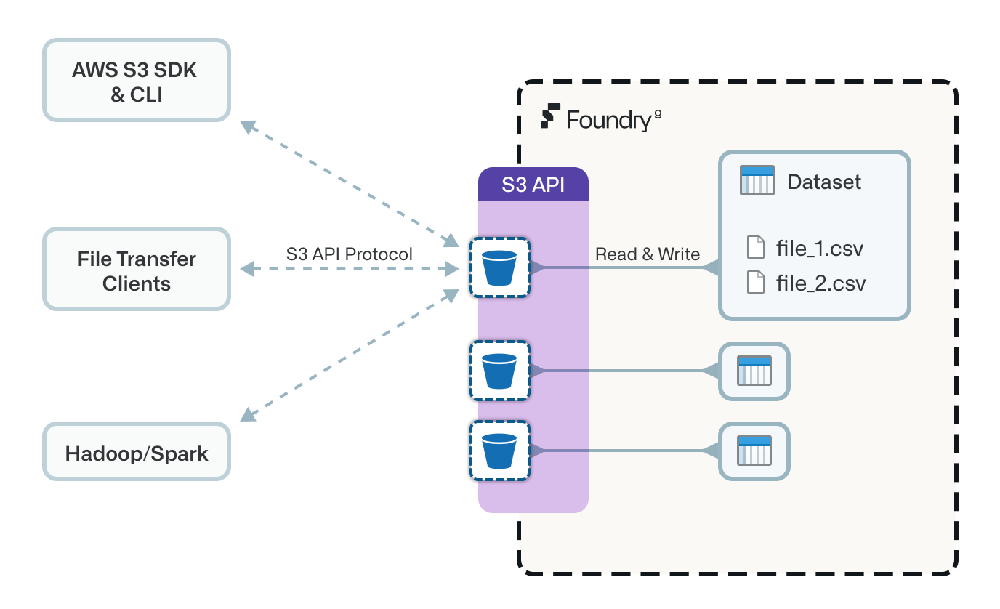

<!-- source: https://palantir.com/docs/foundry/data-integration/foundry-s3-api/ · mirrored 2026-08-06 from Palantir Foundry docs -->

# S3-compatible API for Foundry datasets

The S3-compatible API for Foundry datasets allows you to interact with Foundry datasets as though they are S3 buckets. Learn how datasets behave when accessed through the API, and view the [setup guide](#setup-guide) and [examples](#client-setup-examples).

Foundry exposes a subset of the [Amazon Simple Storage Service (S3) API ↗](https://docs.aws.amazon.com/AmazonS3/latest/API/Welcome.html), allowing you to interact with Foundry datasets using clients that know how to speak to S3 storage services. Examples include the AWS CLI, AWS SDKs, Hadoop S3 filesystem, and Cyberduck.



The S3 API is not fully implemented as not all S3 concepts map naturally to concepts in Foundry. For example, creation and deletion of buckets (which represent Foundry datasets) is not currently supported; datasets should be created in Foundry ahead of using the API. However, the majority of file read/write/delete workflows are supported, including multipart uploads. See [Supported actions](#supported-actions) for a list of which S3 actions are supported.

## Concepts

This section outlines how S3 concepts map to Foundry dataset concepts.

### S3 buckets correspond to Foundry datasets

**S3 buckets** correspond to **Foundry datasets**, with the bucket name being the Foundry dataset's unique identifier (for example, `ri.foundry.main.dataset.bafb7e96-84f1-4d23-a4a5-40b17c6912e7`).

**S3 object keys** correspond to the **logical paths of files within a Foundry dataset** (for example, `top-level-file.csv` or `subfolder/nested-file.csv`).

:::callout{theme="warning"}
Only Foundry datasets can be used as S3 buckets. Compass folders and projects are organizational containers, not datasets, and cannot be used as a bucket name. To keep uploaded files organized separately, such as separating application logs from other outputs, write to a nested object key path within an existing dataset (for example, `logs/nested-file.csv`). Alternatively, create a new dataset for that purpose. Avoid creating a new Compass folder for this.
:::

### Branches

The API supports accessing dataset branches with alphanumeric names (containing only `a-z`, `A-Z`, or `0-9`) or the special characters `-` and `_`. To specify a branch, modify the bucket name by appending the branch name, separated by a period: `<dataset-rid>.<branch-name>`. If no branch is specified, the default branch is used.

For example, to access the `mybranch` branch of the dataset with RID `ri.foundry.main.dataset.bafb7e96-84f1-4d23-a4a5-40b17c6912e7`, use the bucket name `ri.foundry.main.dataset.bafb7e96-84f1-4d23-a4a5-40b17c6912e7.mybranch`.

S3 bucket name validation imposes the character restrictions previously described. If your branch contains characters that are not allowed such as `/`, you can encode the branch name using Base64-encoding. You should omit any trailing `=` characters. For example, `feature/my-branch` is Base64 encoded as `ZmVhdHVyZS9teS1icmFuY2g=`. `ZmVhdHVyZS9teS1icmFuY2g` (without the `=` character) can be used to reference this branch in the bucket name.

The API does not support branch creation; specified branches must already exist on the dataset.

### Transactions

The API supports accessing dataset transactions in a similar way to branches. This allows users to access historical versions of a dataset. For example, to access the `ri.foundry.main.transaction.0cdfe8c9-f595-4859-a194-7daecff9d6fe` transaction of the dataset with RID `ri.foundry.main.dataset.bafb7e96-84f1-4d23-a4a5-40b17c6912e7`, use the bucket name `ri.foundry.main.dataset.bafb7e96-84f1-4d23-a4a5-40b17c6912e7.ri.foundry.main.transaction.0cdfe8c9-f595-4859-a194-7daecff9d6fe`.

Only committed transactions may be accessed in this way. As a result, the bucket will be read-only; it is not possible to put or delete objects when using a bucket name that includes a transaction identifier.

### Transaction management

S3 does not have the notion of transactions, so [Foundry dataset transactions](/docs/foundry/data-integration/datasets/#transactions) are automatically handled with the following behavior:

1. Transactions are lazily opened when users write or delete files.
2. The API supports writing multiple files concurrently *or* deleting multiple files concurrently. Files will be modified in the same open transaction, with writes using `UPDATE` transactions and deletes using `DELETE` transactions.
3. The API does not support concurrent writes *and* deletes, given this would require both an `UPDATE` and `DELETE` transaction to be active at the same time. This is a consequence of the platform-wide guarantee that a branch can have [at most one open transaction](/docs/foundry/data-integration/branching/#dataset-branch-guarantees). Whichever write or delete request reaches the platform first will open the corresponding transaction; any request of the other type will not be able to open its own transaction until the first one is committed (following the auto-commit behavior described below). This does not put the dataset at risk of an inconsistent state: writes and deletes are never applied concurrently or interleaved, only the order in which the two request types are serviced is timing-dependent.
4. Transactions are automatically committed after a short period of inactivity following a write or delete. This allows you to upload multiple files in the same transaction, avoiding many transactions with very few files. To avoid transactions being kept open indefinitely, for example if files are continuously uploaded such that there is no period of inactivity, a transaction will be committed after a certain amount of time as soon as there are no active uploads. If files are continuously uploaded in parallel, then the transaction will remain open until all uploads are complete.
5. If a read request is received within a period of inactivity while the transaction is open, the `UPDATE` and `DELETE` transactions will be immediately committed where possible. This aims to preserve read-after-write semantics that are generally expected with S3. However, if reads are attempted while there are still active write requests to the open transaction, the read will happen from the latest committed view. To guarantee a transaction commits after all writes or deletes are complete, you can issue a subsequent read request prior to any new write or delete requests.

Given the above behaviors, read-after-write semantics are not guaranteed. However, every effort is made to provide them where possible.

### Authentication

Connections through the API are authenticated using access key ID and secret access key credentials.

#### Static credentials

Static credentials are similar to standard AWS access key ID and secret access key credentials. Static credentials are long-lived and, in the Foundry case, are associated with the service user of a [third-party application](/docs/foundry/platform-security-third-party/third-party-apps-overview/) registered in Foundry's Control Panel.

When using a static access key ID and secret access key to connect to datasets through the S3-compatible API, the access level is determined by the access granted to the third-party application's service user. Static credentials must be restricted to individual [projects](/docs/foundry/getting-started/projects-and-resources/). The project restrictions are specified when generating a new set of credentials. Only datasets within the specified projects will be accessible using the generated credentials.

See the [setup guide](#setup-guide) below for guidance on using the `/io/s3/api/v2/credentials` API endpoint to generate these credentials.

#### Temporary credentials

We recommend using [static credentials](#static-credentials) in any workflow that requires long-lived credentials or where it is beneficial to tie access to a service user. If you prefer authenticating to the API as your regular Foundry user, we support exchanging a [user authentication token](/docs/foundry/platform-security-third-party/user-generated-tokens/) for temporary S3 credentials. This token could also be obtained through one of the [OAuth2](/docs/foundry/platform-security-third-party/writing-oauth2-clients/) grants for a [third-party application](/docs/foundry/platform-security-third-party/third-party-apps-overview/).

Temporary credentials are obtained using the standard [AssumeRoleWithWebIdentity ↗](https://docs.aws.amazon.com/STS/latest/APIReference/API_AssumeRoleWithWebIdentity.html) Security Token Service (STS) API. We only require the `WebIdentityToken` request parameter be present and configured with a regular Foundry token as described above. The temporary credentials returned will have an identical scope to that of the provided token. The `DurationSeconds` parameter can be provided to specify the lifetime of the credentials. The credentials will have a maximum lifetime of one hour and will never exceed the lifetime of the Foundry token used to obtain temporary credentials.

The STS API can be accessed at `https://<FOUNDRY_URL>/io/s3`. If you wish to obtain STS credentials programmatically, this URL should be configured in the endpoint configuration of the standard STS clients or credential providers. For example:

```python
import boto3

endpoint = "https://<FOUNDRY_URL>/io/s3"

session = boto3.session.Session()
client = session.client(service_name='sts', endpoint_url=endpoint)

# RoleArn and RoleSessionName are required parameters in boto3 despite being unused
credentials = client.assume_role_with_web_identity(
    RoleArn="xxxxxxxxxxxxxxxxxxxx",
    RoleSessionName="xxxxx",
    WebIdentityToken=token
)["Credentials"]
```

Alternatively, you can access the API directly using cURL or equivalent such as in the example below. `<TOKEN>` should be replaced with a valid Foundry token.

```bash
curl -X POST \
    "https://<FOUNDRY_URL>/io/s3?Action=AssumeRoleWithWebIdentity&WebIdentityToken=<TOKEN>"
```

You will receive session credentials in the XML response, as shown below. These credentials should be securely stored.

```xml
<?xml version='1.0' encoding='UTF-8'?>
<AssumeRoleWithWebIdentityResponse
	xmlns="https://sts.amazonaws.com/doc/2011-06-15/">
	<AssumeRoleWithWebIdentityResult>
		<Credentials>
			<AccessKeyId>PLTRLZZJE0...</AccessKeyId>
			<SecretAccessKey>2j3hKX4EDP...</SecretAccessKey>
			<SessionToken>eyJwbG50ci...</SessionToken>
			<Expiration>2023-08-30T10:55:08.841403951Z</Expiration>
		</Credentials>
	</AssumeRoleWithWebIdentityResult>
</AssumeRoleWithWebIdentityResponse>
```

Once you have temporary credentials, navigate to step four in the [setup guide](#setup-guide) below for guidance on configuring S3 clients. You do not need to follow any steps regarding third-party applications. When configuring S3 clients, you must provide the session token, the access key ID, and secret access key.

:::callout{theme="info"}
To read or write data via the S3-compatible API, users need `s3-proxy:datasets-read` and `s3-proxy:datasets-write` permissions which, by default, are granted to the `Viewer` and `Editor` role respectively. When using static credentials, the service user corresponding to the third-party app will need to be granted the relevant role. When using temporary credentials, the user obtaining credentials will need the relevant role.
:::

### Path-style URL access

The API supports only [path-style ↗](https://docs.aws.amazon.com/AmazonS3/latest/userguide/VirtualHosting.html#path-style-access) bucket access. Your bucket URLs will take the format `https://<FOUNDRY_URL>/io/s3/<bucket-name>/<key-name>`.

In Foundry terms, this means `https://<FOUNDRY_URL>/io/s3/<dataset-rid>/<logical-filepath>`.

Virtual-hosted-style bucket access (where the bucket name is included in the subdomain of the URL) is currently not supported.

### Presigned URLs

Presigned URLs are supported for the `putObject` operation.

## Setup guide

Follow these steps to set up a connection to the API from your S3 client.

1. [Register a third-party application in Foundry](#step-1-register-a-third-party-application-in-foundry)
2. [Grant permissions to your third-party application's service user](#step-2-grant-permissions-to-your-third-party-applications-service-user)
3. [Generate S3 access key ID and secret access key](#step-3-generate-s3-access-key-id-and-secret-access-key)
4. [Configure the S3 client](#step-4-configure-the-s3-client)

[View example configuration settings for specific S3 clients](#client-setup-examples).

### Step 1: Register a third-party application in Foundry

To obtain credentials for the S3-compatible API you will first need to obtain the client ID and secret of a [third-party application](/docs/foundry/platform-security-third-party/third-party-apps-overview/) that has been created in Control Panel in Foundry:

1. Open **Control Panel** in Foundry.
2. Select **Third party applications** in the sidebar.
3. Select **New application**, then complete the setup wizard with the following parameters:
   * **Client type:** Choose **Confidential client**.
   * **Authorization grant types:** Enable the **Client credentials grant**.
4. Select **Register application** in the lower right of the **Summary** page.
5. On the completion screen, record the **Client ID** as this will be needed in a future step. Then select **Enable application use** and use the toggle switch to **Enable** it.

:::callout{theme="neutral"}
Review [Concepts: Authentication](#authentication) to understand the requirements and behavior for project restrictions, and the scope of generated credentials.
:::

### Step 2: Grant permissions to your third-party application's service user

:::callout{theme="warning"}
Users should use [**Developer Console**](/docs/foundry/developer-console/oauth-clients/) to manage their application configuration. The **Control Panel** view only applies if **Developer Console** has not been enabled for the user.
:::

When you created the third-party application in the previous step, Foundry created a service user automatically. To access datasets via the S3 API, this service user must have sufficient permissions on the relevant projects and Markings.

To set up permissions for the service user:

1. Find the name and ID of the service user. You can find these details on your application's "Manage application" page, under **Authorization grant types** > **Client credentials grant** > **Service user**.
2. Grant permissions to the service user, either by adding the user to projects and Markings directly, or by adding the user to a group that has been granted those permissions.

### Step 3: Generate S3 access key ID and secret access key

:::callout{theme="neutral"}
To generate credentials you will need to have the `User experience administrator` role on the Organization in [Control Panel](/docs/foundry/administration/enrollments-and-organizations-permissions/).
:::

Run the terminal command below (using either curl or PowerShell) to receive an access key ID and secret access key. Replace the following placeholders in the command:

* `<TOKEN>`: An active token for your user account.
* `<CLIENT_ID>`: The client ID of the third-party application generated in the previous step.
* `<PROJECT_RID>`: The resource identifier (RID) of a [project](/docs/foundry/getting-started/projects-and-resources/#projects) that the credentials should be able to access. See [Find the project RID](#find-the-project-rid) below for guidance on how to locate this value.

The `projectRestrictions` value can take multiple projects, allowing you to list more project RIDs if necessary. At least one project must be specified. The generated credentials will only be able to access datasets that live within the listed projects.

#### Option 1: curl

```bash
curl -X POST \
    -H "Authorization: Bearer <TOKEN>" \
    -H "Content-type: application/json" \
    --data '{"clientId":"<CLIENT_ID>","projectRestrictions":["<PROJECT_RID>"]}' \
    https://<FOUNDRY_URL>/io/s3/api/v2/credentials
```

#### Option 2: Powershell (Windows)

```powershell
$headers = @{
    "Authorization" = "Bearer <TOKEN>"
    "Content-type" = "application/json"
}
$body = @{
    "clientId" = "<CLIENT_ID>"
    "projectRestrictions" = @("<PROJECT_RID>")
} | ConvertTo-Json

Invoke-WebRequest -Uri "https://<FOUNDRY_URL>/io/s3/api/v2/credentials" -Method POST -Headers $headers -Body $body
```

Securely store the access key and secret key you receive in the response of this request. You must configure clients with these credentials,  *not* the third-party application's client ID and secret.

#### Find the project RID

The `<PROJECT_RID>` value must be the RID of a top-level [project](/docs/foundry/getting-started/projects-and-resources/#projects), not the RID of a folder or other resource nested inside a project. Both projects and folders use the RID format `ri.compass.main.folder.{RID_VALUE}`, so the format alone does not distinguish them.

:::callout{theme="warning"}
Supplying the RID of a nested folder, a dataset, or any resource that is not itself a project results in a permissions error when you use the generated credentials. This occurs even though the RID has the expected `ri.compass.main.folder.{RID_VALUE}` format. If you encounter a permissions error, confirm that the value in `projectRestrictions` is the RID of the project itself rather than a resource within it.
:::

To find the RID of a project:

1. Navigate to the project in Foundry and open it at its root level.
2. Right-click the project and copy its RID, or open the [**Project details panel**](/docs/foundry/compass/use-project-details-panel/) to view the project's RID.
3. Confirm that the copied value is the RID of the project itself and not a folder or resource within it.

The `projectRestrictions` value determines which datasets the credentials can reach; it does not control where files are written within a dataset. Because [S3 buckets correspond to Foundry datasets](#s3-buckets-correspond-to-foundry-datasets), you organize files inside a dataset using object keys (logical file paths) rather than by targeting a Foundry folder. To send files to a specific location, choose the destination dataset as the bucket and use a key prefix such as `logs/` to group files within it.

#### Specifying an organization

By default, the `/v2/credentials` endpoint assumes the authenticating user is generating credentials for a third-party application in their own [Organization](/docs/foundry/security/orgs-and-spaces/). If the third-party application exists in a different Organization, specify the Organization ID as a query parameter in the URL: `https://<FOUNDRY_URL>/io/s3/api/v2/credentials?organizationRid=<ORGANIZATION_ID>`.

#### Revoking credentials

If you need to revoke an access key and secret access key, call the following endpoint and replace `<ACCESS_KEY_ID>` with the access key ID that you wish to revoke:

```bash
curl -X DELETE \
    -H "Authorization: Bearer <TOKEN>" \
    https://<FOUNDRY_URL>/io/s3/api/v2/credentials/<ACCESS_KEY_ID>
```

#### Listing credentials

You can use the following endpoint to retrieve a list of active (non-revoked) access keys, including their client ID and project restrictions.

```bash
curl -X GET \
    -H "Authorization: Bearer <TOKEN>" \
    https://<FOUNDRY_URL>/io/s3/api/v2/credentials
```

### Step 4: Configure the S3 client

To configure an S3 client you must set the following configuration parameters. See the [examples](#client-setup-examples) below for details on how these should be configured in common S3 clients.

| Name | Value | Description |
| --- | --- | --- |
| Hostname / Endpoint | `https://<FOUNDRY_URL>/io/s3` | The hostname to which clients should connect (rather than `s3.amazonaws.com` for native S3 buckets hosted in AWS). |
| Region | `foundry` | The region must be set to `foundry` as it is used as part of the [V4 signature verification ↗](https://docs.aws.amazon.com/general/latest/gr/signature-version-4.html) process. If clients can only use standard AWS regions then use `us-east-1`. |
| Credentials | Access key ID and secret access key, and optionally, session token | [Static](#static-credentials) or [temporary](#temporary-credentials) credentials generated as described above. |
| Path-style access | `true` | The API only supports [path-style ↗](https://docs.aws.amazon.com/AmazonS3/latest/userguide/VirtualHosting.html#path-style-access) bucket access rather than virtual-hosted-style bucket access. |
| Bucket Name (Optional) | `ri.foundry.main.dataset.<uuid>` | Each Foundry dataset is accessible as a separate S3 bucket, with the bucket name being the dataset's RID. |

## Supported actions

The following [S3 actions ↗](https://docs.aws.amazon.com/AmazonS3/latest/API/API_Operations_Amazon_Simple_Storage_Service.html) are supported:

* [AbortMultipartUpload ↗](https://docs.aws.amazon.com/AmazonS3/latest/API/API_AbortMultipartUpload.html)
* [CompleteMultipartUpload ↗](https://docs.aws.amazon.com/AmazonS3/latest/API/API_CompleteMultipartUpload.html)
* [CopyObject ↗](https://docs.aws.amazon.com/AmazonS3/latest/API/API_CopyObject.html)
* [CreateMultipartUpload ↗](https://docs.aws.amazon.com/AmazonS3/latest/API/API_CreateMultipartUpload.html)
* [DeleteObject ↗](https://docs.aws.amazon.com/AmazonS3/latest/API/API_DeleteObject.html)
* [DeleteObjects ↗](https://docs.aws.amazon.com/AmazonS3/latest/API/API_DeleteObjects.html)
* [GetObject ↗](https://docs.aws.amazon.com/AmazonS3/latest/API/API_GetObject.html)
* [HeadBucket ↗](https://docs.aws.amazon.com/AmazonS3/latest/API/API_HeadBucket.html)
* [HeadObject ↗](https://docs.aws.amazon.com/AmazonS3/latest/API/API_HeadObject.html)
* [ListMultipartUploads ↗](https://docs.aws.amazon.com/AmazonS3/latest/API/API_ListMultipartUploads.html)
* [ListObjects ↗](https://docs.aws.amazon.com/AmazonS3/latest/API/API_ListObjects.html)
* [ListObjectsV2 ↗](https://docs.aws.amazon.com/AmazonS3/latest/API/API_ListObjectsV2.html)
* [ListParts ↗](https://docs.aws.amazon.com/AmazonS3/latest/API/API_ListParts.html)
* [PutObject ↗](https://docs.aws.amazon.com/AmazonS3/latest/API/API_PutObject.html)
* [UploadPart ↗](https://docs.aws.amazon.com/AmazonS3/latest/API/API_UploadPart.html)

## Client setup examples

As discussed above, you must ensure the client/SDK/connector is configured to use path-style bucket access. If the client does not support path-style bucket access, it is currently not compatible with this API.
For example, with the [S3A Hadoop client ↗](https://hadoop.apache.org/docs/stable/hadoop-aws/tools/hadoop-aws/index.html)
this can be configured using the `fs.s3a.path.style.access` flag.

If you are using [temporary credentials](#temporary-credentials), be sure to also configure the AWS session access token. Consult the relevant AWS client documentation for details. For example, for the [AWS CLI ↗](https://aws.amazon.com/cli/) you should set the `AWS_SESSION_TOKEN` environment variable.

### AWS CLI

Once you have an access key ID and secret access key, you are ready to configure the [AWS CLI ↗](https://aws.amazon.com/cli/). Run the following command, entering the access key ID, secret access key, and region.

```
$ aws configure --profile foundry
AWS Access Key ID [None]: <ACCESS_KEY_ID>
AWS Secret Access Key [None]: <SECRET_ACCESS_KEY>
Default region name [None]: foundry
Default output format [None]:
```

You should now be able to run commands for the `foundry` profile. For example:

```bash
aws --profile foundry --endpoint-url https://<FOUNDRY_URL>/io/s3 s3 ls s3://<DATASET_RID>
```

As of a [recent release ↗](https://aws.amazon.com/blogs/developer/new-improved-flexibility-when-configuring-endpoint-urls-with-the-aws-sdks-and-tools/) of the AWS CLI, it is now possible to configure the `endpoint-url` as part of the `profile` configuration. A sample `foundry` profile as it would be configured in `~/.aws/config` is shown below. When configuring a profile with the `endpoint_url` property, you no longer need to include the `--endpoint-url` argument when using the `aws` command. Instead, `--profile` is sufficient.

```yaml
[profile foundry]
region = foundry
endpoint_url = https://<FOUNDRY_URL>/io/s3
```

To use [temporary credentials](#temporary-credentials) with the AWS CLI, follow the [AWS documentation ↗](https://docs.aws.amazon.com/cli/latest/userguide/cli-configure-role.html#cli-configure-role-oidc) that explains how to configure the CLI to make the AWS STS `AssumeRoleWithWebIdentity` call for you. A sample `foundry` profile as it would be configured in `~/.aws/config` is shown below. When using this configuration you do not need to have configured credentials in environment variables (`AWS_ACCESS_KEY_ID`, `AWS_SECRET_ACCESS_KEY`, `AWS_SESSION_TOKEN`) or `~/.aws/credentials`.

```yaml
[profile foundry]
region = foundry
endpoint_url = https://<FOUNDRY_URL>/io/s3
web_identity_token_file = ~/.foundry/web-identity.token
role_arn=xxxxxxxxxxxxxxxxxxxx
```

The example above assumes a valid Foundry token is stored in a file at `~/.foundry/web-identity.token`. We only recommend this approach if this file is properly secure and not at risk of being leaked. The `role_arn` property is not used but must still be provided and be at least 20 characters long due to AWS CLI validations. We use `xxxxxxxxxxxxxxxxxxxx` as a placeholder in the example. To use this configuration, you must configure the `endpoint_url` in `~/.aws/config` rather than using `--endpoint-url`, as discussed above.

### AWS SDK for Python (Boto3)

```python
import boto3
import pandas as pd

s3 = boto3.client(
    's3',
    aws_access_key_id="<ACCESS_KEY_ID>",
    aws_secret_access_key="<SECRET_ACCESS_KEY>",
    # aws_session_token="<SESSION_TOKEN>", only needed when using temporary credentials
    endpoint_url="https://<FOUNDRY_URL>/io/s3",
    region_name="foundry"
)

bucket = 'ri.foundry.main.dataset.<uuid>'
key = 'iris.csv'

obj = s3.get_object(Bucket=bucket, Key=key)
df = pd.read_csv(obj['Body'])
print(df)
```

Review the [S3 section of Boto3's documentation ↗](https://boto3.amazonaws.com/v1/documentation/api/latest/reference/services/s3.html) for more information on connecting to S3-compatible sources using Boto3.

### Spark

```python
from pyspark.sql import SparkSession

hostname = "https://<FOUNDRY_URL>/io/s3"
access_key_id = "<ACCESS_KEY_ID>"
secret_access_key = "<SECRET_ACCESS_KEY>"

# ensure dataset RID can be parsed as a valid hostname
dataset_rid = "ri.foundry.main.dataset.<uuid>".replace('.', '-')

spark_session = (
    SparkSession.builder
        .config("fs.s3a.access.key", access_key_id)
        .config("fs.s3a.secret.key", secret_access_key)
        # .config("fs.s3a.session.token", session_token) only needed when using temporary credentials
        .config("fs.s3a.endpoint", hostname)
        .config("fs.s3a.endpoint.region", "foundry")
        .config("fs.s3a.path.style.access", "true")
        .getOrCreate()
)

df = spark_session.read.parquet(f"s3a://{dataset_rid}/*")
df.show()
```

Review the [Spark documentation ↗](https://spark.apache.org/docs/latest/cloud-integration.html) for more information on using Spark with S3.

:::callout{theme="warning"}
There is a known issue using the Hadoop AWS client with bucket names that contain '.'. You may encounter an error message such as *"bucket is null/empty"*. If this occurs, the dataset RID cannot be parsed as a valid hostname. As a workaround, you can substitute '.' in the dataset RID with '-'.
:::

### Cyberduck

1. Download the following profile: [Foundry S3.cyberduckprofile ↗](https://palantir.com/drivers/artifacts/s3/cyberduck/Foundry-S3-Proxy.cyberduckprofile)
2. Double-click the profile file to open and register the profile in Cyberduck.
3. Set the following connection properties on the default bookmark that Cyberduck created for you:

   * **Server:** `https://<FOUNDRY_URL>`
   * **Access Key ID:** `<ACCESS_KEY_ID>`
   * **Secret Access Key:** `<SECRET_ACCESS_KEY>`
   * **Path:** (under **More Options**) `ri.foundry.main.dataset.<uuid>`
4. Close the bookmark settings window.
5. Double-click the bookmark to open a connection.

Review the [Cyberduck documentation ↗](https://cyberduck.io/s3/) for more information on connecting to S3-compatible sources.

### Google Storage Transfer Service

Google Cloud's [Storage Transfer Service ↗](https://cloud.google.com/storage-transfer/docs/overview) can treat Foundry as an [S3-compatible source ↗](https://cloud.google.com/storage-transfer/docs/s3-compatible). You can transfer data from a Foundry dataset to a Cloud Storage bucket by following the below steps.

1. Set up an agent pool and transfer agents by following [Google Cloud's instructions ↗](https://cloud.google.com/storage-transfer/docs/s3-compatible).
2. Create a transfer job, and select **S3-compatible object storage** as the **Source type**. Then select the agent pool you created in step (1) and ensure the following configuration is set:

   * **Bucket:** `ri.foundry.main.dataset.<uuid>`.
   * **Endpoint:** `https://<FOUNDRY_URL>/io/s3`
   * **Signing region:** `foundry`
   * **Signing process:** Signature Version 4 (SigV4)
   * **Addressing-style:** Path-style requests
   * **Network protocol:** `HTTPS`
   * **Listing API version:** `ListObjectsV2`
     Complete the setup to configure the Cloud Storage bucket destination, schedule, and settings of your transfer job.

### Apache NiFi

You can use Apache NiFi to read and write files inside a Foundry dataset. The following example shows how to configure the `PutS3Object` processor type for writing:

* **Object Key:** Logical file path in dataset of the form `path/to/file.csv`
* **Bucket:** Dataset RID, such as `ri.foundry.main.dataset.<uuid>`
* **Access Key ID:** `<ACCESS_KEY_ID>`
* **Secret Access Key:** `<SECRET_ACCESS_KEY>`
* **Region:** "US East (N. Virginia)" which corresponds to `us-east-1`
* **Use Path Style Access:** `true`
* **Endpoint Override URL:** `https://<FOUNDRY_URL>/io/s3`

Refer to the [Apache NiFi documentation ↗](https://nifi.apache.org/documentation/) for more information on the `PutS3Object` processor and other processors that support S3-compatible sources.

### Airbyte

[Airbyte ↗](https://airbyte.com/)'s support for S3 destinations can be used to write files to Foundry datasets. Set the following destination settings:

* **Destination type:** S3
* **S3 Key ID:** `<ACCESS_KEY_ID>`
* **S3 Access Key:** `<SECRET_ACCESS_KEY>`
* **S3 Bucket Name:** `ri.foundry.main.dataset.<uuid>`
* **S3 Bucket Path:** Any valid subdirectory path. Airbyte will write files into this subdirectory within the Foundry dataset.
* **S3 Bucket Region:** `us-east-1`
* **Output Format:** All of Airbyte's output formats are compatible with Foundry datasets.
* **Endpoint:** `https://<FOUNDRY_URL>/io/s3`

Refer to Airbyte's documentation for [S3 destinations ↗](https://docs.airbyte.com/integrations/destinations/s3/) for more information and configuration options.

### DuckDB

[DuckDB ↗](https://duckdb.org/)'s support for S3 can be used to query Foundry datasets. You can manage credentials using DuckDB secrets and query datasets using the `s3://` prefixed URLs.

```
CREATE SECRET foundry_secret (
    TYPE S3,
    KEY_ID '<ACCESS_KEY_ID>',
    SECRET '<SECRET_ACCESS_KEY>',
    REGION 'foundry',
    ENDPOINT '<FOUNDRY_URL>/io/s3',
    URL_STYLE 'path'
);

CREATE TABLE new_tbl AS SELECT * FROM 's3://ri.foundry.main.dataset.<uuid>/spark/*.parquet';
```

Refer to the [DuckDB documentation ↗](https://duckdb.org/docs/extensions/httpfs/s3api) for more information.

:::callout{theme="neutral"}
In the secret configuration above, the `ENDPOINT` configuration parameter should not include the `https://` scheme. The URL scheme is handled automatically by the `USE_SSL` parameter, which defaults to `true`.
:::

### Polars

[Polars' ↗](https://pola.rs/) support for S3 can be used to query Foundry datasets.

```python
import polars as pl

hostname = "https://<FOUNDRY_URL>/io/s3"
access_key_id = "<ACCESS_KEY_ID>"
secret_access_key = "<SECRET_ACCESS_KEY>"
dataset_rid = "ri.foundry.main.dataset.<uuid>"

storage_options = {
    "aws_access_key_id": access_key_id,
    "aws_secret_access_key": secret_access_key,
    "aws_region": "foundry",
    "endpoint_url": hostname
}

df = pl.scan_parquet(f"s3://{dataset_rid}/spark/*.parquet", storage_options=storage_options)
```

Refer to the [Polars documentation ↗](https://docs.pola.rs/user-guide/io/cloud-storage) for more information.
