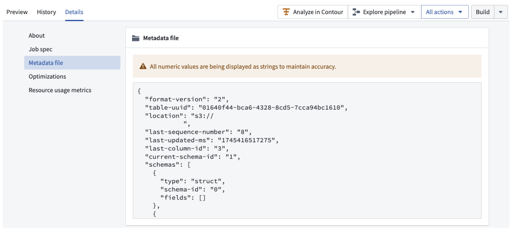
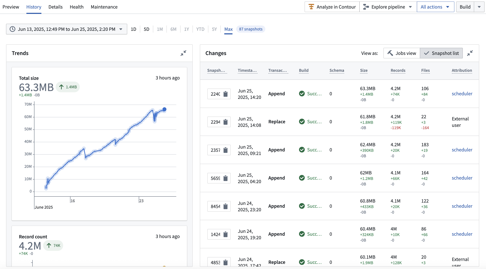

<!-- source: https://palantir.com/docs/foundry/data-integration/iceberg-tables/ · mirrored 2026-08-06 from Palantir Foundry docs -->

# Iceberg tables \[Beta]

:::callout{theme="neutral" title="Beta"}
Iceberg table support is in the [beta](/docs/foundry/platform-overview/development-life-cycle/) phase of development and may not be available on your enrollment. Functionality may change during active development. Contact Palantir Support to request enabling Iceberg tables.
:::

[Apache Iceberg ↗](https://iceberg.apache.org/) is a widely adopted open-source table format and is available in Foundry via **Iceberg tables** as an alternative resource type for representing tabular data.

Foundry offers Iceberg both as managed tables and as [virtual tables](/docs/foundry/data-integration/virtual-tables/) via an external catalog or storage provider.

## What is Iceberg?

[Apache Iceberg ↗](https://iceberg.apache.org/) is an open table format that has gained significant traction in the data and analytics community due to benefits around scalability, performance, and broad ecosystem support. In particular, the wide adoption of the Iceberg format specification enables a broad array of integrations and interoperability across modern data ecosystems.

The Apache Iceberg project includes the [Apache Iceberg table format specification ↗](https://iceberg.apache.org/spec/), as well as a set of engine connectors that support the Iceberg specification, such as [Spark ↗](https://iceberg.apache.org/docs/nightly/spark-getting-started/), [Flink ↗](https://iceberg.apache.org/docs/nightly/flink/) and more.

Beyond the core Apache Iceberg project, there is a growing ecosystem of connectors and engines that support the Iceberg format:

* [PyIceberg ↗](https://py.iceberg.apache.org/) provides a gateway into the Python ecosystem.
* Engines like [Trino ↗](https://trino.io/docs/current/connector/iceberg.html) and [PrestoDB ↗](https://prestodb.io/docs/current/connector/iceberg.html) offer native support.
* Other third-party tools and platforms, such as [Databricks ↗](https://docs.databricks.com/aws/en/iceberg/) and [Snowflake ↗](https://docs.snowflake.com/en/user-guide/tables-iceberg), provide offerings built on top of the Iceberg format.

## Foundry Iceberg catalog

Apache Iceberg defines an [Iceberg REST Catalog ↗](https://editor-next.swagger.io/?url=https://raw.githubusercontent.com/apache/iceberg/main/open-api/rest-catalog-open-api.yaml) specification, which outlines a set of endpoints and behaviors that a service must implement to function as an Iceberg REST catalog.

By adhering to this specification, the service becomes compatible with a growing number of compute engines that support the Iceberg REST Catalog.

Foundry now natively implements this Iceberg REST Catalog specification, In addition, Foundry also supports connectivity to third-party Iceberg REST catalogs such as [Databricks Unity Catalog ↗](https://www.databricks.com/product/unity-catalog). See [Virtual tables: Iceberg catalogs](/docs/foundry/data-integration/virtual-tables/#iceberg-catalogs) for supported third-party catalogs.

Foundry exposes Iceberg catalog metadata explicitly as a JSON file via dataset application under the Details tab.

The screenshot below shows how Iceberg catalog metadata appears in the dataset application:

## Iceberg tables vs. datasets

As Palantir expands coverage for Iceberg tables, the features and benefits available for Foundry Iceberg tables will grow over time and limitations will be removed.

Below summarizes the current state of support as compared to [datasets](/docs/foundry/data-integration/datasets/), while Iceberg tables are in the Beta phase of development.

### Benefits of Iceberg tables

The following benefits of Iceberg tables are currently available in Foundry:

* **Interoperability:** Open Iceberg format means third-party tools can more easily read and write Palantir Iceberg tables.
* **Compaction:** Support for automated compaction without affecting incremental reads.
* **Row edits:** Support for `DELETE`, `UPDATE` and `MERGE INTO` statements, which allow you to conditionally modify rows without the need to re-snapshot.
* **Changelogs:** Incrementally consume row deletions and updates.
* **Enriched table history:** Enhanced history view surfacing Iceberg [table metadata ↗](https://iceberg.apache.org/spec/?h=metadata#table-metadata).

The interface for viewing Iceberg table history can be seen in the following screenshot:

### Notable differences between Iceberg tables and Foundry datasets

There are a few notable differences worth calling out between the behavior of Iceberg tables and Foundry datasets today:

* **Default branches:** Iceberg’s main branch is called `main`, whereas Foundry’s main branch is called `master`. In Foundry’s integration with Iceberg, `main` and `master` are treated as the same, which means a Foundry job running on `master` will write to an Iceberg’s table's `main`.
* **Automatic schema evolution:** Iceberg table schema evolution is not always automatic. Certain workflows, such as table replaces, evolve the table's schema automatically; however, others require explicit schema evolution commands or settings, such as `ALTER TABLE`. When writing through Foundry's transforms APIs and Pipeline Builder, Foundry uses table replaces when running non-incrementally to handle this for you. Other workflows, such as incremental schema evolution, may fail and require manual resolution. See the [Apache Iceberg documentation on schema evolution ↗](https://iceberg.apache.org/spec/#schema-evolution) for details.

### Foundry functionality not yet available for Iceberg tables

Note that certain Foundry features are not currently supported for Iceberg tables, including:

* Views ([Foundry views](/docs/foundry/data-integration/views/) and [Iceberg views ↗](https://iceberg.apache.org/view-spec/))
* [Restricted views](/docs/foundry/security/restricted-views/)
* [Streaming](/docs/foundry/data-integration/streams/)
* [Timeseries syncs](/docs/foundry/time-series/time-series-syncs/)
* [Projections](/docs/foundry/optimizing-pipelines/projections-overview/)
* [Faster pipelines in Pipeline Builder](/docs/foundry/building-pipelines/create-faster-pipeline-pb/)

### Iceberg terminology disambiguation

Iceberg introduces terms that do not always have direct equivalents in Foundry:

| Iceberg term | Meaning | Foundry disambiguation |
| --- | --- | --- |
| [Table metadata ↗](https://iceberg.apache.org/spec/#table-metadata) | Metadata describing the structure, schema, and state of an Iceberg table. | Foundry also tracks metadata for tables and datasets across all formats, but this metadata is managed internally by Foundry services. For Iceberg tables, Foundry exposes the native Iceberg metadata explicitly as a JSON file via the Iceberg catalog. |
| [Snapshots ↗](https://iceberg.apache.org/spec/#snapshots) | A record of the table's state at a specific point in time. Iceberg creates a new snapshot with every data modification. | An Iceberg snapshot is roughly equivalent to a Foundry [transaction](/docs/foundry/data-integration/datasets/#transactions). However, Foundry also uses the term ["snapshot"](/docs/foundry/data-integration/datasets/#snapshot) differently: in Foundry, a "snapshot" refers to a transaction that fully replaces all data in a dataset, while an Iceberg snapshot captures all types of data operations, including incremental changes. See [Iceberg snapshot types](/docs/foundry/iceberg/transactions/#iceberg-snapshot-types-and-foundry-dataset-transactions) for a complete disambiguation of Foundry catalog dataset transaction types and Iceberg snapshot types. |

## Using Iceberg in Foundry

Refer to the [Iceberg tables](/docs/foundry/iceberg/overview/) section of the documentation for details and guides on working with Foundry Iceberg tables.
