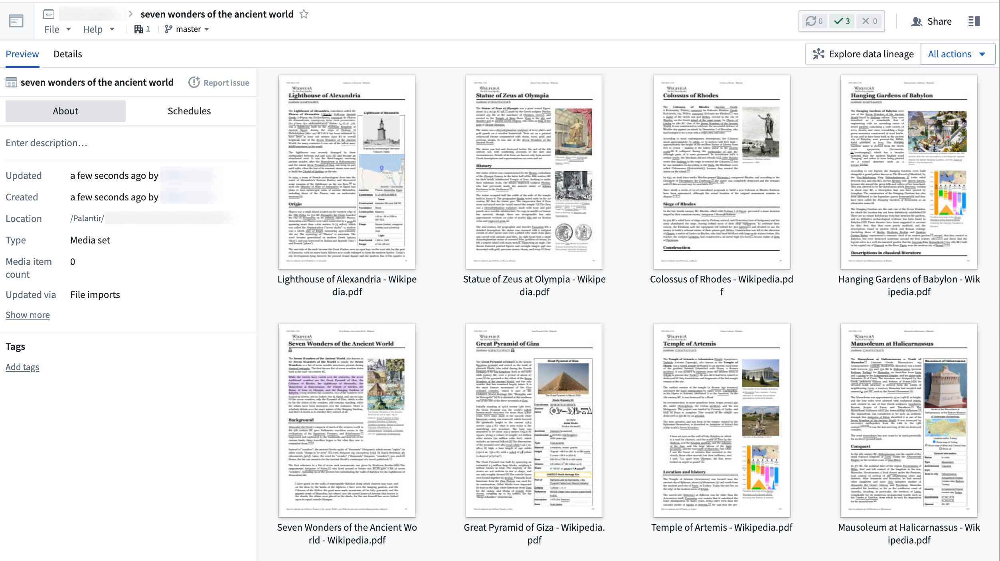

<!-- source: https://palantir.com/docs/foundry/data-integration/media-sets/ · mirrored 2026-08-06 from Palantir Foundry docs -->

# Media sets (unstructured data)

A **media set** is a collection of media files with a common schema, for example, files of the same format. Media sets are designed to work with high-scale, unstructured data and enable the processing of media items such as audio, imagery, video, and documents. Media sets enable access to flexible storage, compute optimizations, and schema-specific transformations to enhance media workflows and pipelines.

Example media set workflows include:

* Enabling content analysis by extracting text from PDFs with Pipeline Builder
* Performing geospatial analysis with raster tiling (TIFF, NITF) in the Map application
* Processing medical imaging files (DICOM format) with Pipeline Builder

To find out more about media sets and how to work with media in Foundry, **visit the [media set documentation](/docs/foundry/media-sets-advanced-formats/media-overview/)**.
