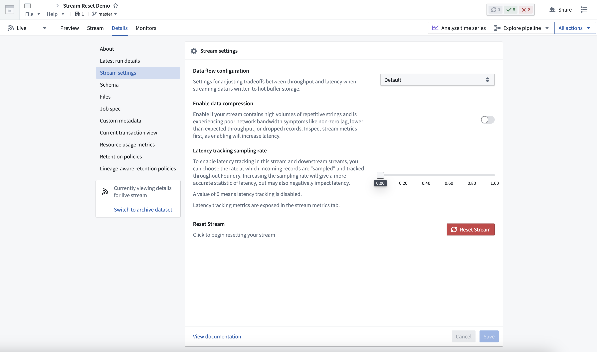
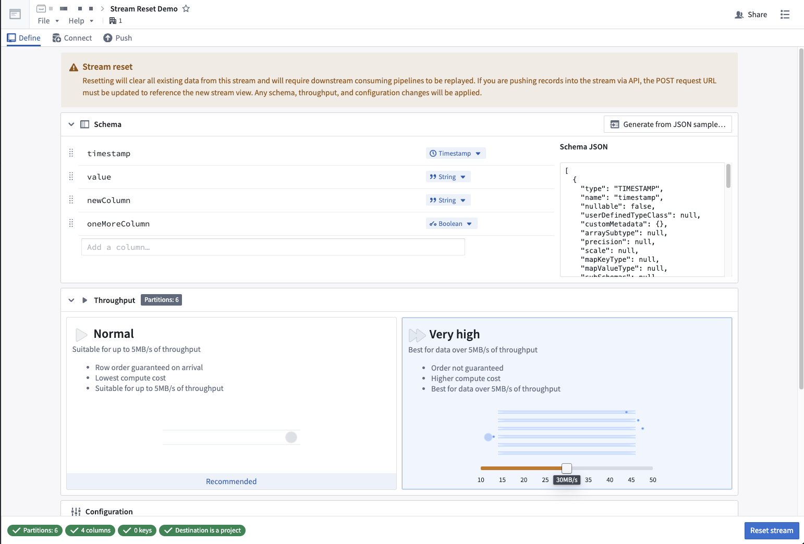

<!-- source: https://palantir.com/docs/foundry/data-integration/reset-stream/ · mirrored 2026-08-22 from Palantir Foundry docs -->

# Reset stream

Resetting an ingest stream clears the existing records from a stream and provides an opportunity to change the stream's schema, throughput, and configuration values. This can be helpful during stream pipeline development since you can clear and update an ingest stream without replacing existing references of the stream within your Pipeline Builder pipelines.

Note that resets are only available for ingest streams. Downstream consuming pipelines of the ingest stream must be replayed after a reset.

* [Push-based ingestion](/docs/foundry/data-connection/push-based-ingestion/) requires updating the POST URL to reference the new stream `viewRid` value.
* [Magritte-based ingestion](/docs/foundry/data-connection/set-up-streaming-sync/) requires an agent rebuild.

:::callout{theme="danger"}
Resetting streams can have irreversible effects on data. We do not recommend resetting production ingest streams because existing records will be lost.
:::

To reset a stream, follow the instructions below:

1. Open an ingest stream.
2. Select the **Details** tab.
3. In the **Stream Settings** section, select **Reset stream**.

4. You will be redirected to the stream reset page. On this page, you can optionally update the schema, throughput, or configuration values. If you only want to clear data from the stream, leave those sections unchanged.

5. Select **Reset stream** to initiate the stream reset.
