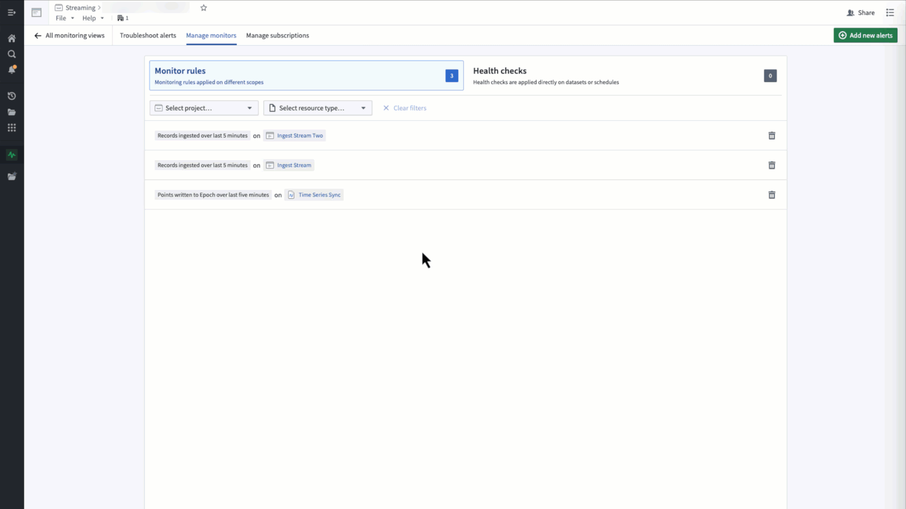
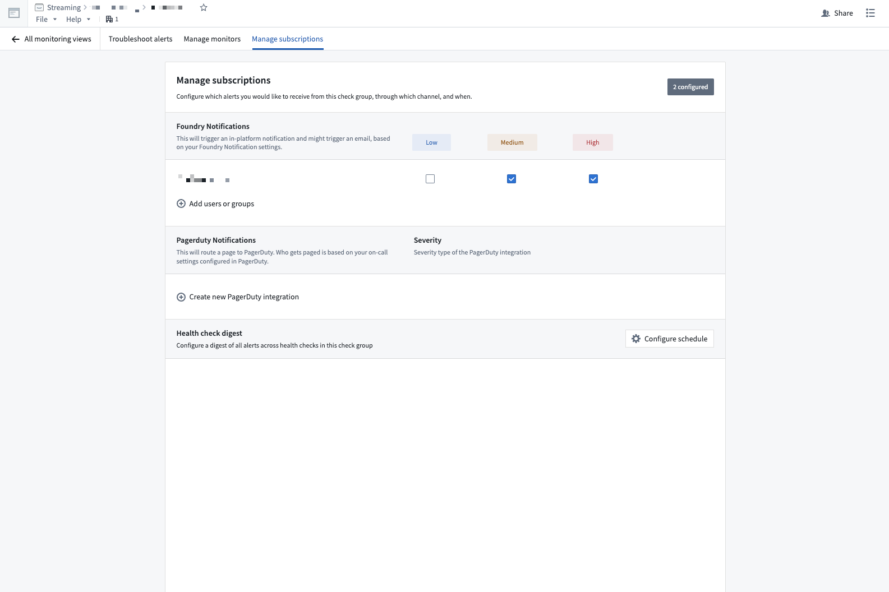
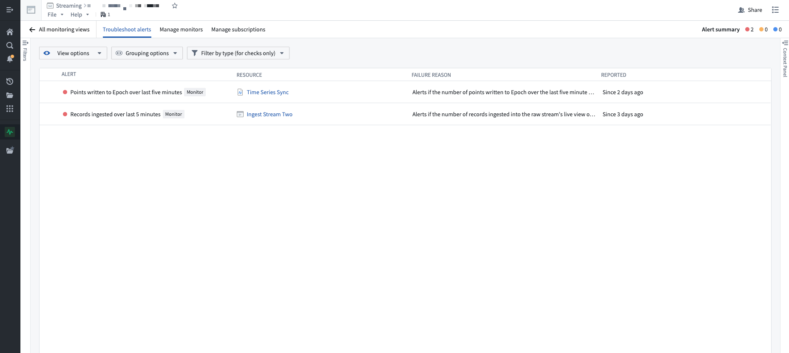

<!-- source: https://palantir.com/docs/foundry/data-integration/stream-monitoring/ · mirrored 2026-08-22 from Palantir Foundry docs -->

# Stream monitoring

Stream monitoring enables alerting around your stream's health.

A stream is considered "healthy" when it is:

* Ingesting new records from source systems.
* Processing and writing records into user-facing Foundry applications.
* Regularly persisting state, regardless of the presence of incoming records. This is *only* applicable for pipelines.

You can monitor the health of a pipeline by setting ingest and output alerts that fire when the number of records ingested or output, over a time period, falls below a user-defined threshold.

For example, an ingest monitor could alert if your stream has ingested zero records over the last five minutes, while an output monitor could alert if your stream has output less than 1000 records over the last 30 minutes.

## Creating monitors

1. Open the Data Health application.
2. Select the **Monitoring Views** tab.
3. Create or select an existing Monitoring View.
4. Navigate to the **Manage Monitors** tab.
5. Select **Add new alert**.
6. Select **Add monitoring rules**.

## Configuring ingest monitors

:::callout{theme="warning"}
You should only apply monitors to streams with a deterministic flow of records.   

Various fixed time periods, such as five and thirty minutes, are supported.
:::

Ingest monitors ensure that:

* Your source system is generating and sending records to Foundry.
* Foundry is writing records into the ingest stream's live view.

To configure this:

1. Follow the [creating monitors](#creating-monitors) instructions.
2. Select **Streaming dataset** as the resource type.
3. Add the ingest streams to monitor and select **Next**.
4. Select **+ Add** in the **Ingest stream monitors** card.
5. Select **Records ingested** monitor with a 5 or 30 minute duration.
6. Set your threshold and select **Next**.
7. Review your monitor and select **Save monitoring rules**.

Examples:

* `Records ingested` with a five-minute duration and threshold of zero: Alerts when your stream has written zero records to the live view over the last five minutes.
* `Records ingested` the thirty-minute duration and threshold of 1000: Alerts when your stream has written less than or equal to 1000 records to the live view over the last 30 minutes.

## Configuring pipeline monitors

You can follow the same workflow used to [configure ingest monitors](#configuring-ingest-monitors) for pipeline monitors, but there are some notable differences in the monitors available for streaming pipelines outlined below.

### Checkpoint metrics

* `Checkpoint Liveness`: Alerts if a stream has not checkpointed in the configured amount of time. This monitor is *highly recommended* for production streams, as it is a high-signal indicator of a degraded performance. [Learn more about checkpointing.](/docs/foundry/data-integration/streams/#checkpointing)
* `Last Checkpoint Duration`: Alerts if checkpoint duration has increased beyond a configured threshold.
* `Checkpoint Trigger Failures`: Alerts if checkpoints fail to trigger consecutively.
* `Consecutive Checkpoint Failures`: Alerts if checkpoints fail consecutively.

### Performance metrics

* `Total Lag`: Alerts if a job falls behind on the input by the configured amount of records, which signals degraded performance.
* `Total Throughput`: Alerts if the amount of records per checkpoint is under or over a configured threshold, which indicates changes in the upstream input.
* `Utilization`: Alerts if the percentage of the stream's utilized capacity is above a set threshold, which you can configure using [streaming profiles](/docs/foundry/data-integration/streaming-profiles/).

## Configuring output monitors

Output monitors ensure that your pipeline is:

* Processing ingested records.
* Writing those processed records into user-facing Foundry applications.

:::callout{theme="neutral"}
While stream monitoring is in the beta phase, [time series](/docs/foundry/time-series/time-series-overview/) and [geotemporal series](/docs/foundry/geospatial/geotemporal-series-overview/) are the only data formats able to be monitored.
:::

### Time series

To monitor records written to [time series](/docs/foundry/time-series/time-series-overview/), you will set alerts on the time series sync.

1. Follow the [creating monitors](#creating-monitors) instructions.
2. Select **Time series sync** as the resource type.
3. Add the time series syncs to monitor and select **Next**.
4. Select **+ Add** in the **monitors** card.
5. Select **Points written to Epoch** with a 5 or 30 minute duration.
6. Set your threshold and select **Next**.
7. Review your monitor and select **Save monitoring rules**.

Examples:

* `Points written to Time Series DB` with a five minute duration and threshold of zero: Alerts when your time series sync has written zero records over the last five minutes.
* `Points written to Time Series DB` with a 30 minute duration and threshold of 1000: Alerts when your time series sync has written less than or equal to 1000 records over the last 30 minutes.

### Geotemporal observations

To monitor [geotemporal observations](/docs/foundry/geospatial/geotemporal-series-overview/), you will set alerts on the backing observation dataset.

1. Follow the [creating monitors](#creating-monitors) instructions.
2. Select **Geotemporal observations** as the resource type.
3. Add the observation datasets to monitor and select **Next**.
4. Select **+ Add** in the **monitors** card.
5. Select **Geotemporal observations sent** with a 5 or 30 minute duration.
6. Set your threshold and select **Next**.
7. Review your monitor and select **Save monitoring rules**.

Examples:

* `Geotemporal observations sent` with a five minute duration and threshold of zero: Alerts when your geotemporal sync has sent zero observations to geotime over the last five minutes.
* `Geotemporal observations sent` the 30 minute duration and threshold of 1000: Alerts when your geotemporal sync has sent less than or equal to 1000 observations to geotime over the last 30 minutes.

:::callout{theme="neutral"}
- Ensure you set the monitor on the backing observation dataset instead of the errors dataset.
- `Geotemporal observations sent` only ensures the records were sent from geotime ingest. This does not guarantee that the geotime service has processed the record after ingestion.
:::

## Viewing metrics

To view the metrics underlying a monitor, select the monitor rule in row in the monitoring view's **Manage monitors** tab.

Metrics are only available for streaming or time series monitors with a single target scope.

## Monitor notifications

You can configure notifications through the monitoring view's **Manage subscriptions** tab.

To set email alerts:

1. Select **Add users to group**.
2. Search and select a user.
3. Select the severities to get notified for.

To set PagerDuty alerts:

1. Select **Create new PagerDuty integration**.
2. Set the **Integration Name**.
3. Create an integration in PagerDuty.
4. Copy and paste the integration key into the **Integration Key**.
5. Select the **Severity** of alerts.

## Firing alerts

You can view firing alerts in the **Troubleshoot alerts** tab of your monitoring view.

