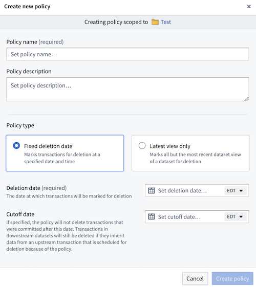

<!-- source: https://palantir.com/docs/foundry/data-lifetime/core-concepts-data-lifetime/ · mirrored 2026-08-06 from Palantir Foundry docs -->

# Core concepts

The concepts explained below are important to understand before using or configuring Data Lifetime in your enrollment.

## Data Lifetime policies

Data Lifetime allows you to define “lineage-aware" retention policies at the namespace level and apply them to datasets within these namespaces. Once a policy is applied, Data Lifetime assigns deletion dates to all transactions in the dataset based on policy configurations. Two types of policies can be configured:

* **[Fixed deletion date](/docs/foundry/data-lifetime/deletion-policies-implications/#fixed-deletion-date-policy):** By default, all transactions in a root dataset are assigned the same specified deletion time (unless a [cutoff date](/docs/foundry/data-lifetime/deletion-policies-implications/#fixed-deletion-date-policy) is configured).
* **[Latest view only](/docs/foundry/data-lifetime/deletion-policies-implications/#keep-latest-view-only-policy):** All transactions in a root dataset that are *not* in that dataset's current view will be assigned a deletion date equal to the current time. This means that all historical transactions will be marked for immediate deletion, while transactions in the latest view of the dataset will not be assigned a deletion date.

### Retention policies vs. lineage-aware retention policies

Foundry offers two ways to systematically delete data from the system:

* **Retention policies**, defined in the [Retention](/docs/foundry/retention/overview/) application, are applied to dataset transactions based on specific rules and can systematically delete data. However, these policies **are not** lineage-aware and thus do not propagate to downstream datasets. Learn more about [retention policies](/docs/foundry/retention/overview/).

* **Data Lifetime policies** are distinct from [retention](/docs/foundry/retention/overview/) policies. The *lineage-aware* deletion mechanism of Data Lifetime policies ensures that when a transaction is deleted, all downstream transactions derived from that transaction are also removed. A key distinction between both methods is that Data Lifetime suggests that policies be applied to either root or otherwise upstream datasets, while policies managed through [Retention](/docs/foundry/retention/overview/) do not have this requirement.

:::callout{theme="warning"}
Though policies can be simultaneously configured on the same enrollment, Data Lifetime does not consider other retention policies when showing deletion dates for transactions. For example, if a retention policy is meant to delete a specific transaction on Tuesday, and Data Lifetime is set to delete that same transaction on Wednesday, Data Lifetime will report Wednesday as the deletion date for that transaction. This remains true even if, realistically, the transaction will be deleted on Tuesday based off of the retention policy.
:::

### Permissions and roles

:::callout{theme="warning"}
Understanding permissions and roles is a crucial part of using Data Lifetime. Learn more about the importance of [safeguarding policies](/docs/foundry/data-lifetime/getting-started/#safeguard-policy-use).
:::

The default roles for permissions in Data Lifetime are described below:

* **Namespace Viewer:** View retention policies.
* **Dataset Editor:** Set/remove retention policies on/from datasets.
* **Data Governance Officer:**
  * Create/update/delete retention policies for namespaces they can view.
  * Set/remove retention policies and policy overrides for datasets they can view.

The Data Governance Officer role is particularly vital for managing and safeguarding Data Lifetime policies. Learn more about [assigning permissions within Control Panel](/docs/foundry/administration/control-panel/). Additionally, we recommend all Organizations review and understand our [data governance principles and implementation](/docs/foundry/security/data-protection-and-governance/) within the platform.

The following matrix shows the actions that would only be granted to individuals with the role of **Data Governance Officer** and depicts the additional permissions needed to take action.

|  | Namespace Viewer | Policy Viewer | Dataset Viewer |
| --- | --- | --- | --- |
| Create Data Lifetime policy | ✅ | ❌ | ❌ |
| Update Data Lifetime policy | ✅ | ✅  | ❌ |
| Delete Data Lifetime policy | ✅  | ✅ | ❌ |
| Set Data Lifetime policy on dataset | ✅  | ✅ | ✅ |
| Remove Data Lifetime policy from dataset | ✅ | ✅  | ✅ |
| Set Data Lifetime policy override on dataset | ✅ | ✅ | ✅ |

The following matrix shows the actions all users (particularly, those who do *not* have the **Data Governance Officer** role for their Organization) can take and the permissions needed to take action.

| | Namespace Viewer | Policy Viewer | Dataset Viewer | Dataset Editor |
| --- | --- | --- | --- | --- |
| View Data Lifetime policy | ✅ | ✅ | ❌ | ❌ |
| View Data Lifetime policies for dataset | ✅ | ✅  | ✅ | ❌ |
| Set Data Lifetime policy on dataset | ✅ | ✅ | ❌ | ✅ |
| Remove Data Lifetime policy from dataset | ✅  | ✅ | ❌ | ✅ |
