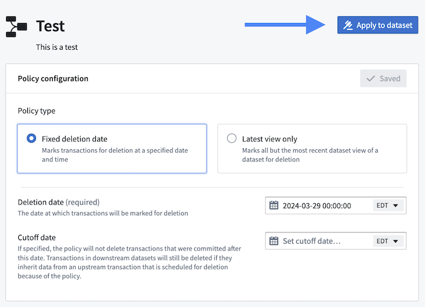
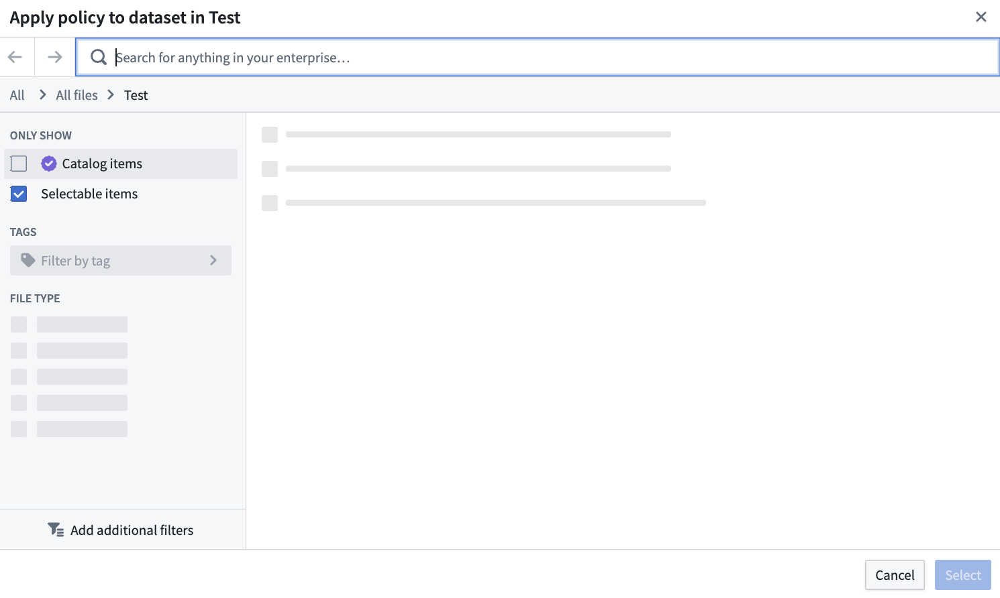

<!-- source: https://palantir.com/docs/foundry/data-lifetime/creating-a-deletion-policy/ · mirrored 2026-08-06 from Palantir Foundry docs -->

# Create a deletion policy for a dataset

:::callout{theme="neutral"}
We recommend using the Data Lifetime application to set deletion policies. However, in some cases, it may be more appropriate to configure policies directly on a dataset. When [viewing a dataset](/docs/foundry/dataset-preview/overview/), select the **Details** tab, then **Lineage-aware retention policies** to create a new policy.
:::

Familiarize yourself with the various [permission roles](/docs/foundry/data-lifetime/core-concepts-data-lifetime/#permissions-and-roles) before attempting to create a new deletion policy. You must have the `Data Governance Officer` role or `Dataset Editor` privileges to perform the steps in this guide.

Follow the steps below to create a lineage-aware deletion policy.

1. Navigate to **Applications** from the left navigation panel, choose **Security & governance**, then select **Data Lifetime**.

2. Select **+ New Policy** and add the necessary information, including the policy name, type, and deletion date.

3. Choose **Create policy** to land on the configuration details page of the new policy. Learn more about [deletion policy types](/docs/foundry/data-lifetime/deletion-policies-implications/).

4. Select **Apply to dataset** in the upper left of the screen.

5. Choose the dataset to which you want to apply the new policy.

6. Once you locate the appropriate dataset, choose *Select* to apply the policy. You should see a green success message appear at the top of your screen, confirming that the policy was successfully applied to the chosen dataset. Learn how to [further verify it a policy was properly applied](/docs/foundry/data-lifetime/view-changes-applied-policy/).
