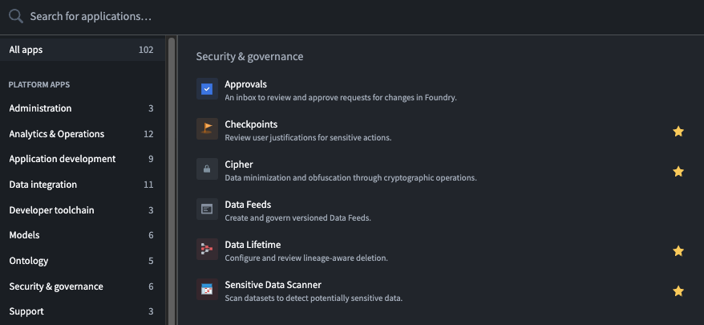

<!-- source: https://palantir.com/docs/foundry/data-lifetime/getting-started/ · mirrored 2026-08-06 from Palantir Foundry docs -->

# Getting started

Start using Data Lifetime for your organization by following the best practices and guides listed in the sections below.

## Access the Data Lifetime application

You can find the Data Lifetime application using the **Applications** search tool, located in the navigation sidebar to the left of your screen. Search by name, or find the application under **Security & governance**.

The following guides will explain specific workflows available in Data Lifetime:

* [Implications of deletion policies](/docs/foundry/data-lifetime/deletion-policies-implications/)
* [Create a deletion policy on a dataset](/docs/foundry/data-lifetime/creating-a-deletion-policy/)
* [Remove deletion policies on a dataset](/docs/foundry/data-lifetime/removing-a-policy/)
* [View policy activity history](/docs/foundry/data-lifetime/view-changes-applied-policy/)
* [Create policy overrides](/docs/foundry/data-lifetime/policy-overrides/)
* [FAQ](/docs/foundry/data-lifetime/FAQ/)

## Safeguard policy use

The configuration of deletion policies is a critical and sensitive task that must be performed with care and accountability. Changes to deletion policies can cause **significant impacts on data integrity**, including accidental data loss or retaining data longer than legally allowed.

The Data Lifetime lineage-aware deletion solution is integrated into the robust access control system in the platform, allowing organizations the ability to **restrict the privilege of policy application to specific trusted users.** Moreover, applying override policies requires an even higher access level within this system.

Additionally, Data Lifetime can be integrated with [Checkpoints](/docs/foundry/checkpoints/overview/), an application that allows organizations to require user justifications for actions in the platform. Applying Checkpoints to require justifications for applying or removing a deletion policy in Foundry can enhance data governance best practices by providing additional auditability and transparency.
