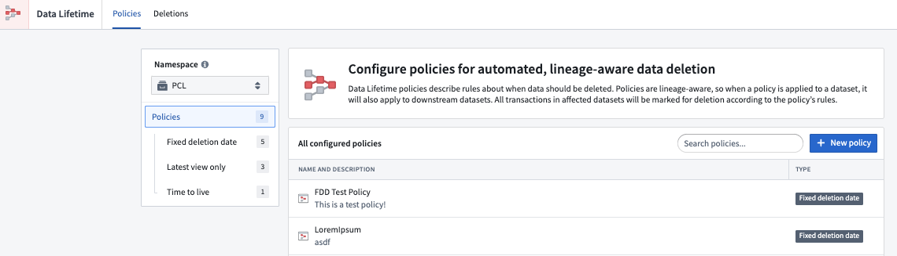
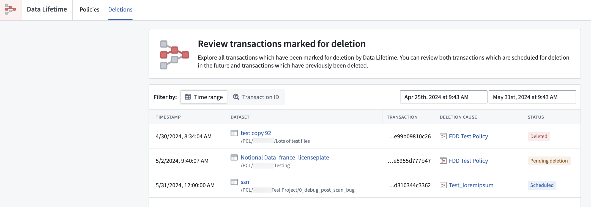

<!-- source: https://palantir.com/docs/foundry/data-lifetime/overview/ · mirrored 2026-08-06 from Palantir Foundry docs -->

# Data Lifetime

Data Lifetime is a service that allows you to set *lineage-aware* retention policies on datasets in Foundry. These policies govern the deletion of [transactions](/docs/foundry/data-integration/datasets/#transactions) within a dataset on which they are applied, along with any downstream datasets.

Data frequently experiences duplication, integration with additional data, and storage in various formats to accommodate a range of use cases. Foundry's distinct features enable data engineers to track modifications and merges back to their origin, ensuring other users can examine the data's transformation history both upstream and downstream. The structure that governs the flow of data through a system, starting from its source and extending to its various final forms, is commonly known as "data lineage". In Foundry, data flow visualization can be achieved using our interactive [Data Lineage](/docs/foundry/data-lineage/overview/) tool. Understanding the environment associated with data integrations and transformations is an essential first step when exploring the deletion process.

:::callout{theme="neutral"}
In some cases, regulations may necessitate the deletion of specific data. This typically involves removing all "descendants" within the data lineage to guarantee a comprehensive approach to deletion. This ensures compliance with the data protection regulations that may require organizations to completely remove the data and any associated instances or derived versions within the system's architecture.
:::
