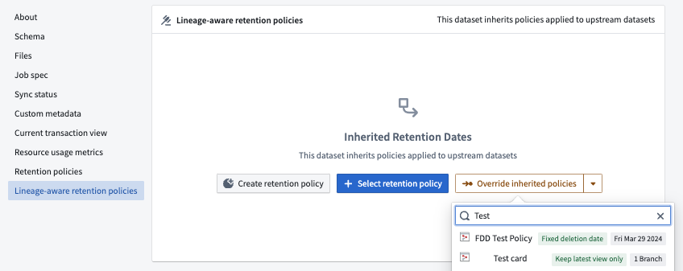
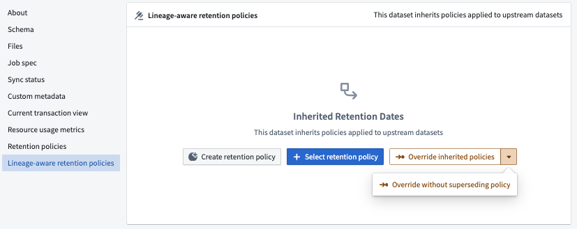

<!-- source: https://palantir.com/docs/foundry/data-lifetime/policy-overrides/ · mirrored 2026-08-06 from Palantir Foundry docs -->

# Create policy overrides

In certain scenarios, you may want to stop the inheritance of deletion dates from upstream transactions and retain downstream data for longer periods. You may require this if, for example, successful aggregations or minimizations render datasets exempt from deletion requirements. For these use cases, Data Lifetime includes **policy overrides**. A policy override is a policy with the unique attribute of breaking the inheritance of deletion dates from upstream transactions.

## Configure policy overrides

The sections below explain how to override the policy on a specific dataset. You must have the [`Data Governance Officer` role](/docs/foundry/data-lifetime/core-concepts-data-lifetime/#permissions-and-roles) to override a policy (with or without a superseding policy). To access this view, you must first navigate to the [dataset preview](/docs/foundry/dataset-preview/overview/).

From the dataset preview, navigate to the **Details** tab, then choose **Lineage-aware retention policies** From here, you can choose between two types of policy overrides: **Override inherited policies**, or **Override without superseding policy**

### Override inherited policies

This option will override any policy that was previously applied to the datase, along with all downstream datasets. From the **Select retention policy** dropdown menu, choose a policy from a list of existing policies. Once you select a policy, the override will immediately apply. Note that if a downstream dataset is already subject to a different policy (if it acquired a policy through another lineage, for example), the policy change will not apply.

### Override without superseding policy

If you choose to override without superseding the active policy, you will effectively remove any deletion dates for all transactions in the dataset, along with any downstream datasets.

If no superseding policy is specified, the transactions within the dataset that have the policy override may not have deletion dates.

