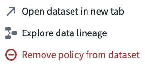
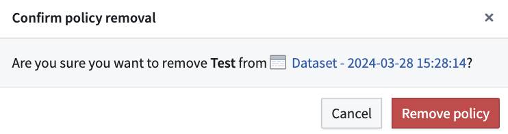

<!-- source: https://palantir.com/docs/foundry/data-lifetime/removing-a-policy/ · mirrored 2026-08-06 from Palantir Foundry docs -->

# Remove a deletion policy

1. Navigate to the **Policies** tab in the Data Lifetime application and select the policy you want to remove.

2. Choose the **Root datasets** tab from the left side panel, identify the dataset you wish to remove from the policy, then select the three small dots.

To review the action history of a policy, you can navigate to the **History** tab.

3. Select **Remove policy from dataset**.

4. A pop-up window will appear, prompting you to confirm the policy removal. Select **Remove policy**. A green success message should then appear at the top of your screen, indicating that the policy was successfully removed from the selected dataset.

