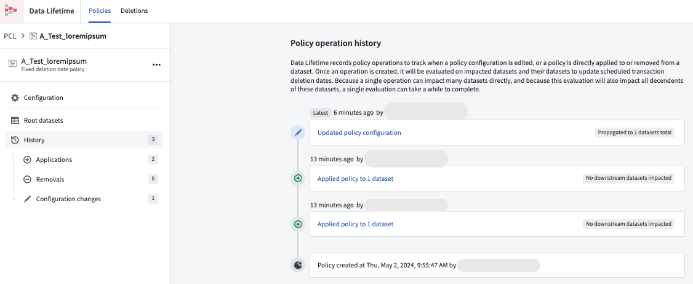

<!-- source: https://palantir.com/docs/foundry/data-lifetime/view-changes-applied-policy/ · mirrored 2026-08-06 from Palantir Foundry docs -->

# View policy activity history

Occasionally, you may need to examine all operations performed on a specific policy. The Data Lifetime application allows you to view all actions applied to a policy, including the addition of a new dataset (**Applications**) or the removal of a dataset from a policy (**Removals**). To review these operations, refer to the **History** tab.

1. Within the Data Lifetime application, navigate to the **Policies** tab.
2. Choose the policy to investigate.
3. Select **History** to view all actions carried out on the policy, from latest to oldest.

4. To view transactions that have been deleted or marked for deletion, navigate to the **Deletions** tab. You may filter the deletions by [**Transaction ID**](/docs/foundry/data-lifetime/FAQ/#how-do-I-find-the-transaction-id-of-a-dataset-to-use-the-transaction-filter-in-the-data-lifetime-application) or **Time range**.

