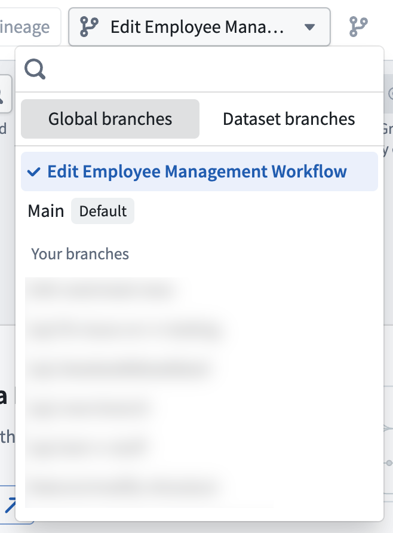
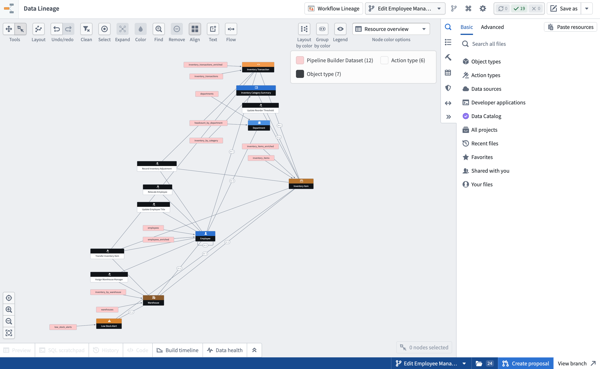
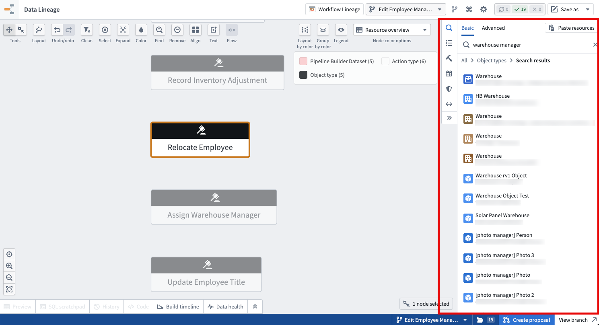
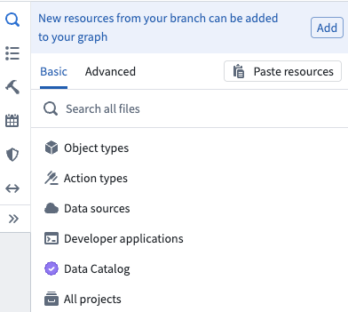
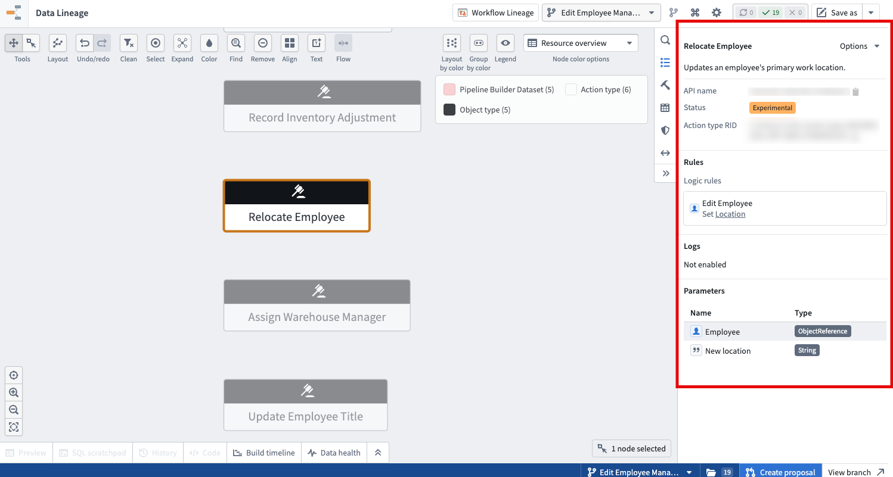

<!-- source: https://palantir.com/docs/foundry/data-lineage/branching-data-lineage/ · mirrored 2026-08-22 from Palantir Foundry docs -->

# Branching data lineage

Data Lineage integrates with Global Branching, enabling you to view the state of your entities as they exist on a branch. You can select a global branch in Data Lineage to inspect branched resources, view branch-aware metadata, and search for entities on a branch.

For general information on Global Branching concepts and workflows, refer to the [Global Branching documentation](/docs/foundry/global-branching/overview/).

:::callout{theme="neutral"}
Data Lineage is not a branched resource. Graphs and graph configurations are not tracked as modified resources on a branch and cannot be merged back to `Main`. Data Lineage being branch-aware means that you can use it to view and interact with changes made on global branches.
:::

## Select a branch

To view resources on a global branch, use the branch selector in the Data Lineage toolbar and select the **Global branches** tab. Choose the branch you want to inspect.

When a global branch is selected, the lineage graph displays the state of resources as they exist on that branch, including any datasets, ontology entities, or other resources that have been added or modified.

:::callout{theme="neutral"}
The branch selector also includes a **Dataset Branches** tab for selecting dataset-level branches. All global branches have a corresponding dataset branch, but not every dataset branch is tied to a global branch.
:::

## View branch-aware lineage

Once a global branch is selected, the lineage graph reflects the branch state across both datasets and ontology entities:

* **Datasets** display their branch-specific data, build status, and staleness information.
* **Ontology entities** such as object types, action types, and link types display their branch-specific metadata, including names and properties. Entities created or modified on the branch are reflected in the graph.
* **Links between resources** reflect the branch state, showing how datasets and ontology entities are connected on the branch.

:::callout{theme="neutral"}
If your graph contains resources from multiple ontologies, only the ontology associated with the selected global branch will reflect branch-specific data. Resources from other ontologies will continue to show data from `Main`.
:::

## Search for entities on a branch

When a global branch is selected, the search in Data Lineage is branch-aware. You can search for ontology entities that exist on the branch, including entities that were created on the branch and do not yet exist on `Main`.

## View entities modified on your branch

When a global branch is selected, the search panel displays a callout that allows you to add all entities modified on your branch to the graph with one click. This provides a quick way to visualize the full set of changes on your branch without searching for each entity individually.

The callout updates automatically as new resources are modified on your branch, so you can return to Data Lineage at any point during your branch workflow and see the latest set of changes.

## Node details and previews

When you select a node on the graph while on a global branch, the details sidebar and preview panels display branch-specific information:

* **Dataset nodes** show branch-specific preview data, build history, and staleness.
* **Ontology entity nodes** show branch-specific metadata, including display names, descriptions, and properties as they exist on the branch.

## Colorings and badges

Node [colorings](/docs/foundry/data-lineage/node-coloring/) and badges in Data Lineage are branch-aware when a global branch is selected. Coloring options that depend on ontology metadata or dataset properties will reflect the state of the selected branch.

## Saved graphs

When you save a graph while a global branch is selected, the global branch selection is saved with the graph configuration. Opening the saved graph restores the branch context, so you and other users will see the same branch-specific view of the lineage.

## Known limitations

* **Dataset fallback branches:** When a global branch is selected, dataset fallback branches are disabled. The graph only displays data from the dataset branch associated with the selected global branch.
* **Single ontology per global branch:** Each global branch is associated with exactly one ontology. If your graph contains resources from multiple ontologies, only the ontology tied to the selected global branch reflects branch-specific data. Resources from other ontologies continue to display data from `Main`.
* **Dataset-to-ontology links on older global branches:** Links between datasets and ontology entities (object types and link types) are indexed automatically for all entities on `Main` and for any global branch created on or after May 2026. Global branches created before May 2026 are not backfilled, and may show no dataset-to-ontology links for entities that have not been modified on the branch. To populate these links on an older branch, save a modification to the affected object type or link type on that branch to reindex its provenance.
