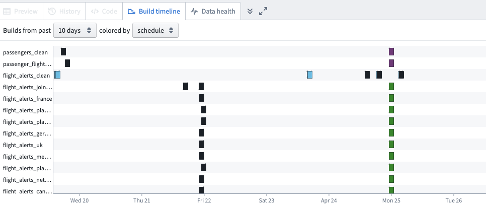
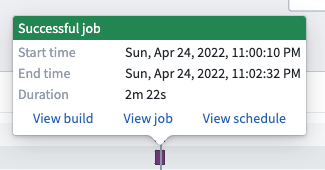

<!-- source: https://palantir.com/docs/foundry/data-lineage/build-timeline/ · mirrored 2026-08-06 from Palantir Foundry docs -->

# View build timeline

Use the **Build timeline** tool in Data Lineage to view the build history of your datasets.

In Data Lineage, click on **Build timeline** in the bottom left of your window. This action expands the view panel to display a Gantt chart of builds that took place during the period of time of your choice. You can select the number of days or hours you would like to view in your timeline, ranging from one hour to ten days. You can also choose to display the builds by color based on schedule or job status.

To view the build timeline of a specific dataset, select the dataset on your graph. Select multiple datasets with the **Drag select mode** tool or by holding `Ctrl / Command ` while clicking.

To view details of a job in the build timeline, click on the job in the Gantt chart. You will see information about the job status, start and end time, and duration.

See more details about the build, job, and schedule by clicking on the links within the job information window.
