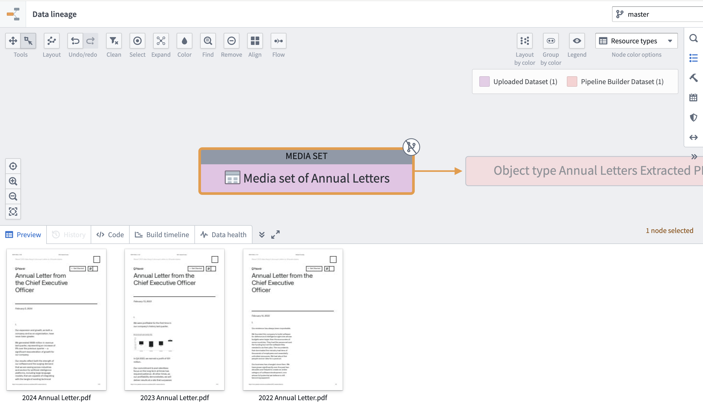
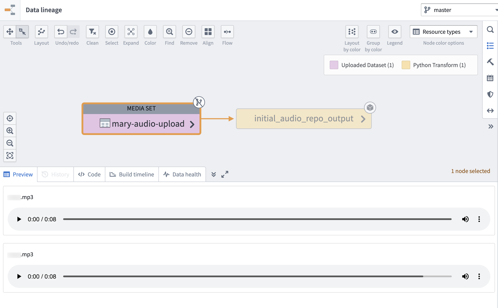
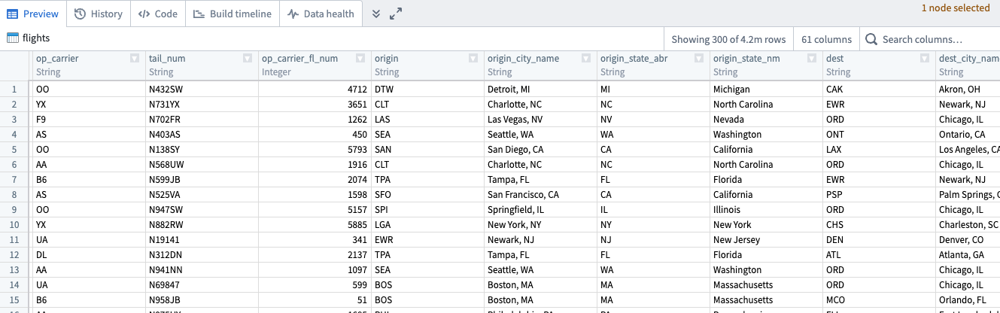
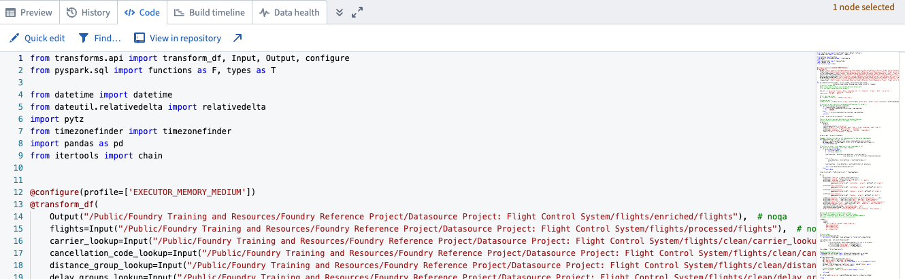

<!-- source: https://palantir.com/docs/foundry/data-lineage/dataset-preview-logic/ · mirrored 2026-08-06 from Palantir Foundry docs -->

# Preview and logic

The Data Lineage interface allows you to view previews of selected datasets or media sets, as well as examine the associated code to understand the logic behind the dataset or media set.

## Preview

To see a preview of a dataset or media set, select it in your data lineage graph, then choose the **Preview** tab in the bottom left of the interface.

### Media set

When the media set preview expands, you can view the contents of your media set. [Learn more about media sets.](/docs/foundry/data-integration/media-sets/).

Example of PDF preview:

Example of audio preview:

### Dataset

When the dataset preview expands, you can scroll through the first 300 rows of the selected dataset. You can also search for specific columns using the **Search columns...** field to the right of the preview window. The preview of your dataset will look different depending on the type of data within your dataset.

## Logic

Select the **Code** tab to view the code logic of the selected dataset or media set. From the **Code** view, you can make quick edits, search for items, or open the code in the repository or other application used to derive the data.

:::callout
Uploaded and writeback datasets do not have associated code to view in Data Lineage.
:::
