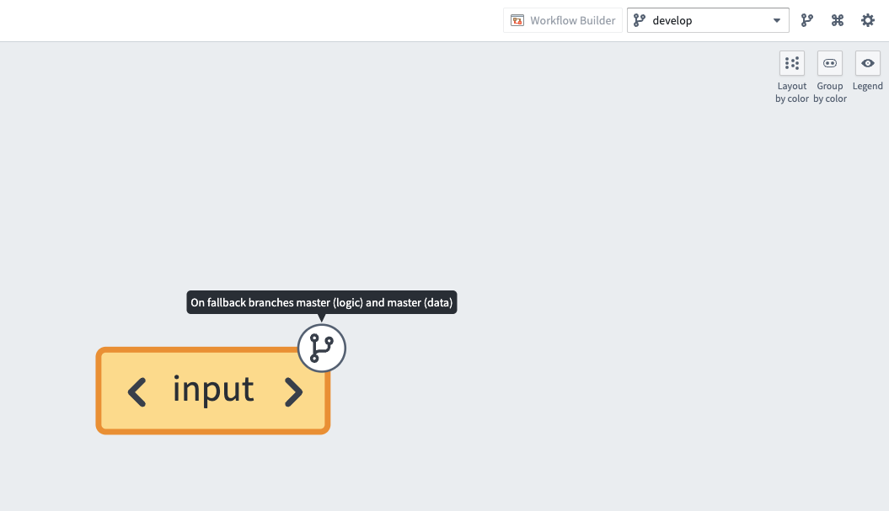
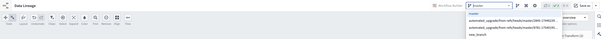
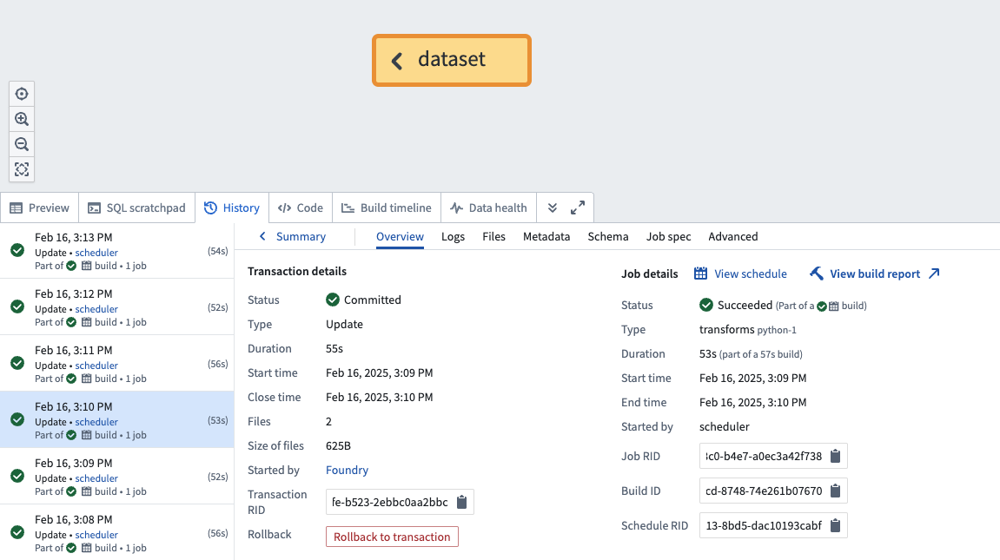
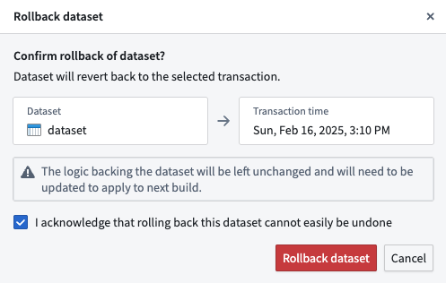
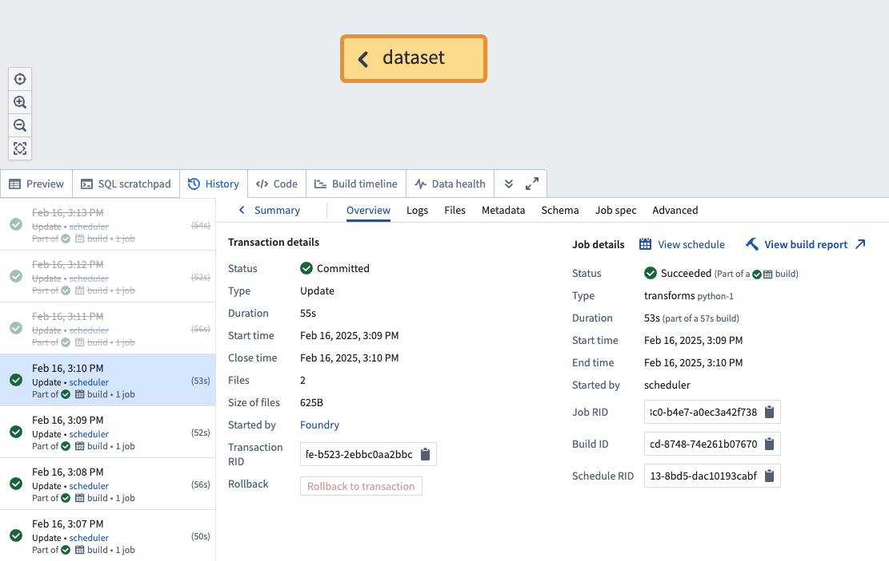
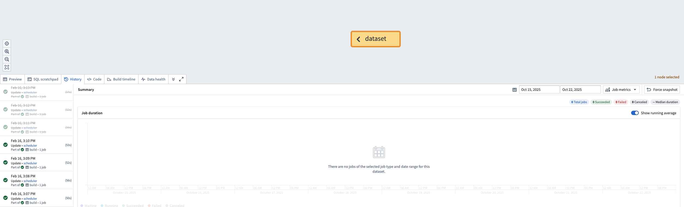
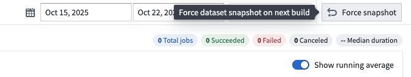
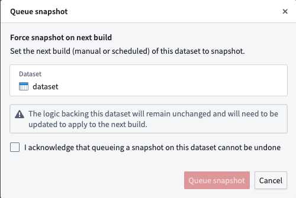

<!-- source: https://palantir.com/docs/foundry/data-lineage/dataset-rollback/ · mirrored 2026-08-06 from Palantir Foundry docs -->

# Roll back a dataset

When building a pipeline, you may need to roll back a [dataset](/docs/foundry/data-integration/datasets/) to an earlier version. There may be various reasons for this, including the following:

* You identified a mistake in the logic required to build a dataset and need to revert it.
* Incorrect data was pushed into your pipeline from an upstream source.
* An outage occurred, and you want to quickly navigate back to an earlier state of your dataset.

The dataset rollback feature allows you to update the data and job history of a dataset. If the dataset is being built [incrementally](/docs/foundry/transforms-python/incremental-overview/), the dataset rollback feature also ensures that the incrementality of your dataset is preserved.

## Types of dataset rollbacks

The two types of possible rollbacks on a dataset are as follows:

1. **[Rolling back to an earlier transaction](#roll-back-to-an-earlier-transaction):** Performed when there is a previous transaction to roll the dataset back to.
2. **[Forcing a snapshot on the next build](#force-a-snapshot-on-the-next-build):** Typically applicable for incremental workflows when there is no previous transaction to roll back to, meaning that the dataset needs to be rolled back to a state before the branch or the dataset was created.

:::callout{theme="warning"}
If you accidentally force a snapshot on the next build of a dataset, but you intended to roll back to an earlier transaction, do not proceed with a rollback, as this could leave the dataset in a partially rolled back state.   
Instead, build the dataset; it will run as a snapshot since the dataset was configured to snapshot on the next build, and then carry out the intended rollback.
:::

## Considerations and limitations

When rolling back a dataset, keep the following considerations in mind:

* Only transactional datasets are supported for rollbacks.
* You are only able to roll back to a *successful* transaction.
* It is not possible to roll back to a transaction that was deleted based on a [retention policy](/docs/foundry/retention/overview/). However, you *can* roll back to a transaction that was deleted by a dataset rollback in Data Lineage.
* You can only roll back a dataset on which you have the [`Editor` role](/docs/foundry/security/projects-and-roles/#roles).
* After a rollback is carried out, the logic backing the dataset will be left unchanged and will need to be updated in order to apply to the next build.
* If the branch on which a rollback is being performed does not exist on the dataset, the rollback will be applied to a fallback branch.

:::callout{theme="warning"}
If multiple outputs are built together by the same job, each output would need to be rolled back to a transaction that was built by the same previous job.   
Similarly, if multiple outputs are built together, all of them would need to be forced to run as a snapshot on the next build.   
Rolling back or requesting a snapshot for only a subset of outputs would result in outputs being left in an inconsistent state for subsequent jobs. Specifically, for incremental workflows:

* Partial rollbacks could cause the subsequent job to run unexpectedly as a snapshot.
* Partial force snapshot requests would cause the subsequent job to continue running incrementally.
:::

## Roll back to an earlier transaction

1. Navigate to a [Data Lineage](/docs/foundry/data-lineage/overview/) graph containing the dataset you would like to roll back.
2. Select the dataset in the graph. Then, from the branch selector at the top of the graph, select the branch on which you would like to perform the rollback.

3. Select the **History** tab in the panel at the bottom of the page.
4. Select the transaction to roll back to.

5. Select **Rollback to transaction**.
6. A confirmation dialog will be displayed.

7. Acknowledge the warning that a rollback cannot easily be undone and select **Rollback dataset**.

8. Once the rollback is complete, navigate to the dataset's  **History** tab and ensure that the rolled back transactions are now crossed out, as shown below:

:::callout{theme="warning"}
If a dataset backs an [object type](/docs/foundry/object-link-types/object-types-overview/) stored using Object Storage v2, manual intervention is required to ensure that the object type is [reindexed](/docs/foundry/object-indexing/funnel-batch-pipelines/#full-reindexing-special-cases) with a successful run of the [replacement pipeline](/docs/foundry/object-indexing/funnel-batch-pipelines/#replacement-pipelines) to reflect the state after the rollback.
:::

## Force a snapshot on the next build

:::callout{theme="neutral"}
Forcing a snapshot will **not** change the dataset’s transaction history or produce immediate visible changes. The snapshot will occur on the next build.   
Forcing a snapshot **will** require a force build to rebuild the dataset if there are no changes to either the input data or the logic backing the dataset.
:::

1. Navigate to a [Data Lineage](/docs/foundry/data-lineage/overview/) graph containing the dataset you would like to force a snapshot on.
2. Select the dataset in the graph. Then, from the branch selector at the top of the graph, select the branch on which you would like to perform the rollback.

3. Select the **History** tab in the panel at the bottom of the page. Do not select any transactions.

4. In the displayed **Summary** panel, select the **Force snapshot** option in the toolbar at the top right.

5. A confirmation dialog will be displayed.

6. Acknowledge the warning that a forcing a snapshot on the next build cannot be undone and select **Queue snapshot**.
