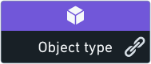

<!-- source: https://palantir.com/docs/foundry/data-lineage/elements-reference/ · mirrored 2026-08-22 from Palantir Foundry docs -->

# Graph elements reference

## Node types

| Node                                        | Type | Description |
| --- | --- | --- |
 | **Data source** | This is the name of the data source as it appears in [Data Connection](/docs/foundry/data-connection/overview/). [Learn more about the different source types.](/docs/foundry/data-integration/source-type-overview/)
 | **Dataset**  |  Foundry datasets and the lineage between them. The color of the dataset node depends on [user selection](/docs/foundry/data-lineage/node-coloring/). Dashed border indicates unstructured datasets.
 | **Object type**  | Ontology [object types](/docs/foundry/object-link-types/object-types-overview/). The icon and color of the node depends on the definition of each object type. When clicking on the “link” icon next to the object type name, Data Lineage shows the relations between this object type and other object types.
 | **Artifact** | Data Lineage exposes different Foundry artifacts like: [Contour](/docs/foundry/contour/overview/) analyses, [Reports](/docs/foundry/reports/overview/), etc. The color of the node depends on the artifact type, which is indicated at the top of the node.

## Node indicators

Node indicators appear on top of dataset nodes and provide additional information about the resource.

| Indicator | Type | Description |
| --- | --- | --- |
  | **Open issues** | This indicator signals there are currently open issues associated with the node on the graph. Hovering over this signal indicates the number of open issues.
 | **Defines an object type** | This indicator appears on datasets that are used to define Ontology object types. Hovering over the right arrow of allows you to expose those linked object types. [Learn more about object types.](/docs/foundry/object-link-types/object-types-overview/)
 | **Syncs** | Datasets with this indicator on them have syncs to other databases or systems. You can view these syncs by selecting the node and opening the Properties panel, or by opening the “Details” tab in Dataset Preview (right click on the node and click on **Open**).
 | **Trashed** | This indicator appears on nodes representing deleted datasets or artifacts. Deleted nodes are also partially faded with their name crossed out.
