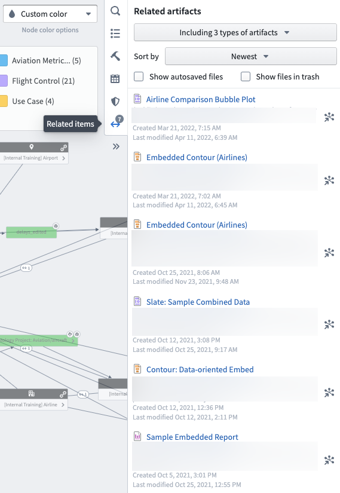
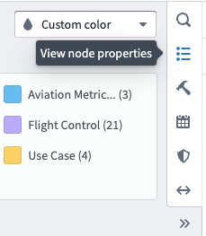
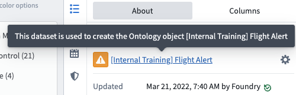
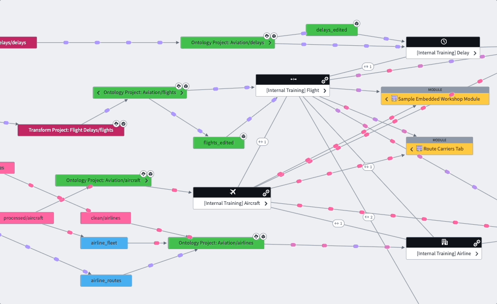

<!-- source: https://palantir.com/docs/foundry/data-lineage/explore-artifacts/ · mirrored 2026-08-06 from Palantir Foundry docs -->

# Explore artifacts and ontology entities

You can find Foundry artifacts and ontology entities related to your datasets in Data Lineage. The Data Lineage interface allows you to navigate directly to these resources and see how they fit in your ontology.

## Find related artifacts

In your data lineage graph, select a dataset. Then, select **Related items** in the right sidebar to expand the **Related artifacts** panel. The **Related items** icon will show a badge with the number of artifacts related to the selected dataset. In the artifacts panel, you can see a list of related resources throughout Foundry, including Contour visualizations and Slate applications.

Click on the node icon next to a resource to zoom in on the related dataset, or click the resource to open it in the corresponding application in a new tab. You can filter the list of related artifacts to include different item types and sort the list by oldest, newest, name, path, or last modified.

## Find ontology entities

Find object types defined by datasets in your lineage graph by selecting the dataset and opening the **View node properties** panel in the right sidebar.

In the **About** tab, you will see any object types that were created with the selected dataset. Click the **Settings** icon next to the object type to view its configuration in a new Ontology manager tab.

You can also add object types to your data lineage with the **Search Foundry** tool in the right sidebar. Use a basic or advanced search to find an object type and select it from the list to add it to your graph. You can then view link types related to the object type and use the graph to visualize connections between your datasets and the newly added object type.

[Learn more about creating an Ontology.](/docs/foundry/ontology/overview/)
