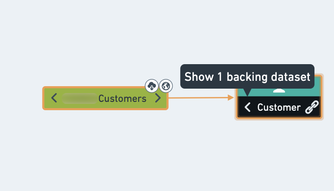
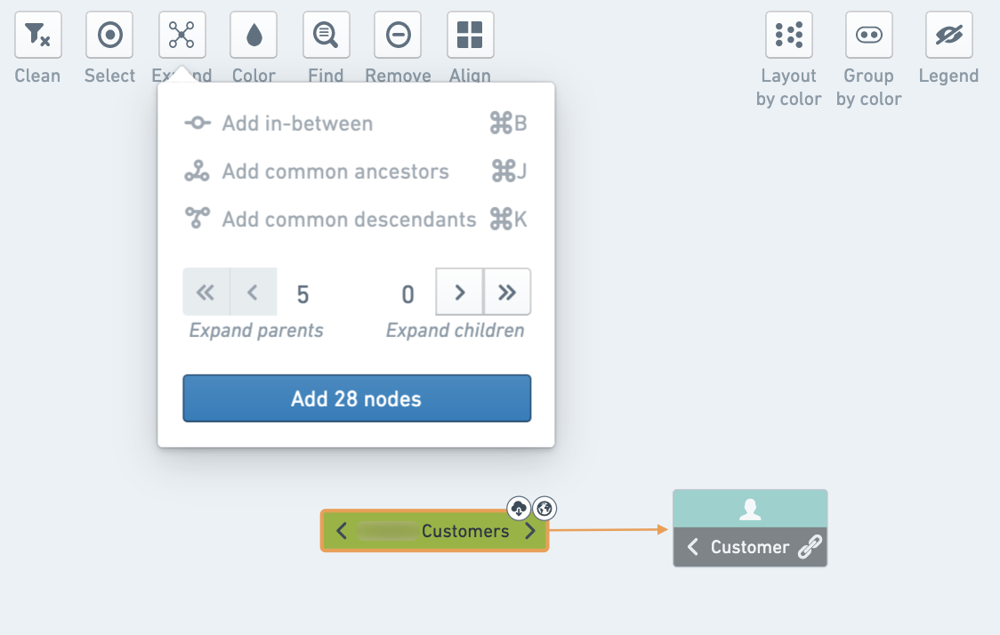
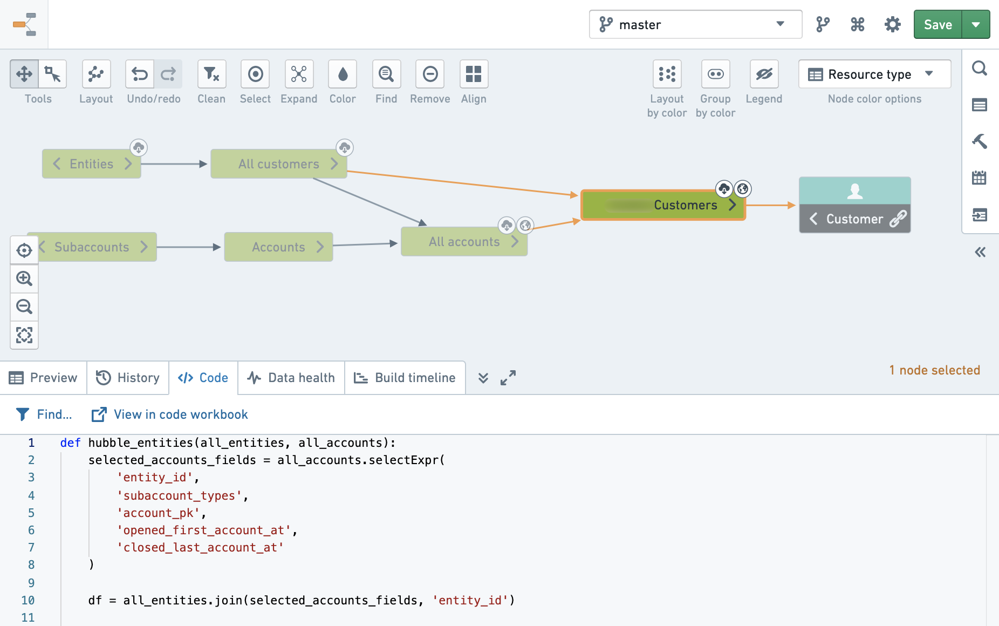

<!-- source: https://palantir.com/docs/foundry/data-lineage/explore-lineage/ · mirrored 2026-08-06 from Palantir Foundry docs -->

# Explore data lineage

Data lineage helps you understand how your data came to be. There are various ways to explore data pipelines in the Data Lineage app. Consider one common path:

1. Using the **Search** helper, find your resource (for example, a dataset or an object type) and add it to the graph.

2. Click on the left arrow of the node to expose the direct parents of the resource.

3. To expand your graph, select the next resource on the graph and click the **Expand** button in the graph tools.

4. Click on the chevron button to define the number of levels to expose. Click the double-chevron to expand all the way to the raw data (or all the way to the final descendants).

:::callout
Adding too many nodes simultaneously may affect the graph's performance and usability. Keep a manageable number of nodes by checking the node count in the **Expand** tool.
:::

:::callout{theme="success"}
You can find the relation between two nodes on the graph by selecting the **Expand** button and adding all nodes in between the resources or all common ancestors/descendants.
:::

5. Get more information on one of the datasets by selecting the dataset and using the bottom panel to display a preview of the data.

6. Click on **Code** to view how the dataset was created.

7. Click on **View in code workbook** or **View in repository** to see the original code and make changes as needed (subject to permissions).

:::callout
Some options may be unavailable for some datasets depending on the type of resource. For example, **Code** is only available for Code Workbook or Code Repositories. For Fusion sheet syncs with no code to show, you may have the option to view the source sheet and make your changes there (if you have appropriate permissions).
:::
