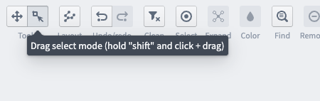
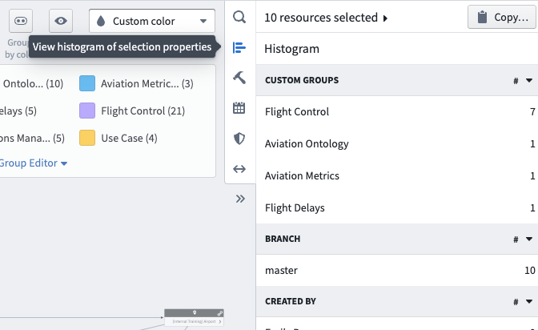
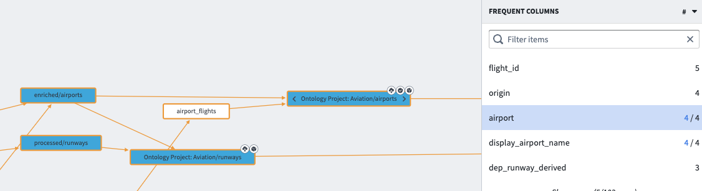

<!-- source: https://palantir.com/docs/foundry/data-lineage/find-column/ · mirrored 2026-08-06 from Palantir Foundry docs -->

# Find datasets with a given column

You can easily search for specific dataset columns within your Data Lineage graph:

* First, ensure you added all datasets of interest in your pipeline to your lineage graph.

* Next, select all datasets of interest by using **Drag select mode** in the Tools toggle in the upper left hand corner of the app. You can also hold down `Ctrl / Command` to select multiple nodes at once, or use `Ctrl / Command + A` to select all nodes.   
     

* Then, select **View histogram of selection properties** from the Data Lineage sidebar.   
     

* Under the **Frequent Columns** section, you can see the most frequent columns by name in your selection.

* Click one of the columns to highlight the datasets in your selection that contain this column.   
     
