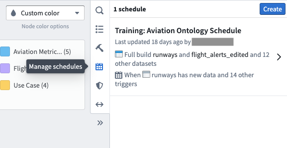
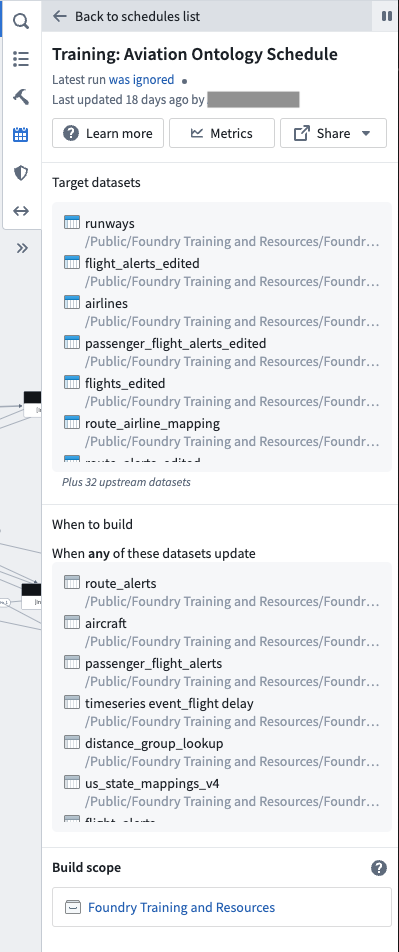

<!-- source: https://palantir.com/docs/foundry/data-lineage/manage-schedules/ · mirrored 2026-08-22 from Palantir Foundry docs -->

# Manage schedules

Data Lineage allows you to easily manage build schedules within your lineage graph. In the right sidebar, select **Manage schedules** to open the schedule details pane.

You will see the schedules related to selected datasets in your graph. Click on a schedule to see more details:

* **Latest run:** The status of the latest run of the schedule.
* **Last update:** A timestamp of when the last update took place and the user who made changes
* **Target datasets:** A list of downstream datasets including in the build schedule.
* **When to build:** Displays the build schedule trigger determined when creating the build schedule. For example, a build schedule can be set to run **when specific datasets update.**
* **Build scope:** Defines the Project or user datasets included in the build and the permissions used to run the build.

Learn more about scheduling builds in the [**Building pipelines**](/docs/foundry/building-pipelines/scheduling-overview/) documentation.
