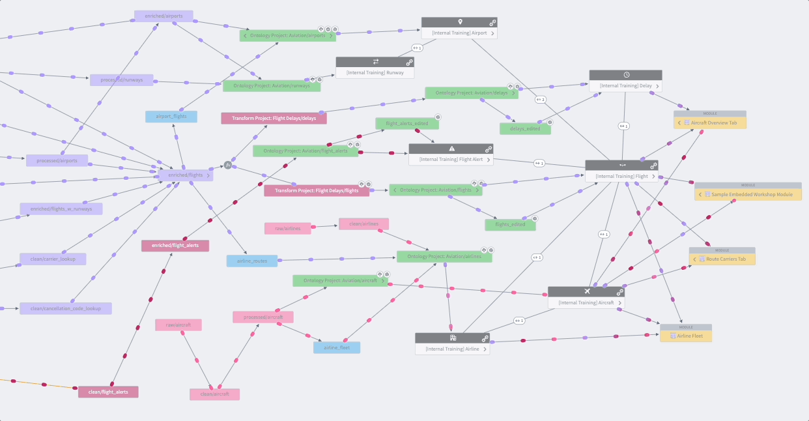

<!-- source: https://palantir.com/docs/foundry/data-lineage/overview/ · mirrored 2026-08-22 from Palantir Foundry docs -->

# Data Lineage

**Data Lineage** is an interactive tool that facilitates a holistic view of how data flows through the Foundry platform.

With Data Lineage, you can:

* Easily find and discover datasets
  * Search to find datasets using Project, table, and column names
  * Click through Foundry Projects to browse data
* Explore [pipelines](/docs/foundry/data-integration/data-pipeline/) through a powerful interface
  * Expand or hide ancestors and descendants of datasets
  * View attributes of a group of tables at once
  * Visualize your pipeline through coloring (e.g. color out-of-date tables)
  * Drill into details about your data such as its schema, when it was last built, and the code that generated the data itself
* Collaborate with teammates
  * Create pipeline snapshots to share with other users
