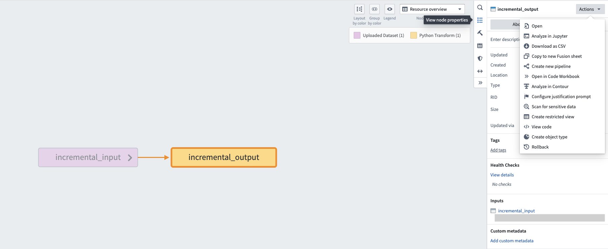
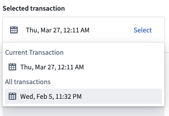
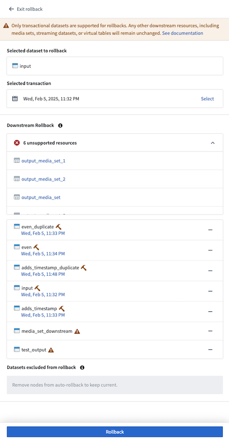
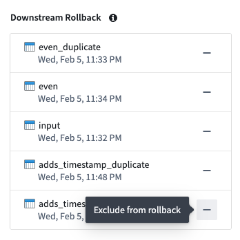
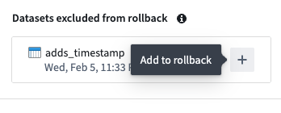
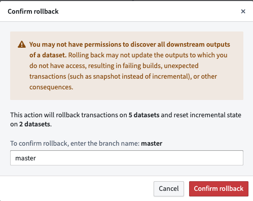
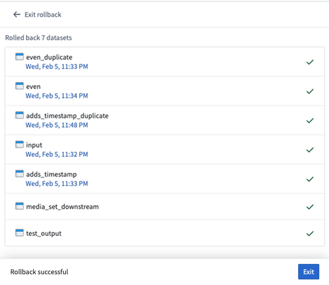
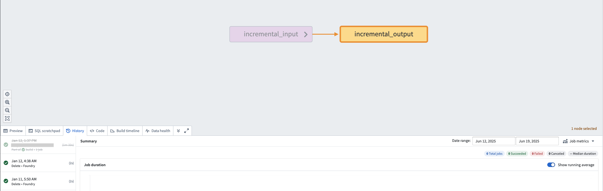
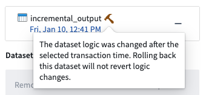
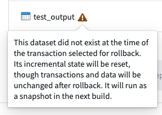

<!-- source: https://palantir.com/docs/foundry/data-lineage/pipeline-rollback/ · mirrored 2026-08-22 from Palantir Foundry docs -->

# Roll back a pipeline \[Planned deprecation]

:::callout{theme="warning" title="Planned deprecation"}
Rolling back a pipeline is in the [planned deprecation](/docs/foundry/platform-overview/development-life-cycle/) phase of development and will be unavailable for use after November 30th. We recommend using the [roll back a dataset](/docs/foundry/data-lineage/dataset-rollback/) feature instead.
:::

When building your pipeline, you may need to roll back a [dataset](/docs/foundry/data-integration/datasets/) and all of its downstream dependents to an earlier version. There can be many reasons for this, including the following:

* You identified a mistake in the logic required to build a dataset and need to revert it.
* Incorrect data was pushed into your pipeline from an upstream source.
* An outage occurred, and you want to quickly navigate back to an earlier state of your pipeline.

The pipeline rollback feature allows you to revert back to a [transaction](/docs/foundry/data-integration/datasets/#transactions) of an upstream dataset. When performing a rollback, the data provenance of the upstream dataset transaction is used to identify its downstream datasets and their corresponding transactions to create a final pipeline rollback state. Typically, this process would require several steps to properly roll back each affected dataset. With pipeline rollback, this is reduced to a few simple steps discussed below, along with the ability to preview the final pipeline state before confirming and proceeding with the rollback. Pipeline rollback also ensures that the incrementality of your pipeline is preserved.

As you set up your rollback, you can choose to exclude any downstream datasets; these datasets will remain unchanged as the pipeline is rolled back to the selected transaction.

:::callout{theme="warning"}
If a dataset backs an [object type](/docs/foundry/object-link-types/object-types-overview/) stored using Object Storage v2, manual intervention is required to ensure that the object type is [reindexed](/docs/foundry/object-indexing/funnel-batch-pipelines/#full-reindexing-special-cases) with a successful run of the [replacement pipeline](/docs/foundry/object-indexing/funnel-batch-pipelines/#replacement-pipelines) to reflect the state after the rollback.
:::

## Execute a pipeline rollback

1. Navigate to a [Data Lineage](/docs/foundry/data-lineage/overview/) graph containing the upstream dataset you would like to roll back.
2. Select the dataset in the graph. Then, from the branch selector at the top of the graph, select the branch on which you would like to perform the rollback.
3. Select **View node properties** in the panel on the right.

4. Select **Actions**, then **Rollback**.
5. Under **Selected transaction**, choose the transaction to which you would like to roll back.

After choosing the transaction, downstream datasets will automatically be found and the states they will revert to if the rollback is actioned will be displayed.

Resource types that are unable to be rolled back, including streaming datasets, media sets, and restricted views, will be displayed under the **unsupported resources** section. Transactional datasets on which you do not have `Edit` access will also be included in this list.

6. Select the timestamp under each dataset to navigate to the [**History** page](/docs/foundry/dataset-preview/overview/#history) of the input, where the corresponding transaction will be highlighted.

7. Select any datasets to exclude from the rollback by selecting **—** to the right of the dataset name. Once excluded from rollback, the dataset will appear in the **Datasets excluded from rollback** section.

8. To add an excluded dataset back to the rollback, select **+** to the right of the dataset name.

9. After finalizing the state of your desired rollback, select **Rollback**. A confirmation dialog will appear.

10. Enter the branch name as confirmation, then select **Confirm rollback** to proceed.

11. Once the rollback is complete, navigate to the **History** tab of the datasets and notice that the rolled back transaction is now crossed out, as shown below:

## Warnings

Depending on how your pipeline changed between the current state and the rollback transaction, you may receive one of the warnings shown below on datasets selected for downstream rollback:

* If the rollback transaction was built using a different JobSpec (logic) than the latest transaction, the transaction will show the following warning: `The dataset logic was changed after the selected transaction time. Rolling back this dataset will not revert logic changes.` If you receive this warning, you may need to inspect how the logic changed over time and determine if you can apply the logic again after the rollback and before any new dataset builds.

* If a downstream dataset did not exist at the time of the selected rollback transaction, the dataset will show the following warning: `This dataset did not exist at the time of the transaction selected for rollback. Its incremental state will be reset, though transactions and data will be unchanged after rollback. It will run as a snapshot in the next build.` If you receive this warning, note that the rollback will reset the dataset's job history as if it was never built. The next build on the dataset will not be run incrementally (if the dataset is an incremental dataset) since it will be treated as a completely new dataset being built for the first time.

## Considerations and limitations

When rolling back a pipeline, keep the following considerations in mind:

* Only transactional datasets are supported for rollbacks. Any other downstream resources, including media sets, streaming datasets, or virtual tables will remain unchanged.
  * These resources will be displayed under the **unsupported resources** section of the rollback preview panel.
* You are only able to roll back to a *successful* transaction.
* It is not possible to roll back to a [retentioned transaction](/docs/foundry/retention/overview/)
  * However, you can roll back to a `DELETE` retention transaction.
* You can only roll back datasets to which you have access. If you do not have access to certain downstream datasets, they **will not** be rolled back.
  * It is possible to have `Edit` access on an upstream dataset that is then used to build a downstream dataset to which you only have `View` access. In this case, the downstream dataset will be considered an "unsupported resource".
* Only transactional datasets with a [JobSpec](/docs/foundry/data-integration/builds/#jobs-and-jobspecs) can be rolled back; uploaded datasets are not supported for rollback.
* A maximum of **50 transactions** can be rolled back on the upstream dataset at a given time.
