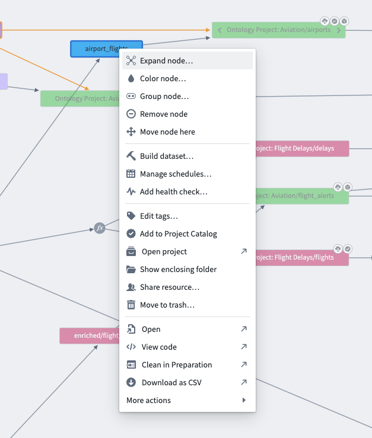
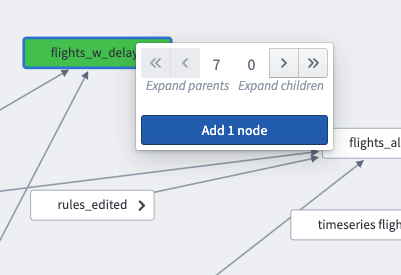
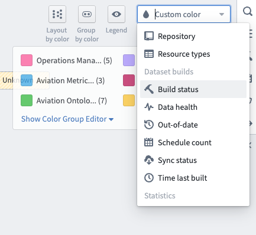

<!-- source: https://palantir.com/docs/foundry/data-lineage/stale-datasets/ · mirrored 2026-08-22 from Palantir Foundry docs -->

# Understand out-of-date datasets

There are a few reasons why your dataset may not be up to date. Common scenarios to explore are:

* Is my dataset build failing?
* Is there an upstream dataset that has not built and is not up to date?
* Have we received up-to-date data from the source?

You can easily answer these questions by using Data Lineage.

* First, verify the status of each of the resources in your pipeline by opening up the dataset of interest in Data Lineage and right-clicking on the node.

* Then, select **Expand node**. You can see all of the ancestor nodes for that dataset by clicking the double left arrow above **Expand parents**.

* Next, select the **Build status** option in the **Node color options** dropdown in the top right of Data Lineage to see the build status of every resource in your pipeline. This view of your pipeline will make it much easier to diagnose stale datasets.

