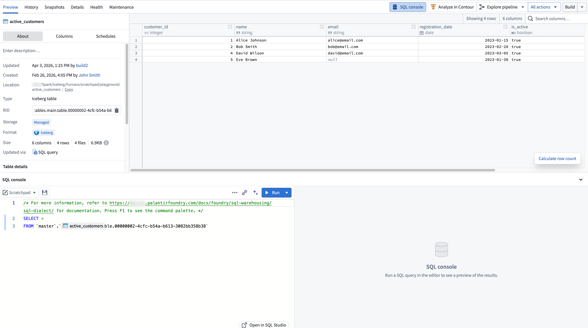
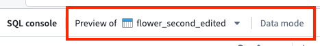

<!-- source: https://palantir.com/docs/foundry/dataset-preview/sql-console/ · mirrored 2026-08-18 from Palantir Foundry docs -->

# SQL console

The SQL console is the embedded SQL interface available within Foundry applications, providing contextual SQL access to the resource you are currently viewing. The SQL console is targeted for quick queries in the context of a specific resource (such as a dataset or object type). For a dedicated, full-screen SQL application, see [SQL Studio](/docs/foundry/sql-warehousing/sql-studio/).

## Accessing SQL console

You can access the SQL console in the bottom panel of supported applications:

| Application | Resources queryable |
|---|---|
| [Dataset Preview](/docs/foundry/dataset-preview/overview/) | Tabular data |
| [Data Lineage](/docs/foundry/data-lineage/overview/) | Tabular data |
| [Ontology Manager](/docs/foundry/ontology-manager/overview/) | Ontology object types and backing tabular data |

The starter query is prepopulated based on the resource you are currently viewing.

## Using SQL console

The SQL console provides core SQL editing and execution functionality, including running queries, autocomplete for tables and columns, an inline results panel, and the ability to save queries as [SQL worksheets](/docs/foundry/sql-warehousing/worksheets/). The SQL console uses Foundry's [Spark SQL dialect](/docs/foundry/sql-warehousing/sql-dialect/).

For full details on SQL Studio features, including AI-assisted query generation and result visualization, see the [SQL Studio documentation](/docs/foundry/sql-warehousing/sql-studio/).

### Modes

In [Ontology Manager](/docs/foundry/ontology-manager/overview/), the SQL console supports two modes:

* **Data mode** for querying tabular data using [Furnace](/docs/foundry/sql-warehousing/furnace/).
* **Object mode** for querying ontology object types using [Ontology SQL](/docs/foundry/sql-warehousing/ontology-sql/).

When viewing an object type in Ontology Manager, you can select between modes from the mode dropdown in the SQL console toolbar. The object type's backing dataset is suggested as the default resource in data mode.

In other applications, only data mode is available.

### Expanding to SQL Studio

To open the current query in a dedicated, full-screen application, select the expand option in the SQL console toolbar. This launches [SQL Studio](/docs/foundry/sql-warehousing/sql-studio/), which provides a full SQL application with a resource browser, version history, AI-assisted query generation, and additional capabilities not available in the embedded console.

:::callout{theme="neutral"}
A standalone full-screen view of the SQL console is temporarily available in environments where SQL Studio is not yet enabled. This standalone view will be replaced by the SQL Studio application.
:::

## Roles and permissions

Access to the SQL console is governed by the same SQL and download control roles that apply across Foundry. For details on the available roles and how they interact with SQL access, see [SQL permissions](/docs/foundry/sql-warehousing/sql-permissions/).
